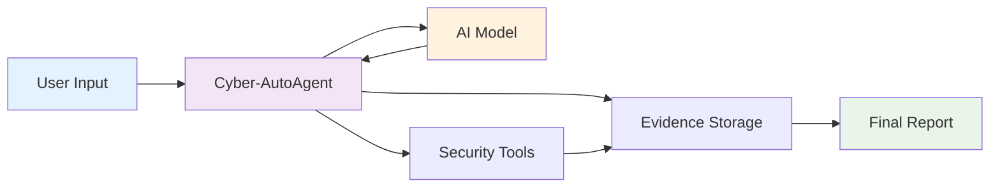
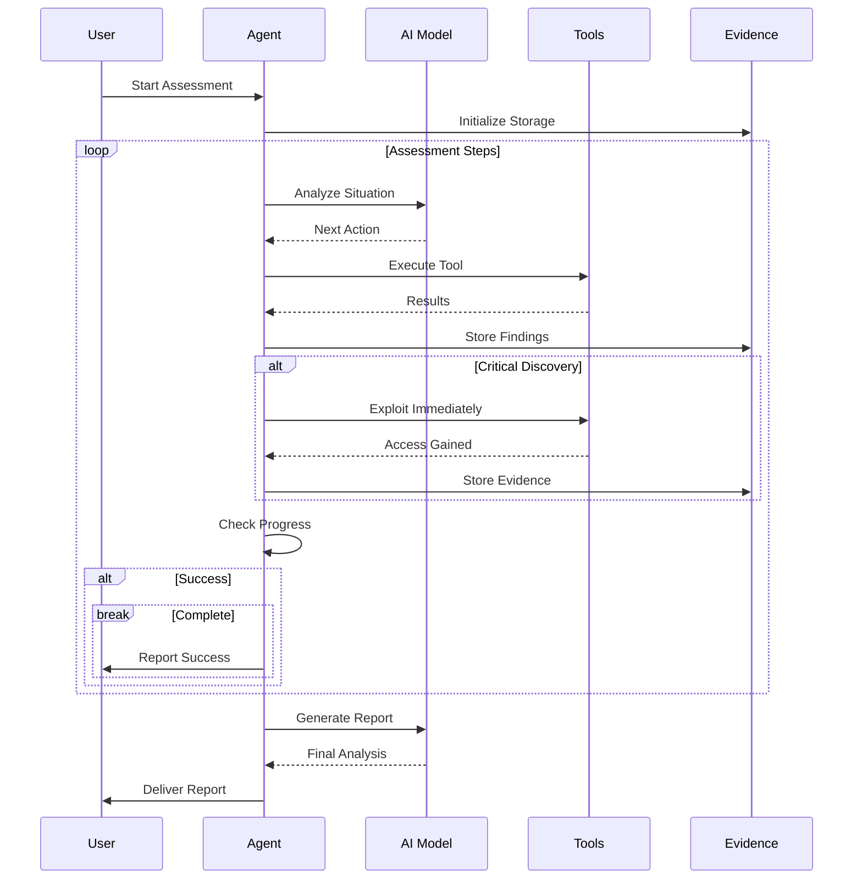
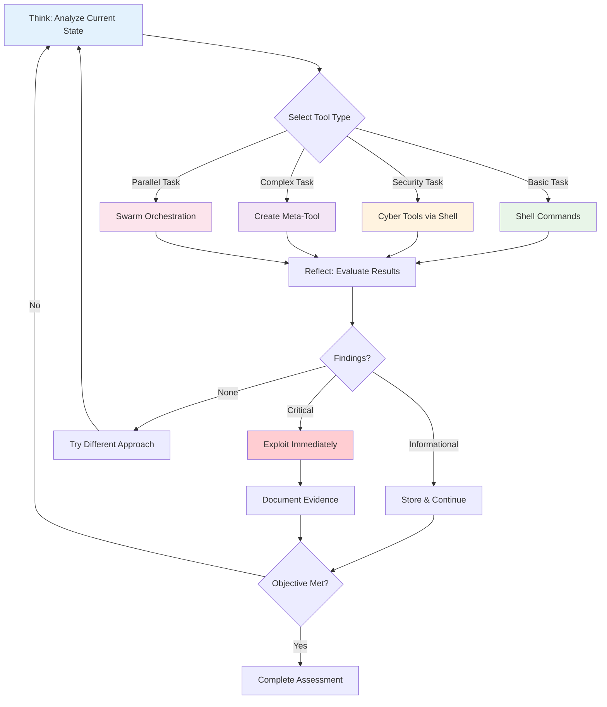

# Cyber-AutoAgent

```
 ██████╗██╗   ██╗██████╗ ███████╗██████╗ 
██╔════╝╚██╗ ██╔╝██╔══██╗██╔════╝██╔══██╗
██║      ╚████╔╝ ██████╔╝█████╗  ██████╔╝
██║       ╚██╔╝  ██╔══██╗██╔══╝  ██╔══██╗
╚██████╗   ██║   ██████╔╝███████╗██║  ██║
 ╚═════╝   ╚═╝   ╚═════╝ ╚══════╝╚═╝  ╚═╝

█████╗ ██╗   ██╗████████╗ ██████╗  █████╗  ██████╗ ███████╗███╗   ██╗████████╗
██╔══██╗██║   ██║╚══██╔══╝██╔═══██╗██╔══██╗██╔════╝ ██╔════╝████╗  ██║╚══██╔══╝
███████║██║   ██║   ██║   ██║   ██║███████║██║  ███╗█████╗  ██╔██╗ ██║   ██║   
██╔══██║██║   ██║   ██║   ██║   ██║██╔══██║██║   ██║██╔══╝  ██║╚██╗██║   ██║   
██║  ██║╚██████╔╝   ██║   ╚██████╔╝██║  ██║╚██████╔╝███████╗██║ ╚████║   ██║   
╚═╝  ╚═╝ ╚═════╝    ╚═╝    ╚═════╝ ╚═╝  ╚═╝ ╚═════╝ ╚══════╝╚═╝  ╚═══╝   ╚═╝   
```

<div align="center">


**[!] EXPERIMENTAL SOFTWARE - USE ONLY IN AUTHORIZED, SAFE, SANDBOXED ENVIRONMENTS [!]**

<h3>Proactive Cybersecurity Autonomous Agent Powered by AI</h3>

<p>
  <strong>Cyber-AutoAgent</strong> is a proactive security assessment tool that autonomously conducts intelligent penetration testing with natural language reasoning, dynamic tool selection, and evidence collection using AWS Bedrock or local Ollama models with the Strands framework.
</p>

[](https://hub.docker.com/r/cyberautoagent/cyber-autoagent)
[](https://www.python.org)
[](https://aws.amazon.com/bedrock/)
[](https://ollama.ai)

</div>

---


<div align="center">
  <em>Cyber-AutoAgent in action - Autonomous security assessment with AI reasoning</em>
</div>

---

## Table of Contents

- [Important Disclaimer](#important-disclaimer)
- [Features](#features)
- [Architecture](#architecture)
- [Model Providers](#model-providers)
- [Installation & Deployment](#installation--deployment)
- [Quick Start](#quick-start)
- [Development & Testing](#development--testing)
- [Troubleshooting](#troubleshooting)
- [Contributing](#contributing)
- [License](#license)

---

## Quick Start

```bash
# Using Docker (Recommended)
docker run --rm \
  -v ~/.aws:/home/cyberagent/.aws:ro \
  -v $(pwd)/evidence:/app/evidence \
  cyber-autoagent \
  --target "http://testphp.vulnweb.com" \
  --objective "Identify SQL injection vulnerabilities"

# Using Python
git clone https://github.com/cyber-autoagent/cyber-autoagent.git
cd cyber-autoagent
pip install -e .
python src/cyberautoagent.py --target "192.168.1.100" --objective "Comprehensive security assessment"
```

## Important Disclaimer

**THIS TOOL IS FOR EDUCATIONAL AND AUTHORIZED SECURITY TESTING PURPOSES ONLY.**

- [+] Use only on systems you own or have explicit written permission to test
- [+] Deploy in safe, sandboxed environments isolated from production systems  
- [+] Ensure compliance with all applicable laws and regulations
- [-] Never use on unauthorized systems or networks
- [-] Users are fully responsible for legal and ethical use

## Features

- **Autonomous Operation**: Conducts security assessments with minimal human intervention
- **Intelligent Tool Selection**: Automatically chooses appropriate security tools (nmap, sqlmap, nikto, etc.)
- **Natural Language Reasoning**: Uses Strands framework with metacognitive architecture
- **Evidence Collection**: Automatically stores findings with Mem0 memory (category="finding")
- **Meta-Tool Creation**: Dynamically creates custom exploitation tools when needed
- **Adaptive Execution**: Metacognitive assessment guides strategy based on confidence levels
- **Professional Reporting**: Generates comprehensive assessment reports
- **Swarm Intelligence**: Deploy parallel agents with shared memory for complex tasks

## Architecture

### System Architecture



**Key Components:**
- User provides target and objectives via command line
- Agent orchestrates assessment using AI reasoning
- Security tools execute scans and exploits
- Evidence system stores and analyzes findings

### Assessment Execution Flow



**Execution Pattern:**
- Agent continuously analyzes situation and selects appropriate tools
- Critical discoveries trigger immediate exploitation attempts
- All findings stored as evidence for final analysis
- Assessment completes when objectives met or budget exhausted

### Metacognitive Assessment Cycle



**Metacognitive Process:**

***Design Philosophy: Meta-Everything Architecture***

At the core of Cyber-AutoAgent is a "meta-everything" design philosophy that enables dynamic adaptation and scaling:

- **Meta-Agent**: The swarm capability deploys dynamic agents as tools, each tailored for specific subtasks with their own reasoning loops
- **Meta-Tooling**: Through the editor and load_tool capabilities, the agent can create, modify, and deploy new tools at runtime to address novel challenges
- **Meta-Learning**: Continuous memory storage and retrieval enables cross-session learning, building expertise over time
- **Meta-Cognition**: Self-reflection and confidence assessment drives strategic decisions about tool selection and approach (Note: This aspect is still being expanded for deeper reasoning capabilities)

This meta-architecture allows the system to transcend static tool limitations and evolve its capabilities during execution.

**Process Flow:**
- **Assess Confidence**: Evaluate current knowledge and confidence level (High >80%, Medium 50-80%, Low <50%)
- **Adaptive Strategy**: 
  - High confidence → Use specialized tools directly
  - Medium confidence → Deploy swarm for parallel exploration
  - Low confidence → Gather more information, try alternatives
- **Execute**: Tool hierarchy based on confidence:
  - Professional security tools for known vulnerabilities (sqlmap, nikto, nmap)
  - Swarm deployment when multiple approaches needed (with memory access)
  - Parallel shell for rapid reconnaissance (up to 7 commands)
  - Meta-tool creation only when no existing tool suffices
- **Learn & Store**: Store findings with category="finding" for memory persistence

**Tool Selection Hierarchy (Confidence-Based):**
1. Specialized cyber tools (sqlmap, nikto, metasploit) - when vulnerability type is known
2. Swarm deployment - when confidence <70% or need multiple perspectives (includes memory)
3. Parallel shell execution - for rapid multi-command reconnaissance
4. Meta-tool creation - only for novel exploits when existing tools fail

## Model Providers

Cyber-AutoAgent supports two model providers for maximum flexibility:

### Remote Mode (AWS Bedrock)
- **Best for**: Production use, high-quality results, no local GPU requirements
- **Requirements**: AWS account with Bedrock access
- **Default Model**: Claude Sonnet 4 (us.anthropic.claude-sonnet-4-20250514-v1:0)
- **Benefits**: Latest models, reliable performance, managed infrastructure

### Local Mode (Ollama)
- **Best for**: Privacy, offline use, cost control, local development
- **Requirements**: Local Ollama installation
- **Default Models**: `llama3.2:3b` (LLM), `mxbai-embed-large` (embeddings)
- **Alternative Models**: `llama3.1:8b` (better reasoning), `qwen2.5:7b` (more efficient)
- **Benefits**: No cloud dependencies, complete privacy, no API costs

### Comparison

| Feature | Remote (AWS Bedrock) | Local (Ollama) |
|---------|---------------------|----------------|
| Cost | Pay per API call | One-time setup |
| Performance | High (managed) | Depends on hardware |
| Offline Use | No | Yes |
| Setup Complexity | Moderate | Higher |
| Model Quality | Highest | Low |

## Installation & Deployment

### Prerequisites

**Remote Mode (AWS Bedrock)**
```bash
# Configure AWS credentials
aws configure
# Or set environment variables:
export AWS_ACCESS_KEY_ID=your_key
export AWS_SECRET_ACCESS_KEY=your_secret
export AWS_REGION=your_region
```

**Local Mode (Ollama)**
```bash
# Install Ollama
curl -fsSL https://ollama.ai/install.sh | sh

# Start service and pull models
ollama serve
ollama pull llama3.2:3b
ollama pull mxbai-embed-large
```

### Docker Deployment (Recommended)

```bash
# Clone repository
git clone https://github.com/cyber-autoagent/cyber-autoagent.git
cd cyber-autoagent

# Build image
docker build -t cyber-autoagent .

# Run with AWS credentials (using volume mount)
docker run --rm \
  -v ~/.aws:/home/cyberagent/.aws:ro \
  -v $(pwd)/evidence:/app/evidence \
  -v $(pwd)/logs:/app/logs \
  cyber-autoagent \
  --target "http://testphp.vulnweb.com" \
  --objective "Identify vulnerabilities"

# Using environment variables
docker run --rm \
  -e AWS_ACCESS_KEY_ID=${AWS_ACCESS_KEY_ID} \
  -e AWS_SECRET_ACCESS_KEY=${AWS_SECRET_ACCESS_KEY} \
  -e AWS_REGION=${AWS_REGION:-us-east-1} \
  -v $(pwd)/evidence:/app/evidence \
  -v $(pwd)/logs:/app/logs \
  cyber-autoagent \
  --target "http://testphp.vulnweb.com" \
  --objective "Identify vulnerabilities" \
  --iterations 50
```

### Local Installation

```bash
# Clone repository
git clone https://github.com/cyber-autoagent/cyber-autoagent.git
cd cyber-autoagent

# Create virtual environment
python -m venv venv
source venv/bin/activate  # On Windows: venv\Scripts\activate

# Install dependencies
pip install -e .

# Optional: Install security tools
sudo apt install nmap nikto sqlmap gobuster  # Debian/Ubuntu
brew install nmap nikto sqlmap gobuster      # macOS

# Run
python src/cyberautoagent.py \
  --target "http://testphp.vulnweb.com" \
  --objective "Comprehensive security assessment"
```

### Data Storage

| Data Type | Location |
|-----------|----------|
| Evidence  | `./evidence/evidence_OP_*` |
| Logs      | `./logs/cyber_operations.log` |
| Reports   | `./evidence/evidence_OP_*/` |

Directories are created automatically on first run.

### Command-Line Arguments

**Required Arguments**:
- `--objective`: Security assessment objective
- `--target`: Target system/network to assess (ensure you have permission!)

**Optional Arguments**: 
- `--server`: Model provider - `remote` (AWS Bedrock) or `local` (Ollama), default: remote
- `--iterations`: Maximum tool executions before stopping, default: 100
- `--model`: Model ID to use (default: remote=claude-sonnet, local=llama3.2:3b)
- `--region`: AWS region for Bedrock, default: us-east-1
- `--verbose`: Enable verbose output with detailed debug logging
- `--confirmations`: Enable tool confirmation prompts (default: disabled)
- `--memory-path`: Path to existing FAISS memory store to load past memories
- `--keep-memory`: Keep memory data after operation completes (default: remove)

### Usage Examples

```bash
# Local Mode (Ollama)
python src/cyberautoagent.py \
  --server local \
  --target "192.168.1.100" \
  --objective "Web vulnerability assessment"

# With custom model and region
python src/cyberautoagent.py \
  --server remote \
  --target "example.com" \
  --objective "Find SQL injection vulnerabilities" \
  --model "us.anthropic.claude-sonnet-4-20250514-v1:0" \
  --region "us-west-2"
```

## Configuration

### Environment Variables

```bash
# AWS Bedrock (Remote Mode)
export AWS_ACCESS_KEY_ID=your_key
export AWS_SECRET_ACCESS_KEY=your_secret
export AWS_REGION=us-east-1

# Ollama (Local Mode)
export OLLAMA_HOST=http://localhost:11434  # Optional

# Memory Storage (Optional)
export MEM0_API_KEY=your_key               # Mem0 Platform
export OPENSEARCH_HOST=your-host.com       # OpenSearch
```

## Development & Testing

### Running Tests

This project uses `uv` for dependency management and testing:

```bash
# Run all tests
uv run pytest

# Run specific test file
uv run pytest tests/test_agent.py

# Run tests with verbose output
uv run pytest -v

# Run tests with coverage
uv run pytest --cov=src
```

## Project Structure

```
cyber-autoagent/
|- src/
|  |- cyberautoagent.py       # Main entry point
|  |- modules/
|     |- __init__.py         # Module initialization
|     |- utils.py            # UI utilities and analysis functions
|     |- environment.py      # Environment setup and tool discovery
|     |- system_prompts.py   # System prompt templates 
|     |- agent_handlers.py   # Core agent callback handlers
|     |- agent.py            # Agent creation and configuration
|- pyproject.toml              # Project configuration
|- README.md                   # This file
|- LICENSE                     # MIT License
```

## Troubleshooting

### Common Issues

#### AWS Credentials Not Found
```bash
# Configure AWS CLI
aws configure

# Or set environment variables
export AWS_ACCESS_KEY_ID=your_key
export AWS_SECRET_ACCESS_KEY=your_secret
export AWS_REGION=us-east-1
```

#### Model Access Denied
```bash
# Request model access in AWS Console
# Navigate to: Amazon Bedrock > Model access > Request model access
```

#### Memory System Errors
```bash
# For local FAISS backend (default)
pip install faiss-cpu  # or faiss-gpu for CUDA

# For Mem0 Platform
export MEM0_API_KEY=your_api_key

# For OpenSearch backend
export OPENSEARCH_HOST=your_host
export AWS_REGION=your_region

# Check memory storage location
ls -la ./mem0_faiss_OP_*/
```

#### Tool Not Found Errors
```bash
# Install missing security tools
sudo apt install nmap nikto sqlmap gobuster  # Debian/Ubuntu
brew install nmap nikto sqlmap gobuster      # macOS
```

#### Ollama Issues (Local Mode)

**Ollama Server Not Running**
```bash
# Start Ollama service
ollama serve

# Check if running
curl http://localhost:11434/api/version
```

**Required Models Missing**
```bash
# Pull required models
ollama pull llama3.2:3b
ollama pull mxbai-embed-large

# List available models
ollama list
```

**Connection Errors**
```bash
# Check Ollama is accessible
curl -X POST http://localhost:11434/api/generate \
  -H "Content-Type: application/json" \
  -d '{"model": "llama3.2:3b", "prompt": "test", "stream": false}'
```

**Docker Networking (Local Mode)**
Cyber-AutoAgent automatically detects the correct Ollama host for your environment:

```bash
# Ensure Ollama is running on your host
ollama serve

# Test connection from host
curl http://localhost:11434/api/version
```


**Performance Issues**
```bash
# Monitor resource usage
htop  # Check CPU/Memory during execution

# For better performance, consider:
# - Using smaller models (e.g., llama3.1:8b instead of 70b)
# - Allocating more RAM to Ollama
# - Using GPU acceleration if available
```

## Contributing

1. Fork the repository
2. Create a feature branch (`git checkout -b feature/amazing-feature`)
3. Commit your changes (`git commit -m 'Add amazing feature'`)
4. Push to the branch (`git push origin feature/amazing-feature`)
5. Open a Pull Request

## License

This project is licensed under the MIT License - see the [LICENSE](LICENSE) file for details.

## Legal Notice

This tool is provided for educational and authorized security testing purposes only. Users are solely responsible for ensuring they have proper authorization before testing any systems. The authors assume no liability for misuse or any damages that may result from using this software.

## Acknowledgments

- [Strands Framework](https://github.com/anthropics/strands) - Agent orchestration & swarm intelligence
- [AWS Bedrock](https://aws.amazon.com/bedrock/) - Foundation model access
- [Ollama](https://ollama.ai) - Local model inference
- [Mem0](https://github.com/mem0ai/mem0) - Advanced memory management with FAISS/OpenSearch/Platform backends
---

**Remember: With great power comes great responsibility. Use this tool ethically and legally.**
