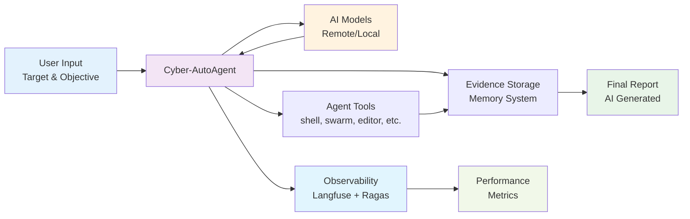
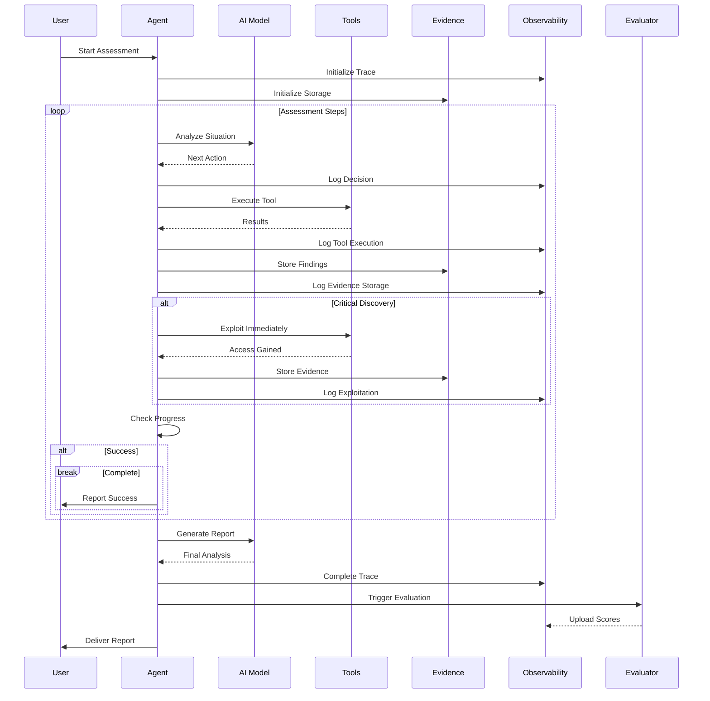
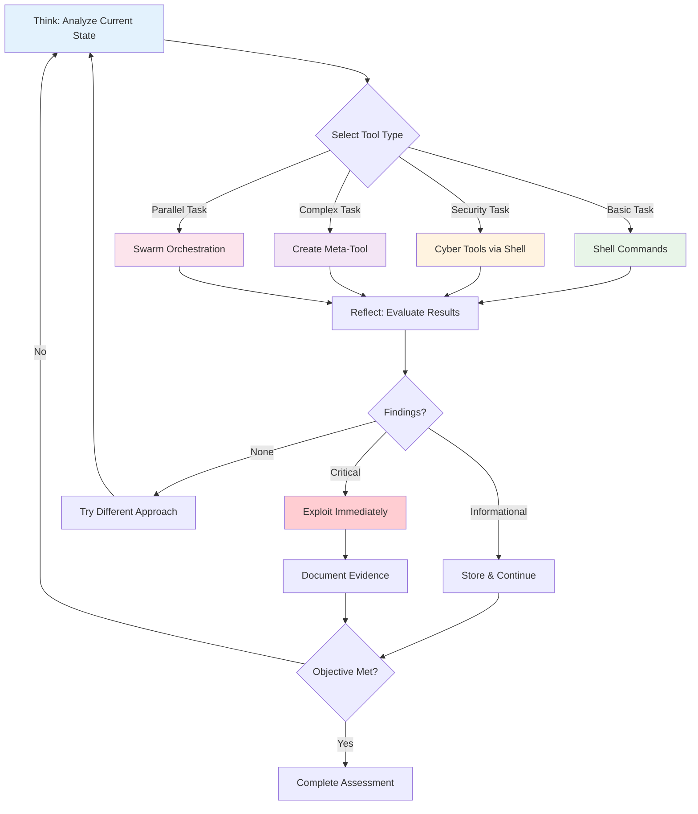

<div align="center">


**[!] EXPERIMENTAL SOFTWARE - USE ONLY IN AUTHORIZED, SAFE, SANDBOXED ENVIRONMENTS [!]**

# ⚠️ PROJECT ARCHIVED

Cyber-AutoAgent started as an experimental side project to explore autonomous offensive security agents and black box pentesting. After achieving 85% on the XBOW valdiation benchmark and building an engaged community, it became clear this work requires dedicated full-time focus to reach production-grade maturity.

Due to time constraints with other commitments, I've made the decision to archive this repository rather than let it stagnate with sporadic updates.

Thanks to everyone who contributed, tested, and supported this experiment. Keep pushing the boundaries of what's possible with agentic AI in cybersecurity. 

<p>
  <strong>Cyber-AutoAgent</strong> is a proactive security assessment tool that autonomously conducts intelligent penetration testing with natural language reasoning, dynamic tool selection, and evidence collection using AWS Bedrock, Litellm or local Ollama models with the core Strands framework.
</p>

[](https://hub.docker.com/r/cyberautoagent/cyber-autoagent)
[](https://www.python.org)
[](https://aws.amazon.com/bedrock/)
[](https://ollama.ai)
[](https://discord.gg/WNHhsnkTc3)

</div>

---


<div align="center">
  <em>Cyber-AutoAgent in action - Autonomous security operations with AI reasoning</em>
</div>

---

## Table of Contents

- [Important Disclaimer](#important-disclaimer)
- [Quick Start](#quick-start)
- [Documentation](#documentation)
- [Features](#features)
- [Architecture](#architecture)
- [Model Providers](#model-providers)
- [Observability](#observability)
- [Installation & Deployment](#installation--deployment)
- [Configuration](#configuration)
- [Development & Testing](#development--testing)
- [Troubleshooting](#troubleshooting)
- [Contributing](#contributing)
- [License](#license)

## Important Disclaimer

**THIS TOOL IS FOR EDUCATIONAL AND AUTHORIZED SECURITY TESTING PURPOSES ONLY.**

| Requirement | Description |
|-------------|-------------|
| Authorization | Use only on systems you own or have explicit written permission to test |
| Legal Compliance | Ensure compliance with all applicable laws and regulations |
| Sandboxed Environment | Deploy in safe, sandboxed environments isolated from production systems |
| Responsibility | Never use on unauthorized systems or networks - users are fully responsible for legal and ethical use |

## Quick Start

The React-based terminal interface is now the **default UI**, providing interactive configuration, real-time operation monitoring, and guided setup in all deployment modes.

### Local Development - Recommended

```bash
# Clone and setup
git clone https://github.com/westonbrown/Cyber-AutoAgent.git
cd Cyber-AutoAgent

# Build React terminal interface
cd src/modules/interfaces/react
npm install
npm run build

# Run interactive terminal (guided setup on first launch)
npm start

# Or run directly with parameters
node dist/index.js \
  --target "http://testphp.vulnweb.com" \
  --objective "Security assessment" \
  --auto-run
```

The React terminal will automatically spawn the Python agent as a subprocess and guide you through configuration on first launch.

> **[Complete User Guide](docs/user-instructions.md)** - Detailed setup, configuration, operation modules, troubleshooting, and examples

### Docker Deployment

#### Single Container

```bash
# Interactive mode with React terminal
docker run -it --rm \
  -e AWS_ACCESS_KEY_ID=${AWS_ACCESS_KEY_ID} \
  -e AWS_SECRET_ACCESS_KEY=${AWS_SECRET_ACCESS_KEY} \
  -e AWS_REGION=${AWS_REGION:-us-east-1} \
  -v $(pwd)/outputs:/app/outputs \
  cyber-autoagent

# Or start directly with parameters
docker run -it --rm \
  -e AWS_ACCESS_KEY_ID=${AWS_ACCESS_KEY_ID} \
  -e AWS_SECRET_ACCESS_KEY=${AWS_SECRET_ACCESS_KEY} \
  -e AWS_REGION=${AWS_REGION:-us-east-1} \
  -v $(pwd)/outputs:/app/outputs \
  cyber-autoagent \
  --target "http://testphp.vulnweb.com" \
  --objective "Identify SQL injection vulnerabilities" \
  --auto-run
```

#### Docker Compose (Full Stack with Observability)

**Setup:** Create `.env` file in project root with your configuration:

```bash
# Copy example and configure
cp .env.example .env
# Edit .env with your provider settings
```

Example `.env` for LiteLLM:
```bash
CYBER_AGENT_PROVIDER=litellm
CYBER_AGENT_LLM_MODEL=gemini/gemini-2.5-flash
GEMINI_API_KEY=your_api_key_here
```

**Run assessments** with the full observability stack:

```bash
# Run with React terminal UI and full observability
docker compose -f docker/docker-compose.yml run --rm cyber-autoagent

# With root access for dynamic tool installation
docker compose -f docker/docker-compose.yml run --user root --rm cyber-autoagent
```

**Note:** The `.env` file in the project root is automatically loaded by docker-compose.

The compose stack automatically provides:
- **Langfuse observability** at http://localhost:3000 (login: admin@cyber-autoagent.com / changeme)
- **Persistent databases** (PostgreSQL, ClickHouse, Redis, MinIO)
- **Network access** to challenge containers
- **React terminal UI** as the default interface

## Documentation

- **[User Guide](docs/user-instructions.md)** - Complete usage, configuration, and examples
- **[Agent Architecture](docs/architecture.md)** - Strands framework, tools, and metacognitive design
- **[Memory System](docs/memory.md)** - Mem0 backends, storage, and evidence management
- **[Observability & Evaluation](docs/observability-evaluation.md)** - Langfuse tracing, Ragas metrics, and performance monitoring
- **[Deployment Guide](docs/deployment.md)** - Docker, Kubernetes, and production setup
- **[Terminal Frontend](docs/terminal-frontend.md)** - React interface architecture and event protocol
- **[Prompt Management](docs/prompt_management.md)** - Module system and prompt loading

## Features

- **Autonomous Operation**: Conducts security assessments with minimal human intervention
- **Intelligent Tool Selection**: Automatically chooses appropriate security tools (nmap, sqlmap, nikto, etc.)
- **Natural Language Reasoning**: Uses Strands framework with metacognitive architecture
- **Evidence Collection**: Automatically stores findings with Mem0 memory (category="finding")
- **Meta-Tool Creation**: Dynamically creates custom exploitation tools when needed
- **Adaptive Execution**: Metacognitive assessment guides strategy based on confidence levels
- **Assessment Reporting**: Generates comprehensive reports with findings and remediation
- **Swarm Intelligence**: Deploy parallel agents with shared memory for complex tasks
- **Real-Time Monitoring**: React interface displays live agent reasoning and tool execution
- **Observability**: Built-in Langfuse tracing and Ragas evaluation metrics

## Architecture

> **[Full Architecture Guide](docs/architecture.md)** - Complete technical deep dive into Strands framework, tools, and metacognitive design

### System Architecture



**Key Components:**
- **User Interface**: React-based terminal interface or command-line with target and objective specification
- **Agent Core**: Strands framework orchestration with metacognitive reasoning and tool selection
- **AI Models**: GenAI tool use models (AWS Bedrock remote) or local models (Ollama)
- **Security Tools**: Pentesting tools (nmap, sqlmap, nikto, metasploit, custom tools, etc.)
- **Evidence Storage**: Persistent memory with FAISS, OpenSearch, or Mem0 Platform backends
- **Observability**: Real-time tracing with Langfuse and automated evaluation with Ragas metrics

### Assessment Execution Flow



**Enhanced Execution Pattern:**
- **Real-time Monitoring**: Every action traced for complete visibility
- **Intelligent Analysis**: Agent continuously analyzes situation using metacognitive reasoning
- **Dynamic Tool Selection**: Chooses appropriate tools based on confidence and findings
- **Evidence Collection**: All discoveries stored in persistent memory with categorization
- **Immediate Exploitation**: Critical vulnerabilities trigger immediate exploitation attempts
- **Automated Evaluation**: System scores tool selection, evidence quality, and methodology
- **Report Generation**: Final analysis combines findings with performance metrics

### Metacognitive Assessment Cycle



**Metacognitive Process:**

***Design Philosophy: Meta-Everything Architecture***

At the core of Cyber-AutoAgent is a "meta-everything" design philosophy that enables dynamic adaptation and scaling:

- **Meta-Agent**: The swarm capability deploys dynamic agents as tools, each tailored for specific subtasks with their own reasoning loops
- **Meta-Tooling**: Through the editor and load_tool capabilities, the agent can create, modify, and deploy new tools at runtime to address novel challenges
- **Meta-Learning**: Continuous memory storage and retrieval enables cross-session learning, building expertise over time
- **Meta-Cognition**: Self-reflection and confidence assessment drives strategic decisions about tool selection and approach

This meta-architecture allows the system to transcend static tool limitations and evolve its capabilities during execution.

**Process Flow:**
- **Assess Confidence**: Evaluate current knowledge and confidence level (High >80%, Medium 50-80%, Low <50%)
- **Adaptive Strategy**:
  - High confidence: Use specialized tools directly
  - Medium confidence: Deploy swarm for parallel exploration
  - Low confidence: Gather more information, try alternatives
- **Execute**: Tool hierarchy based on confidence:
  - Specialized security tools for known vulnerabilities (sqlmap, nikto, nmap)
  - Swarm deployment when multiple approaches needed (with memory access)
  - Parallel shell for rapid reconnaissance (up to 7 commands)
  - Meta-tool creation only when no existing tool suffices
- **Learn & Store**: Store findings with category="finding" for memory persistence

**Tool Selection Hierarchy (Confidence-Based):**
1. Specialized cyber tools (sqlmap, nikto, metasploit) - when vulnerability type is known
2. Swarm deployment - when confidence <70% or need multiple perspectives (includes memory)
3. Parallel shell execution - for rapid multi-command reconnaissance
4. Meta-tool creation - only for novel exploits when existing tools fail

## Model Providers

Cyber-AutoAgent supports multiple model providers for maximum flexibility:

### Bedrock Provider (Direct AWS)
- **Best for**: Production use, high-quality results, no local GPU requirements
- **Requirements**: AWS account with Bedrock access
- **Default Model**: Claude Sonnet 4.5 (claude-sonnet-4-5-20250929-v1:0)
- **Benefits**: Latest models, reliable performance, managed infrastructure

### Ollama Provider (Local)
- **Best for**: Privacy, offline use, cost control, local development
- **Requirements**: Local Ollama installation
- **Default Models**: `qwen3-coder:30b-a3b-q4_K_M` (LLM), `mxbai-embed-large` (embeddings)
- **Benefits**: No cloud dependencies, complete privacy, no API costs

### LiteLLM Provider (Universal)
- **Best for**: Multi-provider flexibility, unified interface
- **Requirements**: API keys for desired providers
- **Supported**: 100+ models from OpenAI, Anthropic, Cohere, Google, Azure, etc.
- **Benefits**: Switch providers easily, fallback support, unified API

### Comparison

| Feature | Bedrock | Ollama | LiteLLM |
|---------|---------|--------|----------|
| Cost | Pay per call | Free | Varies by provider |
| Performance | High | Hardware dependent | Provider dependent |
| Offline Use | No | Yes | No |
| Setup | Easy | Higher | Medium |
| Model Selection | 100+ models | Limited | 100+ models |

## Observability & Evaluation

> **[Complete Observability & Evaluation Guide](docs/observability-evaluation.md)** - Langfuse tracing, Ragas metrics, and automated performance evaluation

Cyber-AutoAgent includes **built-in observability and evaluation** using self-hosted Langfuse for tracing and Ragas for automated performance metrics. This provides complete visibility into agent operations and continuous assessment of cybersecurity effectiveness.

### Key Features

**Observability (Langfuse)**:
- **Complete operation traces**: Every penetration test operation is traced end-to-end
- **Tool execution timeline**: Visual timeline of nmap, sqlmap, nikto usage
- **Token usage metrics**: Track LLM token consumption and costs
- **Memory operations**: Monitor agent memory storage and retrieval patterns
- **Error tracking**: Failed tool executions and error analysis

**Evaluation (Ragas)**:
- **Tool Selection Accuracy**: How well the agent chooses appropriate cybersecurity tools
- **Evidence Quality**: Assessment of collected security findings and documentation
- **Answer Relevancy**: Alignment of agent actions with stated objectives
- **Context Precision**: Effective use of memory and tool outputs
- **Automated scoring**: Every operation receives performance metrics automatically

### Quick Start

When running with Docker Compose, observability and evaluation are enabled by default:

```bash
# Start with observability and evaluation
cd docker
docker-compose up -d

# Access Langfuse UI at http://localhost:3000
# Login: admin@cyber-autoagent.com / changeme

# Enable evaluation for your operations
export ENABLE_AUTO_EVALUATION=true
```

### Configuration

**Essential Environment Variables**:

| Variable | Default | Description |
|----------|---------|-------------|
| `ENABLE_OBSERVABILITY` | `true` | Enable/disable Langfuse tracing |
| `ENABLE_AUTO_EVALUATION` | `false` | Enable automatic Ragas evaluation |
| `LANGFUSE_HOST` | `http://langfuse-web:3000` | Langfuse server URL |
| `RAGAS_EVALUATOR_MODEL` | `us.anthropic.claude-3-5-sonnet-20241022-v2:0` | Model for evaluation |

### Evaluation Metrics

The system automatically evaluates four key metrics after each operation:

1. **Tool Selection Accuracy** (0.0-1.0): Strategic tool choice and sequencing
2. **Evidence Quality** (0.0-1.0): Comprehensive vulnerability documentation
3. **Answer Relevancy** (0.0-1.0): Alignment with security objectives
4. **Context Precision** (0.0-1.0): Effective use of previous findings

### Production Security

For production deployments, update security keys:

```bash
LANGFUSE_ENCRYPTION_KEY=$(openssl rand -hex 32)
LANGFUSE_SALT=$(openssl rand -hex 16)
LANGFUSE_ADMIN_PASSWORD=strong-password-here
```

## Installation & Deployment

> **[Complete Deployment Guide](docs/deployment.md)** - Docker, Kubernetes, production setup, and troubleshooting

### Prerequisites

**System Requirements**
- **Node.js**: Version 20+ required for React CLI interface
- **Python**: Version 3.10+ for local installation
- **Docker**: For containerized deployments
- **macOS Users**: Xcode Command Line Tools required

**React CLI Setup (Required for Interactive Mode)**
```bash
# Ensure Node.js 20+ is installed
node --version  # Should show v20.x.x or higher

# macOS users: Update Xcode tools if needed
sudo softwareupdate --install -a
sudo xcode-select --reset

# Install React CLI dependencies
cd src/modules/interfaces/react
npm install

# If installation fails, clear caches:
npm cache clean --force
rm -rf ~/.node-gyp
npm install
```

**Bedrock Provider**
```bash
# Option 1: Configure AWS credentials
aws configure
# Or set environment variables:
export AWS_ACCESS_KEY_ID=your_key
export AWS_SECRET_ACCESS_KEY=your_secret
export AWS_REGION=your_region

# Option 2: Use AWS Bedrock API key (bearer token)
export AWS_BEARER_TOKEN_BEDROCK=your_bearer_token
export AWS_REGION=your_region
```

> **Note**: Bearer token authentication is only supported with the native Bedrock provider. LiteLLM does not currently support AWS bearer tokens - use standard AWS credentials instead.

**LiteLLM Provider (Universal Gateway)**

LiteLLM supports 100+ model providers. Set the appropriate environment variables for your chosen provider:

```bash
# For OpenAI models (GPT-4, GPT-3.5, etc.)
export OPENAI_API_KEY=your_openai_key
# Usage: --model "openai/gpt-4"

# For Google models (Gemini)
export GEMINI_API_KEY=your_gemini_key
# Usage: --model "gemini/gemini-pro"

# For Azure OpenAI
export AZURE_API_KEY=your_azure_key
export AZURE_API_BASE=https://your-resource.openai.azure.com
export AZURE_API_VERSION=2024-02-15-preview
# Usage: --model "azure/your-deployment-name"

# For Hugging Face
export HUGGINGFACE_API_KEY=your_hf_key
# Usage: --model "huggingface/meta-llama/Llama-2-7b-chat-hf"
```

> **Important**: When using LiteLLM with Bedrock models, AWS bearer tokens (AWS_BEARER_TOKEN_BEDROCK) are NOT supported. Use standard AWS credentials only.

**Ollama Provider**
```bash
# Install Ollama
curl -fsSL https://ollama.ai/install.sh | sh

# Start service and pull models
ollama serve
ollama pull qwen3-coder:30b-a3b-q4_K_M
ollama pull mxbai-embed-large
```

### Docker Deployment (Recommended)

```bash
# Clone repository
git clone https://github.com/cyber-autoagent/cyber-autoagent.git
cd cyber-autoagent

# Build image
docker build -f docker/Dockerfile -t cyber-autoagent .

# Using environment variables
docker run --rm \
  -e AWS_ACCESS_KEY_ID=${AWS_ACCESS_KEY_ID} \
  -e AWS_SECRET_ACCESS_KEY=${AWS_SECRET_ACCESS_KEY} \
  -e AWS_BEARER_TOKEN_BEDROCK=${AWS_BEARER_TOKEN_BEDROCK} \
  -e AWS_REGION=${AWS_REGION:-us-east-1} \
  -v $(pwd)/outputs:/app/outputs \
  -v $(pwd)/tools:/app/tools \
  cyber-autoagent \
  --target "x.x.x.x" \
  --objective "Identify vulnerabilities" \
  --iterations 50
```

### Local Installation

```bash
# Clone repository
git clone https://github.com/cyber-autoagent/cyber-autoagent.git
cd cyber-autoagent

# Create virtual environment
python -m venv venv
source venv/bin/activate  # On Windows: venv\Scripts\activate

# Install Python dependencies
pip install -e .

# Install React CLI interface
cd src/modules/interfaces/react
npm install
cd ../../../..

# Optional: Install security tools (non-exhaustive list)
sudo apt install nmap nikto sqlmap gobuster  # Debian/Ubuntu
brew install nmap nikto sqlmap gobuster      # macOS

# Run with React CLI
cd src/modules/interfaces/react
npm start

# Or run Python directly
python src/cyberautoagent.py \
  --target "http://testphp.vulnweb.com" \
  --objective "Comprehensive security assessment"
```

### Data Storage

**Unified Output Structure** (default, enabled by `CYBER_AGENT_ENABLE_UNIFIED_OUTPUT=true`):
| Data Type | Location |
|-----------|----------|
| Evidence  | `./outputs/<target>/OP_<id>/` |
| Logs      | `./outputs/<target>/OP_<id>/logs/` |
| Reports   | `./outputs/<target>/OP_<id>/` |
| Tools     | `./tools/` |
| Utils     | `./outputs/<target>/OP_<id>/utils/` |
| Memory    | `./outputs/<target>/memory/` |

The unified structure organizes all artifacts under operation-specific directories with unique IDs (`OP_YYYYMMDD_HHMMSS`), making it easy to track and manage results from multiple assessment runs. All directories are created automatically.

### Command-Line Arguments

**Required Arguments**:
- `--objective`: Security assessment objective
- `--target`: Target system/network to assess (ensure you have permission!)

**Optional Arguments**:
- `--provider`: Model provider - `bedrock` (AWS), `ollama` (local), or `litellm` (universal), default: bedrock
- `--module`: Security module - `general` (web apps) or `ctf` (challenges), default: general
- `--iterations`: Maximum tool executions before stopping, default: 100
- `--model`: Model ID to use (default: remote=claude-sonnet-4-5, local=qwen3-coder:30b-a3b-q4_K_M)
- `--region`: AWS region for Bedrock, default: us-east-1
- `--verbose`: Enable verbose output with detailed debug logging
- `--confirmations`: Enable tool confirmation prompts (default: disabled)
- `--memory-path`: Path to existing memory store to load past memories
- `--memory-mode`: Memory initialization mode - `auto` (loads existing) or `fresh` (starts new), default: auto
- `--keep-memory`: Keep memory data after operation completes (default: true)
- `--output-dir`: Custom output directory (default: ./outputs)

### Usage Examples

```bash
# Basic Python Usage (Bedrock Provider)
python src/cyberautoagent.py \
  --target "http://testphp.vulnweb.com" \
  --objective "Find SQL injection vulnerabilities" \
  --provider bedrock \
  --iterations 50

# Using LiteLLM with OpenAI
export OPENAI_API_KEY=your_key
python src/cyberautoagent.py \
  --target "http://testphp.vulnweb.com" \
  --objective "Security assessment" \
  --provider litellm \
  --model "openai/gpt-4o"

# Docker with full observability, evaluation and root access (for package installation)
docker run --rm \
  --user root \
  --network cyber-autoagent_default \
  -e AWS_ACCESS_KEY_ID=${AWS_ACCESS_KEY_ID} \
  -e AWS_SECRET_ACCESS_KEY=${AWS_SECRET_ACCESS_KEY} \
  -e AWS_REGION=${AWS_REGION:-us-east-1} \
  -e LANGFUSE_HOST=http://langfuse-web:3000 \
  -e LANGFUSE_PUBLIC_KEY=cyber-public \
  -e LANGFUSE_SECRET_KEY=cyber-secret \
  -e ENABLE_AUTO_EVALUATION=true \
  -v $(pwd)/outputs:/app/outputs \
  -v $(pwd)/tools:/app/tools \
  cyber-autoagent:dev \
  --target "http://testphp.vulnweb.com" \
  --objective "Comprehensive SQL injection and XSS assessment" \
  --iterations 25
```

## Security

By default, the agent runs as a non-root user (`cyberagent`) for security. This limits the agent's ability to install additional tools on the fly during execution. If you need the agent to install packages dynamically, you can override this at container start:

```bash
# Small example, full command above
docker run --user root cyber-autoagent
```

**Note**: Running as root reduces security isolation but enables full system access for tool installation.

## Configuration

The agent uses a **centralized configuration system** defined in `src/modules/config/`. All settings can be customized through environment variables, with sensible defaults provided.

**Recent Improvements**:
- **Modular architecture** with organized agents/, config/, tools/, prompts/, and evaluation/ directories
- **Langfuse prompt management** for dynamic prompt loading and versioning
- **Unified output structure** for better organization (enabled by default)
- **Standardized paths** for logs, reports, and evidence collection
- **Enhanced memory management** with cross-operation persistence
- **Dedicated report agent** for improved report generation

Copy the example environment file and customize it for your needs:

```bash
cp .env.example .env
```

The `.env.example` file contains detailed configuration options with inline comments for all supported features including model providers, memory systems, and observability settings. Key environment variables include:

- `AWS_ACCESS_KEY_ID`, `AWS_SECRET_ACCESS_KEY`, `AWS_BEARER_TOKEN_BEDROCK`, `AWS_REGION` for remote mode (AWS Bedrock)
- `OLLAMA_HOST` for local mode (Ollama)
- `CYBER_AGENT_OUTPUT_DIR`, `CYBER_AGENT_ENABLE_UNIFIED_OUTPUT` for output management
- `LANGFUSE_PUBLIC_KEY`, `LANGFUSE_SECRET_KEY` for observability
- `MEM0_API_KEY` or `OPENSEARCH_HOST` for memory backends

See `.env.example` for complete configuration options and usage examples.

## Development & Testing

### Running Tests

This project uses `uv` for dependency management and testing:

```bash
# Run all tests
uv run pytest

# Run specific test file
uv run pytest tests/test_agent.py

# Run tests with verbose output
uv run pytest -v

# Run tests with coverage
uv run pytest --cov=src
```

## Project Structure

```
cyber-autoagent/
├── src/                       # Source code
│   ├── cyberautoagent.py      # Main entry point and CLI
│   └── modules/               # Core modules (modular architecture)
│       ├── agents/            # Agent implementations
│       │   ├── cyber_autoagent.py  # Main Strands agent creation
│       │   └── report_agent.py     # Dedicated report generation
│       ├── config/            # Configuration management
│       │   ├── manager.py     # Centralized configuration system
│       │   └── environment.py # Environment setup and validation
│       ├── tools/             # Tool implementations
│       │   └── memory.py      # Mem0 memory management tool
│       ├── prompts/           # Prompt management
│       │   ├── system.py      # AI prompts and configurations
│       │   └── manager.py     # Langfuse prompt management
│       ├── evaluation/        # Evaluation system
│       │   └── evaluation.py  # Ragas evaluation metrics
│       ├── handlers/          # Callback handling and UI utilities
│       │   ├── base.py        # Base classes and constants
│       │   ├── callback.py    # Main ReasoningHandler class
│       │   ├── display.py     # Result display formatting
│       │   ├── tools.py       # Tool execution handling
│       │   ├── reporting.py   # Report generation utilities
│       │   └── utils.py       # UI utilities and analysis
│       ├── interfaces/
│       │   └── react/         # React terminal interface
│       └── operation_plugins/ # Security modules (general, ctf)
├── docs/                      # Documentation
│   ├── architecture.md       # Agent architecture and tools
│   ├── memory.md             # Memory system (Mem0 backends)
│   ├── observability.md      # Langfuse monitoring setup
│   └── deployment.md         # Docker and production deployment
├── docker/                   # Docker deployment files
│   ├── docker-compose.yml    # Full stack (agent + Langfuse)
│   └── Dockerfile            # Agent container build
├── pyproject.toml            # Dependencies and project config
├── uv.lock                   # Dependency lockfile
├── .env.example              # Environment configuration template
├── outputs/                  # Unified output directory (auto-created)
│   └── <target>/            # Target-specific organization
│       ├── OP_<id>/        # Operation-specific files
│       │   ├── report.md   # Security findings (when generated)
│       │   ├── cyber_operations.log  # Operation log
│       │   ├── artifacts/  # Ad-hoc files
│       │   └── tools/      # Custom tools created by agent
│       └── memory/         # Cross-operation memory
│           ├── mem0.faiss
│           └── mem0.pkl
└── README.md                 # This file
```

### Key Files

| File | Purpose |
|------|---------|
| `src/cyberautoagent.py` | CLI entry point, observability setup |
| `src/modules/agents/cyber_autoagent.py` | Strands agent creation, model configuration |
| `src/modules/agents/report_agent.py` | Report generation agent |
| `src/modules/config/manager.py` | Centralized configuration system |
| `src/modules/tools/memory.py` | Unified Mem0 tool (FAISS/OpenSearch/Platform) |
| `src/modules/evaluation/evaluation.py` | Ragas evaluation system |
| `src/modules/prompts/system.py` | AI prompts and configurations |
| `src/modules/prompts/manager.py` | Langfuse prompt management |
| `.env.example` | Environment configuration template |
| `docker/docker-compose.yml` | Complete observability stack |
| `docker/Dockerfile` | Agent container build |
| `docs/architecture.md` | Technical architecture deep dive |

## Troubleshooting

### Common Issues

#### React CLI Installation Issues

**Node.js Version**
```bash
# Check Node.js version (must be 20+)
node --version

# Install Node.js 20+ via nvm
curl -o- https://raw.githubusercontent.com/nvm-sh/nvm/v0.39.0/install.sh | bash
nvm install 20
nvm use 20
```

**macOS Build Errors**
```bash
# Update Xcode Command Line Tools
sudo softwareupdate --install -a
sudo xcode-select --reset

# Clear npm and node-gyp caches
npm cache clean --force
rm -rf ~/.node-gyp

# Reinstall
cd src/modules/interfaces/react
npm install
```

**Linux Build Errors**
```bash
# Install build essentials
sudo apt-get update
sudo apt-get install build-essential python3-dev

# Clear caches and reinstall
npm cache clean --force
cd src/modules/interfaces/react
npm install
```

#### AWS Credentials Not Found
```bash
# Option 1: Configure AWS CLI
aws configure

# Option 2: Set traditional environment variables
export AWS_ACCESS_KEY_ID=your_key
export AWS_SECRET_ACCESS_KEY=your_secret
export AWS_REGION=us-east-1

# Option 3: Use AWS Bedrock API key (bearer token)
export AWS_BEARER_TOKEN_BEDROCK=your_bearer_token
export AWS_REGION=us-east-1
```

#### Model Access Denied
```bash
# Request model access in AWS Console
# Navigate to: Amazon Bedrock > Model access > Request model access
```

#### Memory System Errors

> **See [Memory System Guide](docs/memory.md)** for complete backend configuration and troubleshooting
```bash
# For local FAISS backend (default)
pip install faiss-cpu  # or faiss-gpu for CUDA

# For Mem0 Platform
export MEM0_API_KEY=your_api_key

# For OpenSearch backend
export OPENSEARCH_HOST=your_host
export AWS_REGION=your_region

# Check memory storage location
ls -la ./mem0_faiss_OP_*/
```

#### Tool Not Found Errors
```bash
# Install missing security tools
sudo apt install nmap nikto sqlmap gobuster  # Debian/Ubuntu
brew install nmap nikto sqlmap gobuster      # macOS
```

#### Ollama Issues (Local Mode)

**Ollama Server Not Running**
```bash
# Start Ollama service
ollama serve

# Check if running
curl http://localhost:11434/api/version
```

**Required Models Missing**
```bash
# Pull required models
ollama pull qwen3-coder:30b-a3b-q4_K_M
ollama pull mxbai-embed-large

# List available models
ollama list
```

**Connection Errors**
```bash
# Check Ollama is accessible
curl -X POST http://localhost:11434/api/generate \
  -H "Content-Type: application/json" \
  -d '{"model": "qwen3-coder:30b-a3b-q4_K_M", "prompt": "test", "stream": false}'
```

**Docker Networking (Local Mode)**
Cyber-AutoAgent automatically detects the correct Ollama host for your environment:

```bash
# Ensure Ollama is running on your host
ollama serve

# Test connection from host
curl http://localhost:11434/api/version
```


**Performance Issues**
```bash
# Monitor resource usage
htop  # Check CPU/Memory during execution

# For better performance, consider:
# - Using smaller models (e.g., llama3.1:8b instead of 70b)
# - Allocating more RAM to Ollama
# - Using GPU acceleration if available
```

## Contributing

1. Fork the repository
2. Create a feature branch (`git checkout -b feature/amazing-feature`)
3. Commit your changes (`git commit -m 'Add amazing feature'`)
4. Push to the branch (`git push origin feature/amazing-feature`)
5. Open a Pull Request

## License

This project is licensed under the MIT License - see the [LICENSE](LICENSE) file for details.

## Legal Notice

This tool is provided for educational and authorized security testing purposes only. Users are solely responsible for ensuring they have proper authorization before testing any systems. The authors assume no liability for misuse or any damages that may result from using this software.

## Acknowledgments

- [Strands Framework](https://github.com/anthropics/strands) - Agent orchestration & swarm intelligence
- [AWS Bedrock](https://aws.amazon.com/bedrock/) - Foundation model access
- [Ollama](https://ollama.ai) - Local model inference
- [Mem0](https://github.com/mem0ai/mem0) - Advanced memory management with FAISS/OpenSearch/Platform backends
---

**Remember: With great power comes great responsibility. Use this tool ethically and legally.**
