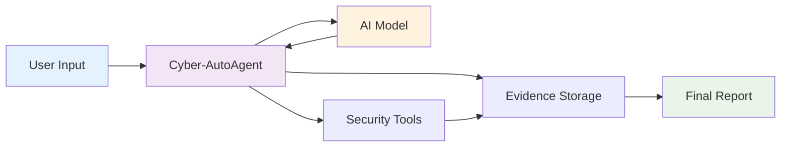
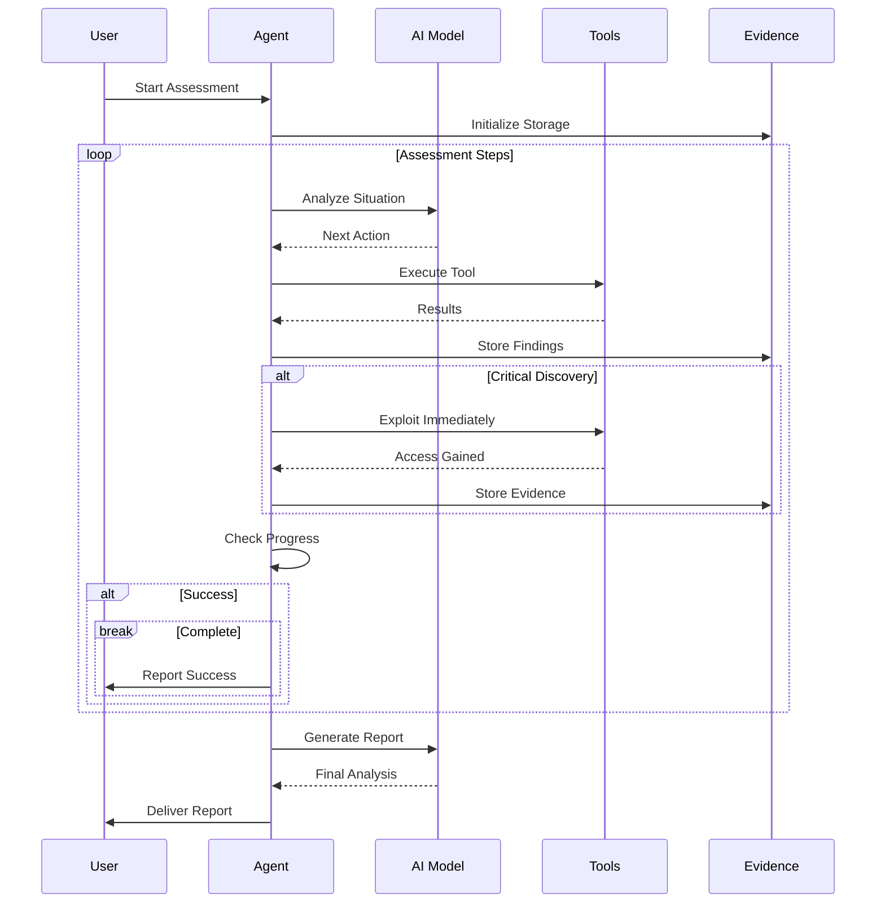
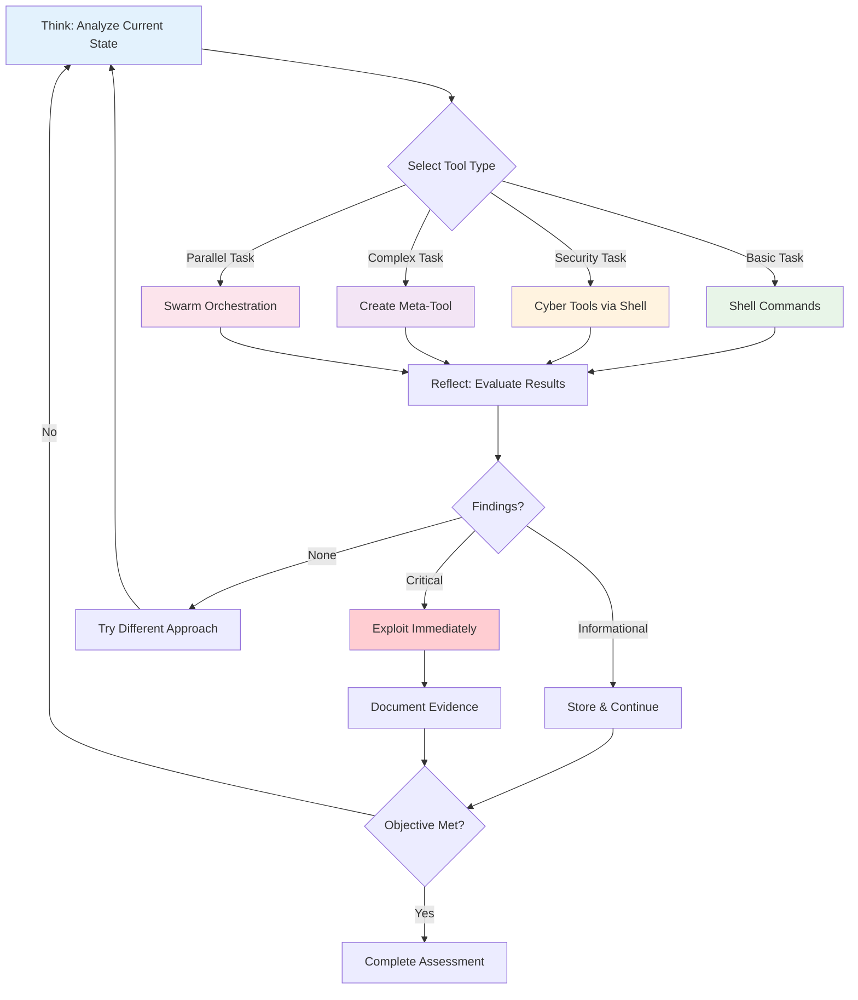

# Cyber-AutoAgent

```
 ██████╗██╗   ██╗██████╗ ███████╗██████╗ 
██╔════╝╚██╗ ██╔╝██╔══██╗██╔════╝██╔══██╗
██║      ╚████╔╝ ██████╔╝█████╗  ██████╔╝
██║       ╚██╔╝  ██╔══██╗██╔══╝  ██╔══██╗
╚██████╗   ██║   ██████╔╝███████╗██║  ██║
 ╚═════╝   ╚═╝   ╚═════╝ ╚══════╝╚═╝  ╚═╝

█████╗ ██╗   ██╗████████╗ ██████╗  █████╗  ██████╗ ███████╗███╗   ██╗████████╗
██╔══██╗██║   ██║╚══██╔══╝██╔═══██╗██╔══██╗██╔════╝ ██╔════╝████╗  ██║╚══██╔══╝
███████║██║   ██║   ██║   ██║   ██║███████║██║  ███╗█████╗  ██╔██╗ ██║   ██║   
██╔══██║██║   ██║   ██║   ██║   ██║██╔══██║██║   ██║██╔══╝  ██║╚██╗██║   ██║   
██║  ██║╚██████╔╝   ██║   ╚██████╔╝██║  ██║╚██████╔╝███████╗██║ ╚████║   ██║   
╚═╝  ╚═╝ ╚═════╝    ╚═╝    ╚═════╝ ╚═╝  ╚═╝ ╚═════╝ ╚══════╝╚═╝  ╚═══╝   ╚═╝   
```

**[!] EXPERIMENTAL SOFTWARE - USE ONLY IN AUTHORIZED, SAFE, SANDBOXED ENVIRONMENTS [!]**

An autonomous cybersecurity assessment tool powered by AI models (AWS Bedrock or local Ollama) and the Strands framework. Conducts intelligent penetration testing with natural language reasoning, tool selection, and evidence collection.


*Demo of Cyber-AutoAgent in action*

## 1. Important Disclaimer

**THIS TOOL IS FOR EDUCATIONAL AND AUTHORIZED SECURITY TESTING PURPOSES ONLY.**

- [+] Use only on systems you own or have explicit written permission to test
- [+] Deploy in safe, sandboxed environments isolated from production systems  
- [+] Ensure compliance with all applicable laws and regulations
- [-] Never use on unauthorized systems or networks
- [-] Users are fully responsible for legal and ethical use

## 2. Features

- **Autonomous Operation**: Conducts security assessments with minimal human intervention
- **Intelligent Tool Selection**: Automatically chooses appropriate security tools (nmap, sqlmap, nikto, etc.)
- **Natural Language Reasoning**: Uses Strands framework with metacognitive architecture
- **Evidence Collection**: Automatically stores findings with Mem0 memory (category="finding")
- **Meta-Tool Creation**: Dynamically creates custom exploitation tools when needed
- **Adaptive Execution**: Metacognitive assessment guides strategy based on confidence levels
- **Professional Reporting**: Generates comprehensive assessment reports
- **Swarm Intelligence**: Deploy parallel agents with shared memory for complex tasks

## 3. Architecture

### System Architecture



**Key Components:**
- User provides target and objectives via command line
- Agent orchestrates assessment using AI reasoning
- Security tools execute scans and exploits
- Evidence system stores and analyzes findings

### Assessment Execution Flow



**Execution Pattern:**
- Agent continuously analyzes situation and selects appropriate tools
- Critical discoveries trigger immediate exploitation attempts
- All findings stored as evidence for final analysis
- Assessment completes when objectives met or budget exhausted

### Metacognitive Assessment Cycle



**Metacognitive Process:**
- **Assess Confidence**: Evaluate current knowledge and confidence level (High >80%, Medium 50-80%, Low <50%)
- **Adaptive Strategy**: 
  - High confidence → Use specialized tools directly
  - Medium confidence → Deploy swarm for parallel exploration
  - Low confidence → Gather more information, try alternatives
- **Execute**: Tool hierarchy based on confidence:
  - Professional security tools for known vulnerabilities (sqlmap, nikto, nmap)
  - Swarm deployment when multiple approaches needed (with memory access)
  - Parallel shell for rapid reconnaissance (up to 7 commands)
  - Meta-tool creation only when no existing tool suffices
- **Learn & Store**: Store findings with category="finding" for memory persistence

**Tool Selection Hierarchy (Confidence-Based):**
1. Specialized cyber tools (sqlmap, nikto, metasploit) - when vulnerability type is known
2. Swarm deployment - when confidence <70% or need multiple perspectives (includes memory)
3. Parallel shell execution - for rapid multi-command reconnaissance
4. Meta-tool creation - only for novel exploits when existing tools fail

## 4. Model Providers

Cyber-AutoAgent supports two model providers for maximum flexibility:

### 🌐 Remote Mode (AWS Bedrock)
- **Best for**: Production use, high-quality results, no local GPU requirements
- **Requirements**: AWS account with Bedrock access
- **Default Model**: Claude Sonnet 4 (us.anthropic.claude-sonnet-4-20250514-v1:0)
- **Benefits**: Latest models, reliable performance, managed infrastructure

### 🏠 Local Mode (Ollama)
- **Best for**: Privacy, offline use, cost control, local development
- **Requirements**: Local Ollama installation
- **Default Models**: `llama3.2:3b` (LLM), `mxbai-embed-large` (embeddings)
- **Alternative Models** (while also providing same response structure and tools integration)
    - "llama3.1:8b" (better reasoning)
    - "qwen2.5:7b" (more efficient)
- **Benefits**: No cloud dependencies, complete privacy, no API costs

### Comparison

| Feature | Remote (AWS Bedrock) | Local (Ollama) |
|---------|---------------------|----------------|
| Cost | Pay per API call | One-time setup |
| Performance | High (managed) | Depends on hardware |
| Offline Use | ❌ No | ✅ Yes |
| Setup Complexity | Moderate | Higher |
| Model Quality | Highest | Low |

## 5. Installation & Deployment

Cyber-AutoAgent can be deployed in two ways: **locally** or using **Docker** (recommended for consistent environments).

### Prerequisites 

#### For Remote Mode (AWS Bedrock)
1. **AWS Account with Bedrock Access**
   ```bash
   # Configure AWS credentials
   aws configure
   # Or set environment variables:
   export AWS_ACCESS_KEY_ID=your_key
   export AWS_SECRET_ACCESS_KEY=your_secret
   export AWS_REGION=your_region
   ```

#### For Local Mode (Ollama)
1. **Install Ollama**
   ```bash
   # macOS / Linux
   curl -fsSL https://ollama.ai/install.sh | sh
   
   # Or download from https://ollama.ai
   ```

2. **Pull Required Models**
   ```bash
   # Start Ollama service
   ollama serve
   
   # Pull LLM and embedding models
   ollama pull llama3.2:3b
   ollama pull mxbai-embed-large
   ```

3. **Configure Ollama Connection (Optional)**
   ```bash
   # Override Ollama host (auto-detected by default)
   export OLLAMA_HOST=http://your-ollama-host:11434
   ```

   **Note**: Cyber-AutoAgent automatically detects the correct Ollama host by testing connectivity. If auto-detection fails, set `OLLAMA_HOST` manually. See section '### Environment Variables' for further information.

#### For Both Modes
**Clone the Repository**
```bash
git clone https://github.com/cyber-autoagent/cyber-autoagent.git
cd cyber-autoagent
```

---

### Option 1: Docker Deployment (Recommended)

**Best for:** Quick setup, consistent environment, all security tools pre-installed

1. **Prerequisites**
   - Docker installed ([Get Docker](https://docs.docker.com/get-docker/))
   - AWS credentials configured (see above)

2. **Build the Docker Image**
   ```bash
   docker build -t cyber-autoagent .
   ```

3. **Run with Docker**
   ```bash
   # Using environment variables
   docker run --rm \
     -e AWS_ACCESS_KEY_ID=${AWS_ACCESS_KEY_ID} \
     -e AWS_SECRET_ACCESS_KEY=${AWS_SECRET_ACCESS_KEY} \
     -e AWS_REGION=${AWS_REGION:-us-east-1} \
     -v $(pwd)/evidence:/app/evidence \
     -v $(pwd)/logs:/app/logs \
     cyber-autoagent \
     --target "http://testphp.vulnweb.com" \
     --objective "Identify vulnerabilities" \
     --iterations 50
   
   # Or using AWS credentials file
   docker run --rm \
     -v ~/.aws:/home/cyberagent/.aws:ro \
     -v $(pwd)/evidence:/app/evidence \
     -v $(pwd)/logs:/app/logs \
     cyber-autoagent \
     --target "http://testphp.vulnweb.com" \
     --objective "Identify vulnerabilities" \
     --iterations 50
   ```

4. **Using Docker Compose** (Alternative)
   ```bash
   # Start with docker-compose
   docker-compose up --build
   
   # Or run specific command
   docker-compose run --rm cyber-autoagent \
     --target "http://testphp.vulnweb.com" \
     --objective "Identify vulnerabilities" \
     --iterations 50
   ```

---

### Option 2: Local Installation

**Best for:** Development, debugging, or when Docker is not available

1. **System Requirements**
   - Python 3.9+ (`python --version`)
   - pip package manager

2. **Install Security Tools** (Optional but Recommended)
   ```bash
   # On Kali Linux / Debian / Ubuntu
   sudo apt update && sudo apt install -y nmap nikto sqlmap gobuster
   
   # On macOS with Homebrew
   brew install nmap nikto sqlmap gobuster
   
   # On other systems, install tools individually from their official sources
   ```

3. **Install Python Dependencies**
   ```bash
   # Create virtual environment (recommended)
   python -m venv venv
   source venv/bin/activate  # On Windows: venv\Scripts\activate
   
   # Install package
   pip install -e .
   
   # Install FAISS for memory storage
   pip install faiss-cpu  # or faiss-gpu for CUDA support
   ```

4. **Verify Installation**
   ```bash
   python src/cyberautoagent.py --help
   ```

5. **Run Locally**
   ```bash
   python src/cyberautoagent.py \
     --target "http://testphp.vulnweb.com" \
     --objective "Identify and demonstrate exploitable vulnerabilities" \
     --iterations 50
   ```

---

### Evidence & Log Storage

Both deployment methods store data in the same local directories:

| Data Type | Local Execution | Docker Execution | Local Directory |
|-----------|----------------|------------------|-----------------|
| Evidence  | `./evidence/evidence_OP_*` | `/app/evidence/evidence_OP_*` | `./evidence/` |
| Logs      | `./logs/cyber_operations.log` | `/app/logs/cyber_operations.log` | `./logs/` |
| Reports   | Saved in evidence directory | Saved in evidence directory | `./evidence/evidence_OP_*/` |

**Note:** Directories are created automatically on first run.

---

### Quick Start Examples

```bash
# Basic security assessment (Docker)
docker run --rm \
  -v ~/.aws:/home/cyberagent/.aws:ro \
  -v $(pwd)/evidence:/app/evidence \
  -v $(pwd)/logs:/app/logs \
  cyber-autoagent \
  --target "192.168.1.100" \
  --objective "Perform comprehensive security assessment" \
  --iterations 50

# Basic security assessment (Local)
python src/cyberautoagent.py \
  --target "192.168.1.100" \
  --objective "Perform comprehensive security assessment" \
  --iterations 50

# With custom model and verbose output
python src/cyberautoagent.py \
  --target "x.x.x.x" \
  --objective "Find SQL injection vulnerabilities" \
  --model "us.anthropic.claude-sonnet-4-20250514-v1:0" \
  --region "us-west-2" \
  --verbose
```

### Command-Line Arguments

#### Required Arguments
- `--objective`: Security assessment objective (what you want to achieve)
- `--target`: Target system/network to assess (ensure you have permission!)

#### Optional Arguments
- `--server`: Model provider - `remote` for AWS Bedrock, `local` for Ollama (default: remote)
- `--iterations`: Maximum tool executions before stopping (default: 100)
- `--verbose`: Enable verbose output with detailed debug logging
- `--model`: Model ID to use (default: remote=claude-sonnet-4, local=llama3.2:3b)
- `--region`: AWS region for Bedrock (default: us-east-1)
- `--confirmations`: Enable tool confirmation prompts (default: disabled for autonomous operation)

#### Usage Examples

**Remote Mode (AWS Bedrock)**
```bash
# Basic remote assessment
python src/cyberautoagent.py \
  --server remote \
  --target "192.168.1.100" \
  --objective "Comprehensive security assessment"

# With custom model
python src/cyberautoagent.py \
  --server remote \
  --target "example.com" \
  --objective "Find SQL injection vulnerabilities" \
  --model "us.anthropic.claude-sonnet-4-20250514-v1:0" \
  --region "us-west-2"
```

**Local Mode (Ollama)**
```bash
# Basic local assessment (fully offline)
python src/cyberautoagent.py \
  --server local \
  --target "192.168.1.100" \
  --objective "Comprehensive security assessment"

# With custom local model
python src/cyberautoagent.py \
  --server local \
  --target "testsite.local" \
  --objective "Web vulnerability assessment" \
  --model "llama3.1:8b"
```

**Note**: By default, tool confirmations are disabled to allow autonomous operation. Use `--confirmations` if you want to approve each tool execution manually.

## 5. Setting Up DVWA Test Target

For safe testing, we recommend using Damn Vulnerable Web Application (DVWA) as a hello world example when starting:

### Manual Setup

```bash
# Clone DVWA
git clone https://github.com/digininja/DVWA.git
cd DVWA

# Copy config
cp config/config.inc.php.dist config/config.inc.php

```

### Test Against DVWA

```bash
python src/cyberautoagent.py \
  --target "X.X.X.X" \
  --objective "Identify SQL injection vulnerabilities and extract database contents" \
  --iterations 30
```

## 6. Understanding the Output

### Step Execution Format
```
────────────────────────────────────────────────────────────────────────────────
Step 1/50: nmap
────────────────────────────────────────────────────────────────────────────────
↳ Running: nmap -sV -sC 192.168.1.100

Starting Nmap 7.94 ( https://nmap.org )
Nmap scan report for 192.168.1.100
Host is up (0.001s latency).
PORT     STATE SERVICE    VERSION
22/tcp   open  ssh        OpenSSH 8.2p1
80/tcp   open  http       Apache httpd 2.4.41
────────────────────────────────────────────────────────────────────────────────
```

### Evidence Collection
```
[*] Evidence Summary
────────────────────────────────────────────────────────────────────────────────

Categories:
   - vulnerability: 3 items
   - credential: 1 items
   - finding: 5 items

Recent Evidence:
   [1] vulnerability
       SQL injection in login parameter id (POST /login.php)
       ID: abc12345...
```

### Budget Management
- [1] **Abundant Budget (>20 steps)**: Standard methodology
- [2] **Constrained Budget (10-19 steps)**: Professional tools only  
- [3] **Critical Budget (5-9 steps)**: Exploitation-only mode
- [4] **Emergency Budget (<5 steps)**: Single high-impact attempt


### Environment Variables

#### AWS Configuration (Remote Mode)
```bash
export AWS_REGION=us-east-1
export AWS_PROFILE=default
export AWS_ACCESS_KEY_ID=your_key
export AWS_SECRET_ACCESS_KEY=your_secret
export DEV=true  # Set by agent automatically
```

#### Ollama Configuration (Local Mode)
```bash
# Ollama connection settings (optional - auto-detected by default)
export OLLAMA_HOST=http://localhost:11434     # Manual override if auto-detection fails
```

**Automatic Host Detection**: Cyber-AutoAgent tests connectivity to find the correct Ollama host:
- **Native execution**: Uses `localhost:11434`
- **Docker on Linux**: Tests and uses `localhost:11434` 
- **Docker on macOS/Windows**: Tests and uses `host.docker.internal:11434`
- **Fallback**: Uses `host.docker.internal:11434` if testing fails

#### Memory Storage Configuration (Mem0)
```bash
# Option 1: Use Mem0 Platform (Cloud)
export MEM0_API_KEY=your_mem0_api_key

# Option 2: Use OpenSearch (Self-hosted)
export OPENSEARCH_HOST=your-opensearch-host.region.aoss.amazonaws.com

# Option 3: Local FAISS (Default - no config needed)
# Automatically uses local FAISS storage at ./mem0_faiss_OP_[timestamp]
```

**Memory Backend Selection**: The agent automatically selects based on environment:
- **Mem0 Platform**: If `MEM0_API_KEY` is set
- **OpenSearch**: If `OPENSEARCH_HOST` is set
- **Local FAISS**: Default when neither is set (no cloud dependencies)

## 7. Development & Testing

### Running Tests

This project uses `uv` for dependency management and testing:

```bash
# Run all tests
uv run pytest

# Run specific test file
uv run pytest tests/test_agent.py

# Run tests with verbose output
uv run pytest -v

# Run tests with coverage
uv run pytest --cov=src
```

## 8. Project Structure

```
cyber-autoagent/
|- src/
|  |- cyberautoagent.py       # Main entry point
|  |- modules/
|     |- __init__.py         # Module initialization
|     |- utils.py            # UI utilities and analysis functions
|     |- environment.py      # Environment setup and tool discovery
|     |- system_prompts.py   # System prompt templates & swarm guidance
|     |- agent_handlers.py   # Core agent callback handlers
|     |- agent.py            # Agent creation and configuration
|- pyproject.toml              # Project configuration
|- README.md                   # This file
|- LICENSE                     # MIT License
```

## 9. Troubleshooting

### Common Issues

#### AWS Credentials Not Found
```bash
# Configure AWS CLI
aws configure

# Or set environment variables
export AWS_ACCESS_KEY_ID=your_key
export AWS_SECRET_ACCESS_KEY=your_secret
export AWS_REGION=us-east-1
```

#### Model Access Denied
```bash
# Request model access in AWS Console
# Navigate to: Amazon Bedrock > Model access > Request model access
```

#### Memory System Errors
```bash
# For local FAISS backend (default)
pip install faiss-cpu  # or faiss-gpu for CUDA

# For Mem0 Platform
export MEM0_API_KEY=your_api_key

# For OpenSearch backend
export OPENSEARCH_HOST=your_host
export AWS_REGION=your_region

# Check memory storage location
ls -la ./mem0_faiss_OP_*/
```

#### Tool Not Found Errors
```bash
# Install missing security tools
sudo apt install nmap nikto sqlmap gobuster  # Debian/Ubuntu
brew install nmap nikto sqlmap gobuster      # macOS
```

#### Ollama Issues (Local Mode)

**Ollama Server Not Running**
```bash
# Start Ollama service
ollama serve

# Check if running
curl http://localhost:11434/api/version
```

**Required Models Missing**
```bash
# Pull required models
ollama pull llama3.2:3b
ollama pull mxbai-embed-large

# List available models
ollama list
```

**Connection Errors**
```bash
# Check Ollama is accessible
curl -X POST http://localhost:11434/api/generate \
  -H "Content-Type: application/json" \
  -d '{"model": "llama3.2:3b", "prompt": "test", "stream": false}'
```

**Docker Networking (Local Mode)**
Cyber-AutoAgent automatically detects the correct Ollama host for your environment:

```bash
# Ensure Ollama is running on your host
ollama serve

# Test connection from host
curl http://localhost:11434/api/version
```


**Performance Issues**
```bash
# Monitor resource usage
htop  # Check CPU/Memory during execution

# For better performance, consider:
# - Using smaller models (e.g., llama3.1:8b instead of 70b)
# - Allocating more RAM to Ollama
# - Using GPU acceleration if available
```

## 10. Roadmap

- **Advanced Objective Completion** - Enhanced success detection with multi-criteria evaluation
- **Dynamic Plan Decomposition** - Automatic task breakdown based on target complexity  
- **Multi-Target Orchestration** - Parallel assessment of multiple systems
- **Chain-of-Thought Reasoning** - Detailed decision logging and explanation

## 11. Contributing

1. Fork the repository
2. Create a feature branch (`git checkout -b feature/amazing-feature`)
3. Commit your changes (`git commit -m 'Add amazing feature'`)
4. Push to the branch (`git push origin feature/amazing-feature`)
5. Open a Pull Request

## 12. License

This project is licensed under the MIT License - see the [LICENSE](LICENSE) file for details.

## 13. Legal Notice

This tool is provided for educational and authorized security testing purposes only. Users are solely responsible for ensuring they have proper authorization before testing any systems. The authors assume no liability for misuse or any damages that may result from using this software.

## 14. Acknowledgments

- [Strands Framework](https://github.com/anthropics/strands) - Agent orchestration & swarm intelligence
- [AWS Bedrock](https://aws.amazon.com/bedrock/) - Foundation model access
- [Ollama](https://ollama.ai) - Local model inference
- [Mem0](https://github.com/mem0ai/mem0) - Advanced memory management with FAISS/OpenSearch/Platform backends
---

**Remember: With great power comes great responsibility. Use this tool ethically and legally.**
