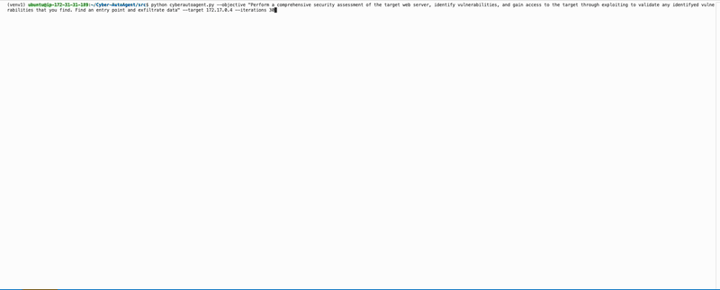
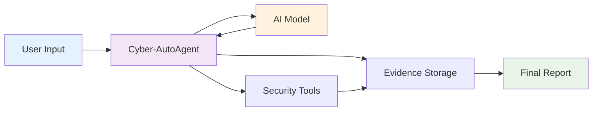
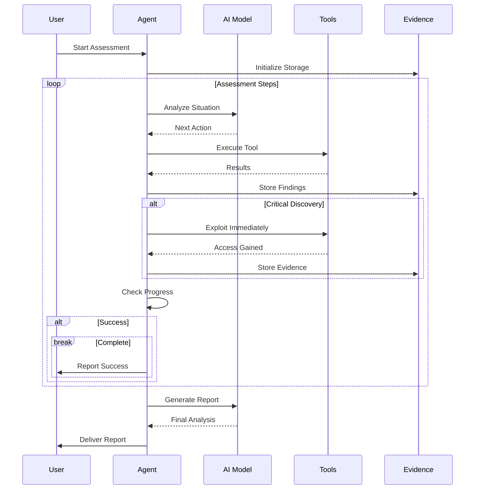
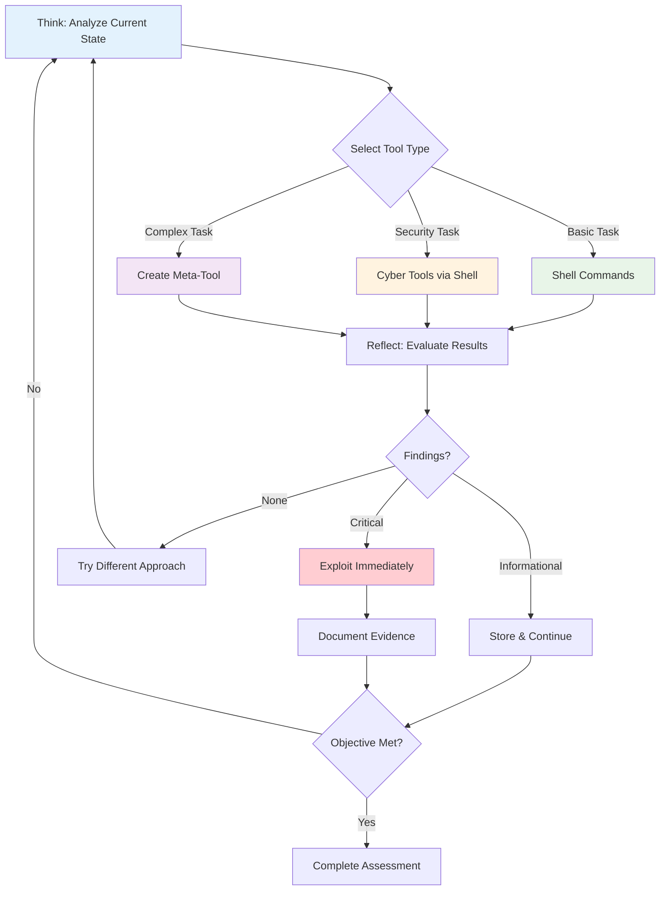

# Cyber-AutoAgent

```
 ██████╗██╗   ██╗██████╗ ███████╗██████╗ 
██╔════╝╚██╗ ██╔╝██╔══██╗██╔════╝██╔══██╗
██║      ╚████╔╝ ██████╔╝█████╗  ██████╔╝
██║       ╚██╔╝  ██╔══██╗██╔══╝  ██╔══██╗
╚██████╗   ██║   ██████╔╝███████╗██║  ██║
 ╚═════╝   ╚═╝   ╚═════╝ ╚══════╝╚═╝  ╚═╝

█████╗ ██╗   ██╗████████╗ ██████╗  █████╗  ██████╗ ███████╗███╗   ██╗████████╗
██╔══██╗██║   ██║╚══██╔══╝██╔═══██╗██╔══██╗██╔════╝ ██╔════╝████╗  ██║╚══██╔══╝
███████║██║   ██║   ██║   ██║   ██║███████║██║  ███╗█████╗  ██╔██╗ ██║   ██║   
██╔══██║██║   ██║   ██║   ██║   ██║██╔══██║██║   ██║██╔══╝  ██║╚██╗██║   ██║   
██║  ██║╚██████╔╝   ██║   ╚██████╔╝██║  ██║╚██████╔╝███████╗██║ ╚████║   ██║   
╚═╝  ╚═╝ ╚═════╝    ╚═╝    ╚═════╝ ╚═╝  ╚═╝ ╚═════╝ ╚══════╝╚═╝  ╚═══╝   ╚═╝   
```

**⚠️ EXPERIMENTAL SOFTWARE - USE ONLY IN AUTHORIZED, SAFE, SANDBOXED ENVIRONMENTS ⚠️**

An autonomous cybersecurity assessment tool powered by AWS Bedrock and the Strands framework. Conducts intelligent penetration testing with natural language reasoning, tool selection, and evidence collection.


*Demo of Cyber-AutoAgent in action*

## 🚨 Important Disclaimer

**THIS TOOL IS FOR EDUCATIONAL AND AUTHORIZED SECURITY TESTING PURPOSES ONLY.**

- ✅ Use only on systems you own or have explicit written permission to test
- ✅ Deploy in safe, sandboxed environments isolated from production systems  
- ✅ Ensure compliance with all applicable laws and regulations
- ❌ Never use on unauthorized systems or networks
- ❌ Users are fully responsible for legal and ethical use

## 🎯 Features

- **Autonomous Operation**: Conducts security assessments with minimal human intervention
- **Intelligent Tool Selection**: Automatically chooses appropriate security tools (nmap, sqlmap, nikto, etc.)
- **Natural Language Reasoning**: Uses Strands framework for natural decision-making
- **Evidence Collection**: Automatically documents findings with categorized memory storage
- **Meta-Tool Creation**: Can create custom tools when existing ones are insufficient
- **Budget-Aware Execution**: Adapts strategy based on remaining computational budget
- **Professional Reporting**: Generates comprehensive assessment reports

## 🏗️ Architecture

### System Architecture



**Key Components:**
- User provides target and objectives via command line
- Agent orchestrates assessment using AI reasoning
- Security tools execute scans and exploits
- Evidence system stores and analyzes findings

### Assessment Execution Flow



**Execution Pattern:**
- Agent continuously analyzes situation and selects appropriate tools
- Critical discoveries trigger immediate exploitation attempts
- All findings stored as evidence for final analysis
- Assessment completes when objectives met or budget exhausted

### Think-Action-Reflect Cycle



**Decision Process:**
- **Think**: AI model analyzes current situation and selects next action
- **Action**: Execute through tool orchestration hierarchy:
  - Shell commands for basic operations
  - Professional cyber tools via shell (nmap, sqlmap, nikto, gobuster)
  - Meta-tooling creation when existing tools are insufficient
- **Reflect**: Evaluate results and determine if exploitation is possible
- **Adapt**: Continue cycle until objectives achieved or budget exhausted

**Tool Orchestration Priority:**
1. Direct shell commands for simple tasks
2. Professional security tools for specialized operations
3. Custom meta-tool creation for complex scenarios requiring multiple chained operations

## 🚀 Quick Start

### Prerequisites

1. **AWS Account with Bedrock Access**
   ```bash
   # Configure AWS credentials
   aws configure
   ```

2. **Python 3.9+ Environment**
   ```bash
   python --version  # Should be 3.9+
   ```

3. **Security Tools (Optional but Recommended)**
   ```bash
   # On Kali Linux / Debian
   sudo apt update && sudo apt install -y nmap nikto sqlmap gobuster
   
   # On macOS with Homebrew
   brew install nmap nikto sqlmap gobuster
   ```

### Installation

1. **Clone the Repository**
   ```bash
   git clone https://github.com/cyber-autoagent/cyber-autoagent.git
   cd cyber-autoagent
   ```

2. **Install Dependencies**
   ```bash
   pip install -e .
   ```

3. **Verify Installation**
   ```bash
   python src/cyberautoagent.py --help
   ```

### Basic Usage

```bash
# Basic security assessment
python src/cyberautoagent.py \
  --target "http://testphp.vulnweb.com" \
  --objective "Identify and demonstrate exploitable vulnerabilities" \
  --iterations 50

# With custom model and region
python src/cyberautoagent.py \
  --target "192.168.1.100" \
  --objective "Enumerate services and find potential entry points" \
  --model "us.anthropic.claude-3-5-sonnet-20241022-v1:0" \
  --region "us-west-2" \
  --verbose
```

## 🧪 Setting Up DVWA Test Target

For safe testing, we recommend using Damn Vulnerable Web Application (DVWA):

### Docker Setup (Recommended)

```bash
# Pull and run DVWA
docker run -d -p 8080:80 vulnerables/web-dvwa

# Access DVWA
open http://localhost:8080

# Default credentials: admin/password
# Set security level to "Low" for testing
```

### Manual Setup

```bash
# Clone DVWA
git clone https://github.com/digininja/DVWA.git
cd DVWA

# Copy config
cp config/config.inc.php.dist config/config.inc.php

# Start with XAMPP/LAMP stack
# Configure database settings in config.inc.php
```

### Test Against DVWA

```bash
python src/cyberautoagent.py \
  --target "X.X.X.X" \
  --objective "Identify SQL injection vulnerabilities and extract database contents" \
  --iterations 30
```

## 📊 Understanding the Output

### Step Execution Format
```
────────────────────────────────────────────────────────────────────────────────
Step 1/50: nmap
────────────────────────────────────────────────────────────────────────────────
↳ Running: nmap -sV -sC 192.168.1.100

Starting Nmap 7.94 ( https://nmap.org )
Nmap scan report for 192.168.1.100
Host is up (0.001s latency).
PORT     STATE SERVICE    VERSION
22/tcp   open  ssh        OpenSSH 8.2p1
80/tcp   open  http       Apache httpd 2.4.41
────────────────────────────────────────────────────────────────────────────────
```

### Evidence Collection
```
📋 Evidence Summary
────────────────────────────────────────────────────────────────────────────────

Categories:
   • vulnerability: 3 items
   • credential: 1 items
   • finding: 5 items

Recent Evidence:
   [1] vulnerability
       SQL injection in login parameter id (POST /login.php)
       ID: abc12345...
```

### Budget Management
- 🟢 **Abundant Budget (>20 steps)**: Standard methodology
- 🟡 **Constrained Budget (10-19 steps)**: Professional tools only  
- 🟠 **Critical Budget (5-9 steps)**: Exploitation-only mode
- 🔴 **Emergency Budget (<5 steps)**: Single high-impact attempt


### Environment Variables
```bash
export AWS_REGION=us-east-1
export AWS_PROFILE=default
export DEV=true  # Set by agent automatically
```

## 🏗️ Project Structure

```
cyber-autoagent/
├── src/
│   ├── cyberautoagent.py       # Main entry point
│   └── modules/
│       ├── __init__.py         # Module initialization
│       ├── utils.py            # UI utilities and analysis functions
│       ├── environment.py      # Environment setup and tool discovery
│       ├── memory_tools.py     # Evidence storage and retrieval
│       ├── system_prompts.py   # System prompt templates
│       ├── agent_handlers.py   # Core agent callback handlers
│       └── agent_factory.py    # Agent creation and configuration
├── pyproject.toml              # Project configuration
├── README.md                   # This file
├── LICENSE                     # MIT License
```

## 🔍 Troubleshooting

### Common Issues

#### AWS Credentials Not Found
```bash
# Configure AWS CLI
aws configure

# Or set environment variables
export AWS_ACCESS_KEY_ID=your_key
export AWS_SECRET_ACCESS_KEY=your_secret
export AWS_REGION=us-east-1
```

#### Model Access Denied
```bash
# Request model access in AWS Console
# Navigate to: Amazon Bedrock > Model access > Request model access
```

#### Memory System Errors
```bash
# Check FAISS installation
pip install faiss-cpu

# Check file permissions
chmod 755 ./evidence_*
```

#### Tool Not Found Errors
```bash
# Install missing security tools
sudo apt install nmap nikto sqlmap gobuster  # Debian/Ubuntu
brew install nmap nikto sqlmap gobuster      # macOS
```

## 🗺️ Roadmap

- **Advanced Objective Completion** - Enhanced success detection with multi-criteria evaluation
- **Dynamic Plan Decomposition** - Automatic task breakdown based on target complexity  
- **Multi-Target Orchestration** - Parallel assessment of multiple systems
- **Chain-of-Thought Reasoning** - Detailed decision logging and explanation
- **Cloud-Native Deployment** - Containerized execution with scaling capabilities

## 🤝 Contributing

1. Fork the repository
2. Create a feature branch (`git checkout -b feature/amazing-feature`)
3. Commit your changes (`git commit -m 'Add amazing feature'`)
4. Push to the branch (`git push origin feature/amazing-feature`)
5. Open a Pull Request

### Development Setup
```bash
# Install with development dependencies
pip install -e ".[dev]"

# Run tests
pytest

# Format code
black src/
isort src/

# Type checking
mypy src/
```

## 📄 License

This project is licensed under the MIT License - see the [LICENSE](LICENSE) file for details.

## ⚖️ Legal Notice

This tool is provided for educational and authorized security testing purposes only. Users are solely responsible for ensuring they have proper authorization before testing any systems. The authors assume no liability for misuse or any damages that may result from using this software.

## 🙏 Acknowledgments

- [Strands Framework](https://github.com/anthropics/strands) - Agent orchestration
- [AWS Bedrock](https://aws.amazon.com/bedrock/) - Foundation model access
- [mem0](https://github.com/mem0ai/mem0) - Memory and evidence storage
- Security community for tool inspiration and feedback

---

**Remember: With great power comes great responsibility. Use this tool ethically and legally.**
