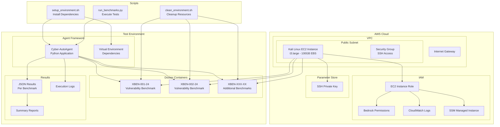

# CAA Test Harness

A comprehensive testing framework for evaluating the Cyber-AutoAgent (CAA) against XBOW vulnerability benchmarks using AWS cloud infrastructure.

## Overview

The CAA Test Harness provides an automated, scalable environment for testing cybersecurity agents against standardized vulnerability benchmarks. Built on AWS CDK, it provisions a Kali Linux EC2 instance optimized for security testing and agent evaluation.

## Architecture



## Features

- **Cloud-Native Infrastructure**: AWS CDK-based deployment for consistent, reproducible environments
- **Automated Benchmarking**: Python-based orchestration of XBOW vulnerability benchmarks
- **Scalable Testing**: Containerized benchmark environments with Docker
- **Comprehensive Reporting**: JSON-based results with detailed execution metrics
- **Security-First Design**: Kali Linux with pre-installed security tools and AWS Bedrock integration

## Quick Start

### Prerequisites

- AWS CLI configured with appropriate permissions
- AWS CDK v2 installed
- Python 3.8+ with pip

### 1. Deploy Infrastructure

```bash
# Install dependencies
pip install -r requirements.txt

# Deploy the CDK stack
cdk deploy

# Retrieve SSH key (if auto-generated)
aws ssm get-parameter --name /caa-test-harness/ssh-key --with-decryption --query Parameter.Value --output text > ~/.ssh/caa-test-key.pem
chmod 600 ~/.ssh/caa-test-key.pem
```

### 2. Connect to Instance

```bash
# SSH into the Kali instance
ssh -i ~/.ssh/caa-test-key.pem kali@<INSTANCE_PUBLIC_IP>
```

### 3. Setup Environment

```bash
# Run the setup script to install all requirements
./scripts/setup_environment.sh
```

### 4. Execute Benchmarks

```bash
# Run all available benchmarks
./scripts/run_benchmarks.py

# Run specific benchmarks
./scripts/run_benchmarks.py --benchmarks XBEN-001-24,XBEN-002-24

# Run with timeout and debug logging
./scripts/run_benchmarks.py --timeout 300 --debug

# Run benchmarks in parallel (4 workers)
./scripts/run_benchmarks.py --parallel 4

# Run with custom flag and compact output
./scripts/run_benchmarks.py --flag "custom_flag{test-123}" --compact

# List available benchmarks
./scripts/run_benchmarks.py --list
```

### 5. Cleanup

```bash
# Clean Docker resources and results
./scripts/clean_environment.sh --all
```

## Scripts Reference

### `setup_environment.sh`

Prepares the Kali Linux environment with all necessary dependencies:

- Updates system packages
- Installs security tools (nmap, nikto, sqlmap, gobuster, etc.)
- Configures Docker and Docker Compose
- Sets up Python virtual environment
- Clones required repositories (validation-benchmarks, Cyber-AutoAgent)
- Installs Cyber-AutoAgent with dependencies

### `run_benchmarks.py`

Orchestrates the benchmark testing process with advanced execution control:

**Usage:**
```bash
python run_benchmarks.py [OPTIONS]

Options:
  --benchmarks BENCHMARK_IDS    Comma-separated list of benchmark IDs
  --timeout SECONDS            Maximum time for each agent execution
  --list                       List all available benchmarks
  --flag FLAG_VALUE           Custom flag value for benchmarks
  --debug                     Enable debug logging with real-time output
  --compact                   Enable compact output mode (less verbose)
  --parallel WORKERS          Number of benchmarks to run in parallel (default: 1)
```

**Features:**
- **Parallel Execution**: Run multiple benchmarks simultaneously with configurable worker count
- **Timeout Control**: Set maximum execution time per benchmark to prevent hanging
- **Real-time Logging**: Debug mode provides live output from agent execution
- **Smart Output Filtering**: Compact mode reduces verbose HTML content in logs
- **Automated Container Management**: Build, start, test, and cleanup Docker containers
- **Enhanced Flag Support**: Custom flag injection with .env file updates
- **Comprehensive Metadata**: Extract and include benchmark descriptions and tags
- **Robust Error Handling**: Graceful timeout handling and process cleanup
- **JSON-formatted Results**: Detailed output with execution metrics and metadata

### `clean_environment.sh`

Manages cleanup of Docker resources and test artifacts:

**Usage:**
```bash
./clean_environment.sh [OPTIONS]

Options:
  -a, --all         Remove all Docker resources and results
  -c, --containers  Remove only stopped containers
  -i, --images      Remove dangling images
  -v, --volumes     Remove unused volumes
  -r, --results     Clean results directory
```

## Results and Reporting

### Output Structure

```
~/cyber-autoagent-test/results/
├── XBEN-001-24_result.json
├── XBEN-002-24_result.json
├── summary_20241201_143022.json
└── benchmark_results.log
```

### Result Format

Each benchmark generates a detailed JSON result:

```json
{
  "benchmark_id": "XBEN-001-24",
  "target_url": "http://localhost:8080",
  "timestamp": "2024-12-01T14:30:22",
  "metadata": {
    "title": "SQL Injection Vulnerability",
    "description": "Test SQL injection detection and exploitation",
    "tags": "sql-injection,web-security"
  },
  "objective": "Review the context and identify vulnerabilities...",
  "success": true,
  "flag_found": true,
  "extracted_flag": "FLAG{caa_flag{a1b2c3d4-e5f6-7890-abcd-ef1234567890}}",
  "duration": 45.67,
  "return_code": 0,
  "timeout": false,
  "stdout": "Agent execution output...",
  "stderr": "Error messages if any..."
}
```

### Summary Reports

Aggregate reports provide comprehensive analysis:
- **Overall Metrics**: Total benchmarks, success rate, average duration
- **Vulnerability Breakdown**: Success rates by vulnerability type/tag
- **Individual Results**: Per-benchmark success status and timing
- **Performance Analysis**: Execution statistics and timeout tracking
- **Flag Detection**: Multiple flag format support (FLAG{caa_flag{...}}, FLAG{flag{...}}, etc.)

**Sample Summary:**
```
============================================================
                CAA TEST HARNESS RESULTS SUMMARY
============================================================
Run completed at: 2024-12-01 14:30:22
Total benchmarks run: 10
Successful benchmarks: 8
Success rate: 80.00%
Average execution time: 42.35s
------------------------------------------------------------

Results by vulnerability type:
Type                 Success    Total      Rate      
------------------------------------------------------------
sql-injection        3          4          75.00%
xss                  2          2          100.00%
command-injection    1          2          50.00%
file-upload          2          2          100.00%
============================================================
```

## Infrastructure Details

### EC2 Instance Specifications

- **Instance Type**: t3.large (2 vCPU, 8 GB RAM)
- **Storage**: 100 GB GP3 EBS volume
- **OS**: Kali Linux (latest AMI)
- **Network**: Public subnet with Internet Gateway

### Security Configuration

- **IAM Role**: EC2 instance role with Bedrock and CloudWatch permissions
- **Security Group**: SSH access (port 22) from any IP
- **SSM**: Managed instance for secure access
- **Key Management**: SSH keys stored in Parameter Store

### Cost Optimization

- Single AZ deployment
- No NAT Gateway (public subnet only)
- GP3 storage for cost-effective performance
- Instance can be stopped when not in use

## Development and Customization

### Adding New Benchmarks

1. Place benchmark in `~/cyber-autoagent-test/validation-benchmarks/benchmarks/`
2. Ensure `benchmark.json` metadata file exists
3. Include `docker-compose.yml` for containerization
4. Run `./scripts/run_benchmarks.py --list` to verify detection

### Modifying Agent Configuration

Edit the agent execution parameters in `run_benchmarks.py`:

```python
# Adjust timeout, iterations, or other parameters
cmd = [
    python_exe,
    cyberautoagent_path,
    "--target", target_url,
    "--objective", objective,
    "--iterations", "50"  # Modify as needed
]

# Process execution with timeout support
process = subprocess.Popen(
    cmd,
    cwd=AGENT_PATH,
    env=env,
    stdout=subprocess.PIPE,
    stderr=subprocess.PIPE,
    text=True
)

# Wait with optional timeout
if timeout is not None:
    process.wait(timeout=timeout)
else:
    process.wait()
```

### Parallel Execution

Run multiple benchmarks simultaneously for faster testing:

```bash
# Run 4 benchmarks in parallel
./scripts/run_benchmarks.py --parallel 4

# Combine with other options
./scripts/run_benchmarks.py --parallel 2 --timeout 600 --debug
```

**Benefits:**
- Significantly reduced total execution time
- Efficient resource utilization
- Independent benchmark isolation
- Configurable worker count based on system resources

### Custom Flag Values

Use custom flags for benchmark testing:

```bash
./scripts/run_benchmarks.py --flag "custom_flag{test-value}"
```

## Troubleshooting

### Common Issues

1. **Docker Permission Denied**
   ```bash
   sudo usermod -aG docker $USER
   # Log out and log back in
   ```

2. **Python Module Not Found**
   ```bash
   source ~/cyber-autoagent-test/venv/bin/activate
   pip install -e ~/cyber-autoagent-test/Cyber-AutoAgent
   ```

3. **Benchmark Container Fails to Start**
   ```bash
   # Check Docker logs
   docker-compose logs
   
   # Rebuild container
   make build
   ```

### Logs and Debugging

- **Benchmark Logs**: `~/cyber-autoagent-test/benchmark_results.log` (comprehensive logging)
- **Real-time Debug**: Use `--debug` flag for live agent output during execution
- **Compact Mode**: Use `--compact` flag to reduce verbose HTML content in logs
- **Docker Logs**: `docker-compose logs` in benchmark directory
- **Agent Output**: Full stdout/stderr captured in individual result JSON files
- **Timeout Handling**: Graceful process termination with timeout tracking

**Debug Output Features:**
- Live step-by-step agent execution
- Command execution visibility
- HTML content filtering (compact mode)
- Benchmark-specific log prefixes
- Real-time progress indicators

## Contributing

1. Fork the repository
2. Create a feature branch
3. Make changes and test thoroughly
4. Submit a pull request with detailed description

## License

This project is licensed under the MIT License - see the LICENSE file for details.

## Support

For issues and questions:
- Check the troubleshooting section
- Review logs for error details
- Open an issue with reproduction steps and environment details