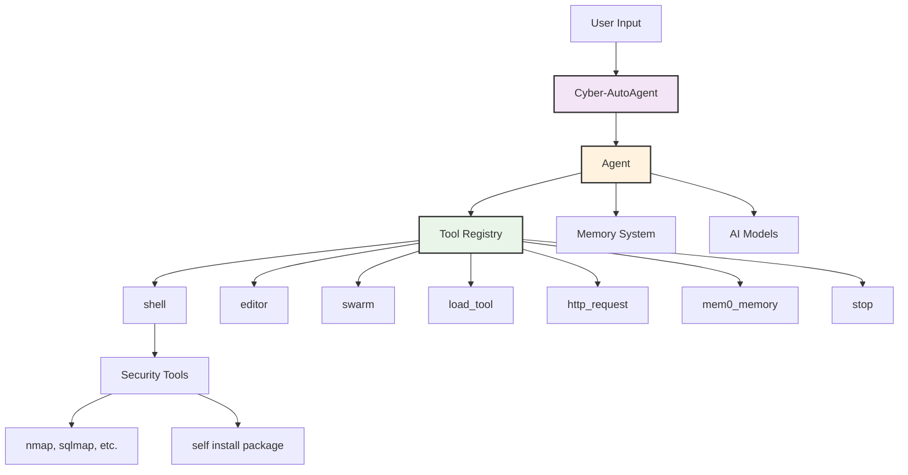
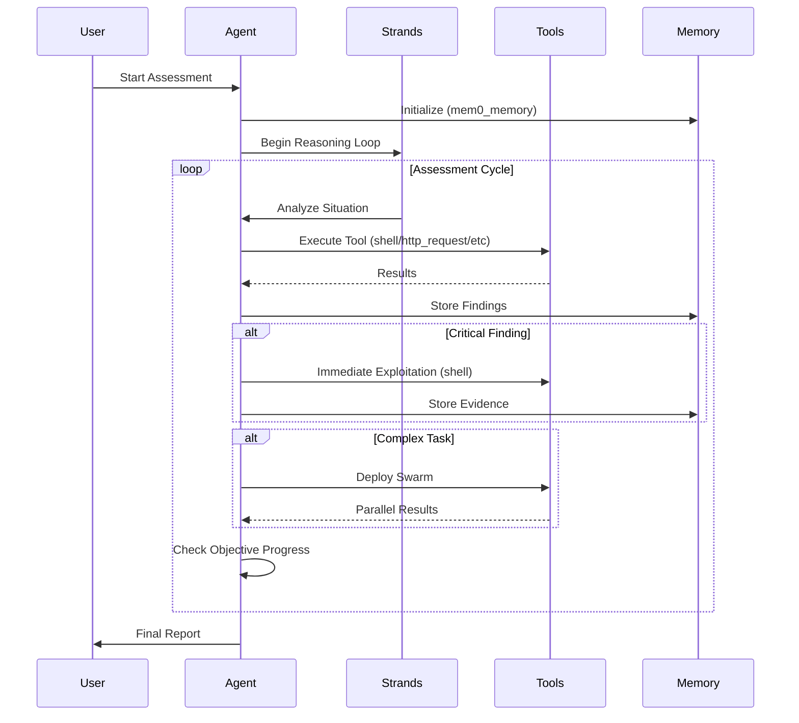
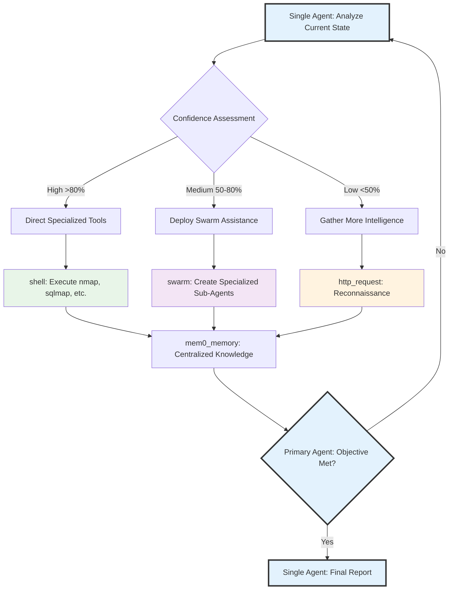
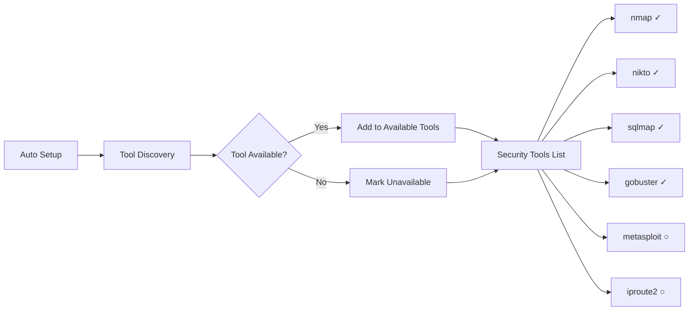
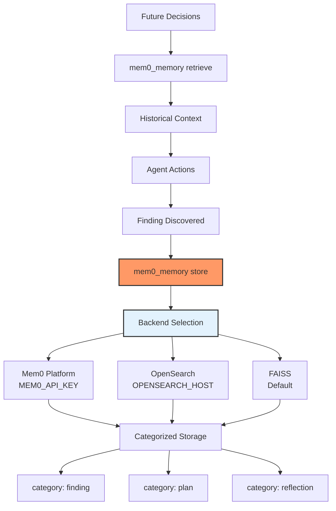

# Agent Architecture

Cyber-AutoAgent implements a **Single Agent Meta-Everything Architecture** using the Strands framework for autonomous penetration testing.

## Design Philosophy: Single Agent Meta-Everything Architecture

The core design philosophy centers on a **single agent** that dynamically extends its capabilities through meta-operations, rather than multiple specialized agents competing for control.

### Why Single Agent?

Traditional multi-agent systems face coordination challenges, resource conflicts, and complexity in task handoffs. Our approach maintains the simplicity and coherence of a single decision-maker while overcoming cognitive limitations through meta-capabilities.

### The Meta-Everything Approach

This architecture allows the system to transcend static tool limitations and evolve its capabilities during execution, all orchestrated by one primary agent:

- **Meta-Agent**: The swarm capability deploys dynamic agents as tools, each tailored for specific subtasks with their own reasoning loops
- **Meta-Tooling**: Through the editor and load_tool capabilities, the agent can create, modify, and deploy new tools at runtime to address novel challenges  
- **Meta-Learning**: Continuous memory storage and retrieval enables cross-session learning, building expertise over time
- **Meta-Cognition**: Self-reflection and confidence assessment drives strategic decisions about tool selection and approach

This meta-architecture allows the system to transcend static tool limitations and evolve its capabilities during execution, all while being orchestrated by a single primary agent.

## Core Architecture



## Strands Tools

The agent operates through these core tools:

### Primary Tools
- **shell**: Execute system commands (nmap, sqlmap, custom scripts)
- **editor**: Create/modify files and custom tools
- **swarm**: Deploy parallel agents for complex tasks
- **http_request**: Make HTTP requests for web testing
- **mem0_memory**: Store/retrieve findings and knowledge
- **load_tool**: Dynamically load created tools
- **stop**: Terminate execution

### Security Tool Access

Security tools are accessed **via shell**, not as direct tools:

```python
# Agent uses shell tool to run security commands
shell("nmap -sV 192.168.1.1")
shell("sqlmap -u 'http://target.com?id=1' --batch")
shell("nikto -h target.com")
```

## Execution Flow



## Metacognitive Architecture

The single agent employs metacognitive assessment to determine the optimal approach for each situation:



**Key Principles:**
- **Single Decision Maker**: One primary agent maintains strategic control
- **Metacognitive Awareness**: Agent assesses its own confidence levels
- **Dynamic Capability Expansion**: Creates tools and deploys swarms as needed
- **Centralized Memory**: All discoveries flow back to the primary agent's knowledge base

## Tool Hierarchy

Based on confidence and task complexity:

1. **Specialized Security Tools** (via shell)
   - When vulnerability type is known
   - High confidence scenarios
   - Direct exploitation

2. **Swarm Deployment**  
   - Multiple approaches needed
   - Medium confidence
   - Parallel reconnaissance

3. **Meta-Tool Creation** (via editor + load_tool)
   - Novel exploits required
   - No existing tool fits
   - Custom payload generation

## Environment Discovery



Tools discovered via `which` command:
- Available tools accessible via `shell`
- Unavailable tools noted but not usable
- Dynamic discovery adapts to environment

## Memory Integration



**Memory Backend Selection**:
1. **Mem0 Platform** - If `MEM0_API_KEY` environment variable is set
2. **OpenSearch** - If `OPENSEARCH_HOST` environment variable is set
3. **FAISS** - Default local vector storage if neither is configured

**Evidence Storage Format**:
```
[VULNERABILITY] SQL Injection
[WHERE] /login.php?id=1
[IMPACT] Database access, credential extraction
[EVIDENCE] Request/response pairs, command outputs
[STEPS] Reproduction steps
[REMEDIATION] Use parameterized queries
[CONFIDENCE] 95% - Verified
```

## Model Providers

### Bedrock Provider (AWS)
- **Primary**: Claude Sonnet 4.5 (claude-sonnet-4-5-20250929-v1:0)
- **Embeddings**: Titan Text v2 (amazon.titan-embed-text-v2:0)
- **Region**: us-east-1 (default, configurable)
- **Benefits**: Latest models, managed infrastructure, reliable performance

### Ollama Provider (Local)
- **Primary**: qwen3-coder:30b-a3b-q4_K_M (default)
- **Embeddings**: mxbai-embed-large
- **Benefits**: Privacy, offline, no API costs, local control

### LiteLLM Provider (Universal)
- **Primary**: 100+ models supported (OpenAI, Anthropic, Cohere, etc.)
- **Configuration**: Provider-specific API keys
- **Benefits**: Multi-provider flexibility, unified interface

## Event System and UI Integration

**ReactBridgeHandler** extends the Strands SDK's callback system to emit structured events for the React terminal interface:

```python
# Event types emitted during operation
- tool_start: Tool invocation with parameters
- tool_end: Tool completion with results
- reasoning: Agent decision-making context
- step_header: Iteration tracking (step X/max_steps)
- metrics_update: Token usage, cost, duration
- operation_init: Operation metadata and configuration
```

Events flow from the Python agent through stdout using the `__CYBER_EVENT__` protocol, enabling real-time monitoring without tight coupling between backend and frontend.

## Evaluation System

**Automated Performance Assessment** using Ragas metrics integrated with Langfuse:

| Metric | Range | Purpose |
|--------|-------|---------|
| tool_selection_accuracy | 0.0-1.0 | Strategic tool choice and sequencing |
| evidence_quality | 0.0-1.0 | Comprehensive vulnerability documentation |
| methodology_adherence | 0.0-1.0 | Defensible methodology alignment |
| penetration_test_quality | 0.0-1.0 | Holistic assessment quality |

Evaluation triggers automatically after operation completion when `ENABLE_AUTO_EVALUATION=true`, providing continuous feedback for system improvement.

## Key Design Principles

1. **Single Agent Orchestration**: One primary agent maintains strategic control and decision-making authority
2. **Meta-Everything**: Dynamic tool creation, sub-agent deployment, and continuous learning capabilities
3. **Confidence-Driven**: Tool selection and strategy based on the agent's metacognitive self-assessment
4. **Evidence-Focused**: Centralized knowledge management with automatic categorization and storage
5. **Swarm Intelligence**: Deploy specialized sub-agents as tools while maintaining primary agent control
6. **Tool Agnostic**: Access any system tool via shell interface, with runtime tool installation capabilities
7. **Continuous Evaluation**: Automated performance metrics for operational improvement

This **Single Agent Meta-Everything Architecture** enables autonomous operation while maintaining coherent strategic control and avoiding the coordination complexity of traditional multi-agent systems.