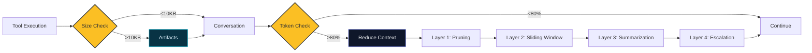
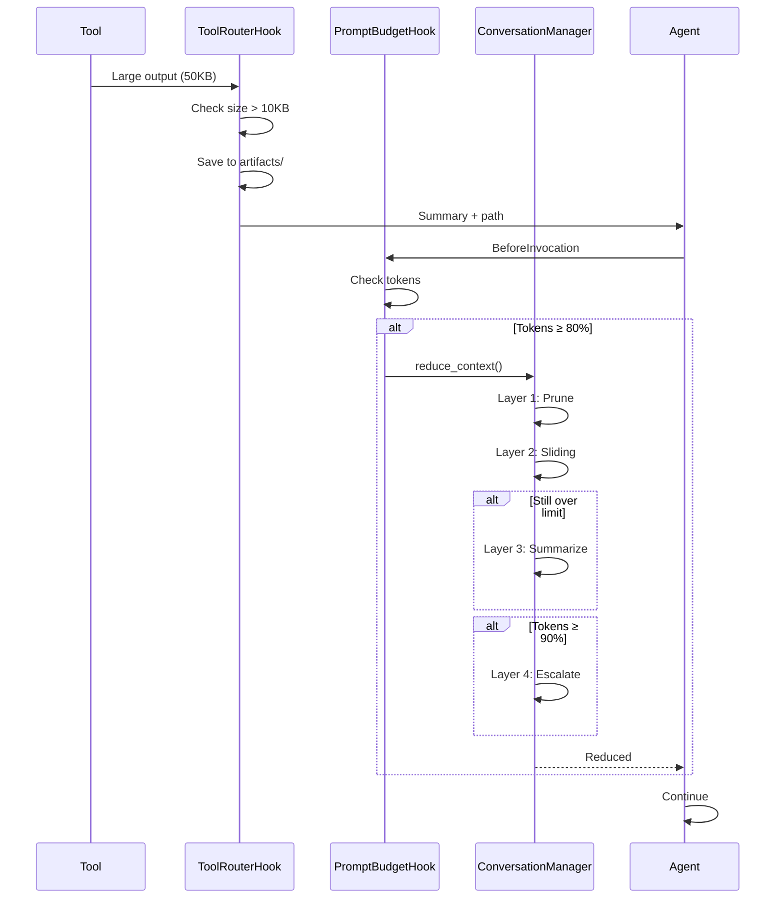

# Context Management

## Overview

Language models have finite conversation windows. During long security assessments that run for hours with hundreds of tool executions, the conversation can quickly exceed these limits. Cyber-AutoAgent solves this through automated context management that monitors token usage, compresses large outputs, removes old messages, and saves complete evidence to disk.

The system never fails due to context overflow. Operations continue reliably while maintaining full evidence chains for final reporting.

## Architecture

The system uses four reduction layers that activate sequentially as needed:



### How It Works



## System Components

The context management system consists of coordinated components operating at different stages:

### ToolRouterHook
Routes tool invocations and manages output sizes before they enter conversation history. Handles truncation and artifact externalization.

**Location**: `modules/handlers/tool_router.py`

### PromptBudgetHook
Monitors token usage before each LLM invocation and triggers reduction when approaching limits. Includes comprehensive diagnostic logging and telemetry fallback for operational reliability.

**Location**: `modules/handlers/conversation_budget.py`
**Events**: Subscribes to `BeforeModelCallEvent` and `AfterModelCallEvent` from Strands SDK
**Diagnostics**: INFO-level logging for budget checks, token estimation status, and threshold triggers

### MappingConversationManager
Orchestrates multi-layer reduction strategies, applying the appropriate technique based on conversation state. The main agent's conversation manager is registered as a shared singleton, enabling swarm agents and specialist sub-agents to use the same context management without explicit configuration.

**Location**: `modules/handlers/conversation_budget.py`
**Pattern**: Singleton shared across main agent, swarm agents, and specialist tools

### LargeToolResultMapper
Compresses individual tool results within messages while preserving metadata and samples.

**Location**: `modules/handlers/conversation_budget.py`

### Memory System
Stores findings and evidence in vector database for cross-session retrieval.

**Location**: `modules/tools/memory.py`

### Artifacts Storage
Persists full tool outputs to disk at `outputs/<target>/<operation>/artifacts/`

## How Context Management Works

### Context Management Approaches

| Approach | How It Works | Best For |
|----------|--------------|----------|
| **Sliding Window** | Removes oldest messages | Simple trimming |
| **Summarization** | Condenses multiple messages via LLM | Historical narrative |
| **Pruning** | Compresses large individual messages | Tool result management |
| **Artifact Externalization** | Stores full content to disk | Large outputs |
| **Multi-Layer** | Combines all approaches sequentially | Long security operations |

## Token Budget Monitoring

The system uses estimation-based tracking to monitor conversation size and trigger reductions when needed.

### Token Estimation (Threshold Decisions)

Token estimation calculates total conversation size by analyzing all message content. This provides accurate counts for threshold decisions (when to trigger reduction) by measuring actual conversation state.

**Usage**: Threshold decisions (should reduction trigger?)
**Method**: Comprehensive content analysis with 3.7 character-to-token ratio
**Triggers**: Below 80% (continue), at 80% (reduce), at 90% (escalate)

**Diagnostic Logging**: The system logs detailed information when estimation fails:
- `TOKEN ESTIMATION FAILED: agent.messages is None` - Messages not initialized
- `TOKEN ESTIMATION FAILED: agent.messages is not a list` - Wrong message type
- `TOKEN ESTIMATION: agent.messages is empty, returning 0 tokens` - Valid empty state
- `TOKEN ESTIMATION ERROR: Exception during estimation` - Estimation exception with traceback

**Fallback Mechanism**: If token estimation fails, the system automatically falls back to using SDK telemetry as a proxy for context size, ensuring budget enforcement continues even when estimation encounters errors.

### SDK Telemetry (Diagnostics and Fallback)

SDK telemetry tracks per-turn token usage for diagnostic purposes. Telemetry data is logged alongside estimation for monitoring and debugging, but threshold decisions rely on estimation to ensure accurate total conversation size measurement.

**Usage**: Diagnostic logging, monitoring, and fallback
**Purpose**: Validates estimation accuracy, tracks token growth patterns, and provides fallback when estimation fails

**Fallback Behavior**: When estimation returns None, telemetry is used as a proxy:
- `BUDGET CHECK FALLBACK: Using telemetry tokens (X) as proxy for context size`
- If both estimation and telemetry fail: `BUDGET CHECK ABORT: No estimation and no telemetry available`

### Configuration

| Setting | Default | Purpose |
| --- | --- | --- |
| `CYBER_PROMPT_FALLBACK_TOKENS` | 200,000 | Token limit when provider limit unavailable |
| `CYBER_PROMPT_TELEMETRY_THRESHOLD` | 0.8 | Percentage triggering proactive reduction |

## Multi-Layer Reduction System

### Layer 1: Message Pruning

Selectively compresses large tool results within individual messages while preserving message structure and conversation flow.

**Trigger Conditions**:
- Tool result content exceeds compression threshold (default: 185,000 characters)
- Message falls within prunable range (excludes preserved initial and recent messages)

**Pruning Operations**:

**Text Content**: Long text truncated to configured limit with clear indicators.

**JSON Content**: Extracts metadata and samples while discarding bulk data. Preserves first few key-value pairs (with 100-character value limit), records original size and key count, includes compression ratio.

**Message Processing**: Uses deep copy to prevent aliasing bugs when modifying nested message structures. This ensures the original conversation history remains unmodified during compression.

**Preservation Zones**: Initial messages (system prompt), recent messages (current context), and prunable range (middle messages eligible for compression).

**Output Characteristics**: Maintains tool execution metadata with clear compression indicators and sample data for LLM comprehension.

### Layer 2: Sliding Window

Maintains fixed conversation window by removing oldest messages while preserving critical context.

**Trigger Conditions**:
- Token usage exceeds threshold after Layer 1 pruning
- Invoked by conversation manager when needed

**Window Configuration**: Retains 30 total messages with 1 initial and 12 recent messages preserved.

**Behavior**: Maintains system prompt and recent exchanges while removing middle messages oldest-first. Logs all message count changes.

### Layer 3: Summarization

Condenses older conversation segments when sliding window proves insufficient.

**Trigger Conditions**:
- Context window overflow exception raised by Layer 2
- Conversation still exceeds model limits after sliding window

**Summarization Approach**: Targets oldest 30% of messages for LLM-based summarization while preserving recent messages verbatim. Summary includes critical findings, decisions, tool executions, and assessment progress.

### Layer 4: Escalation

Final aggressive reduction when previous layers prove insufficient.

**Trigger Conditions**: Token usage at or above 90% after initial reduction. Up to 2 additional passes with 30-second total time budget.

**Behavior**: Repeats reduction cycle with increased aggression, monitoring timing and logging progression. Terminates when tokens fall below 90%, passes complete, or time budget exceeded.

## Prompt Caching (LiteLLM / Anthropic)

Prompt caching reduces repeated input-token charges and latency for stable parts of the system prompt by letting the provider cache previously-seen prompt segments.

- How: The agent now constructs the system prompt as SystemContentBlock[] with a cachePoint hint. Providers that support caching (e.g., Anthropic via LiteLLM) can reuse cached segments across turns; others safely ignore the hint.
- Where: Applied automatically when the provider is bedrock or litellm. For all other providers, the agent falls back to the plain string prompt.
- What’s cached: Minimal segmentation is used initially — the composed system prompt is emitted as a single text block followed by a default cachePoint. This is safe and yields benefits when the prompt remains stable across turns.
- Backward compatibility: Legacy tests and code paths continue to see a string system prompt; unsupported providers behave unchanged.

Example structure of the prompt payload:

```json path=null start=null
[
  { "text": "<full composed system prompt>" },
  { "cachePoint": { "type": "default" } }
]
```

Notes and limitations:
- Only stable sections benefit; if the system prompt changes frequently, providers will write new cache entries instead of reading.
- Some providers expose cacheWrite/cacheRead usage in billing/telemetry; we do not surface these counters in the UI yet.
- No environment variables are required; this behavior is on by default and harmless when unsupported.

## Artifact Externalization

### Processing Flow

Large tool outputs exceeding threshold are saved to disk. The conversation receives a compact summary with the artifact file path and an inline preview of the first 4KB for immediate context.

### Storage Organization

```
outputs/<target>/<operation>/
├── artifacts/
│   ├── sqlmap_<timestamp>_<hash>.log
│   ├── scope_reconftw_<timestamp>.txt
│   └── crawl_gospider_<timestamp>.json
├── logs/
│   └── cyber_operations.log
└── report.md
```

Artifacts are organized by operation for isolation and evidence collection.

### Size Thresholds

| Setting | Default | Purpose |
| --- | --- | --- |
| `CYBER_TOOL_MAX_RESULT_CHARS` | 10,000 | Conversation truncation limit |
| `CYBER_TOOL_RESULT_ARTIFACT_THRESHOLD` | 10,000 | Artifact externalization threshold |

## Execution Flow

Context management operates through two primary hooks:

**ToolRouterHook**: Processes tool outputs before conversation entry. Large outputs are externalized to artifacts, conversation receives compact summaries.

**PromptBudgetHook**: Monitors token usage before each LLM invocation. When usage exceeds 80% threshold, triggers appropriate reduction layers sequentially until tokens fall below limit.

## Configuration Reference

### Essential Settings

Token budget controls:
```bash
CYBER_PROMPT_FALLBACK_TOKENS=200000
CYBER_PROMPT_TELEMETRY_THRESHOLD=0.8
```

Tool result handling:
```bash
CYBER_TOOL_COMPRESS_THRESHOLD=185000
CYBER_TOOL_MAX_RESULT_CHARS=10000
CYBER_TOOL_RESULT_ARTIFACT_THRESHOLD=10000
```

Conversation preservation:
```bash
CYBER_CONVERSATION_PRESERVE_FIRST=1
CYBER_CONVERSATION_PRESERVE_LAST=12
```

### Advanced Tuning

Compression parameters:
```bash
CYBER_TOOL_COMPRESS_TRUNCATE=18500
```

Conversation manager settings (code-level):
- `window_size=30` - Messages retained in sliding window
- `summary_ratio=0.3` - Percentage summarized in Layer 3


### Threshold Tuning

**Conservative (0.8-0.9)**: Minimal reductions, maximum context retention
**Balanced (0.6-0.7)**: Proactive management for general operations
**Aggressive (0.4-0.5)**: Frequent reductions for resource-constrained environments

### Common Issues

**No budget enforcement (tokens grow unbounded):**
- Check for `TOKEN ESTIMATION FAILED` logs to identify estimation issues
- Look for `BUDGET CHECK ABORT` indicating complete failure
- Verify `CYBER_PROMPT_FALLBACK_TOKENS` is set

**Reductions not effective:**
- Check `PRESERVE_LAST` value - should be 12 or less for pruning to work
- Verify prunable range: `(preserve_first + preserve_last) < total_messages`
- Look for `Cannot prune: preservation ranges cover all X messages` warning

**Budget checks not firing:**
- Verify hooks registered: `HOOK REGISTRATION: PromptBudgetHook callbacks registered`
- Check for `HOOK EVENT: BeforeModelCallEvent fired` logs
- Ensure log level is INFO or DEBUG for diagnostic visibility

## Summary

Context management enables multi-hour penetration testing operations through four reduction layers applied sequentially as needed. The system monitors token usage continuously and triggers appropriate strategies to stay within model limits.

The system includes comprehensive diagnostics and fallback mechanisms to ensure budget enforcement continues even when token estimation encounters errors. All budget checks, threshold triggers, and reductions are logged at INFO level for operational visibility.

Artifact externalization preserves complete evidence on disk while conversation maintains compact summaries and recent context. Operations continue reliably across model providers while preserving evidence chains for final reporting.
