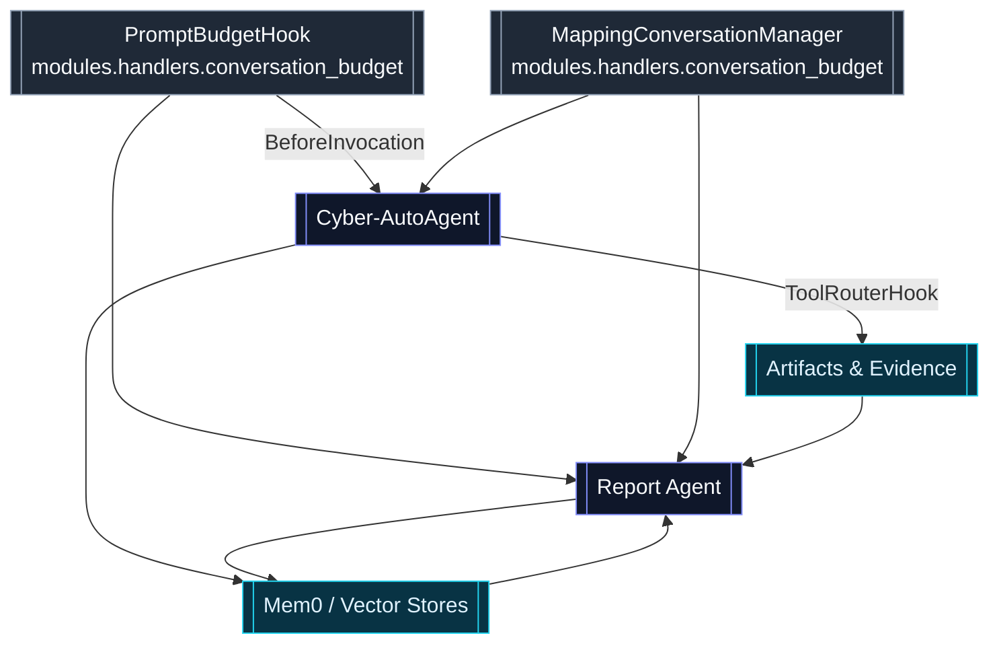
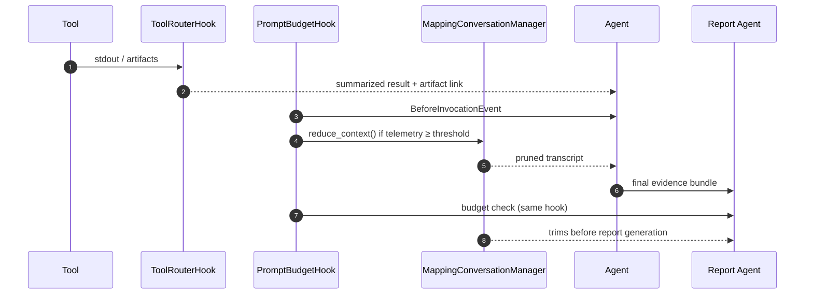

# Context Management

Cyber‑AutoAgent combines several guardrails to keep Strands transcripts within model limits while still preserving the artifacts, evidence, and reasoning required for long-running engagements. This page mirrors the structure of the other docs: overview → architecture → configuration → operational guidance.

## Overview

Cyber‑AutoAgent’s context-management story centers on three ideas:

1. **Proactive trimming**: Sliding-window pruning on every loop and summarization only when absolutely required.
2. **Prompt budgeting**: A hook that monitors telemetry and trims before the next `Agent.invoke` call.
3. **Artifact-first tooling**: Large tool outputs and scope files are streamed to disk/Mem0 so the LLM sees compact summaries.

## Architecture

### Components

| Component | Location | Purpose |
| --- | --- | --- |
| MappingConversationManager | `modules/handlers/conversation_budget.py` | Wraps sliding window + summarizer, logging before/after sizes, and compresses large tool results. |
| PromptBudgetHook | `modules/handlers/conversation_budget.py` | Runs `_ensure_prompt_within_budget` before every agent invocation, using LiteLLM token limits or a fallback. |
| ToolRouterHook | `modules/handlers/tool_router.py` | Routes unknown tools to `shell`, truncates responses, and writes large outputs to `artifacts/`. |
| Memory services | `modules/tools/memory.py` | Keeps findings in Mem0/OpenSearch/FAISS so conversation can reference pointers instead of raw dumps. |
| Report builder | `modules/tools/report_builder.py` | Loads trimmed evidence and feeds it to the report agent with the same budget guardrails. |

## Configuration Summary

| Setting | Description | Typical Source | Default |
| --- | --- | --- | --- |
| `CYBER_PROMPT_FALLBACK_TOKENS` | Prompt-token ceiling when LiteLLM can’t supply one. | Env / `pyproject.toml` | 200 000 |
| `CYBER_PROMPT_TELEMETRY_THRESHOLD` | % of limit that triggers proactive trimming. | Env / `pyproject.toml` | 0.8 |
| `CYBER_TOOL_MAX_RESULT_CHARS` | Characters allowed in a tool result before truncation. | Env / CLI flag | 10 000 |
| `CYBER_TOOL_RESULT_ARTIFACT_THRESHOLD` | Size at which tool output is forced into an artifact. | Env | Same as max chars |
| `CYBER_TOOL_COMPRESS_THRESHOLD` | Characters allowed inside a single toolResult before compression kicks in. | Env | 20 000 |
| `CYBER_TOOL_COMPRESS_TRUNCATE` | Character limit for each block kept in a compressed tool result. | Env | 2 000 |
| `CYBER_CONVERSATION_PRESERVE_FIRST` | Number of initial messages protected from compression/mapping. | Env | 1 |
| `CYBER_CONVERSATION_PRESERVE_LAST` | Number of most recent messages preserved verbatim. | Env | 20 |
| `BROWSER_DEFAULT_TIMEOUT` | Timeout for Playwright-based browser tools. | Env / Docker compose | 120 s (planned) |

Everything can be set via CLI flags, Docker env vars, or the config manager; precedence is documented in `docs/deployment.md`.

## Execution Flow

1. **Tool execution** – ToolRouterHook truncates outputs, stores full text under `outputs/<target>/<operation>/artifacts`, and emits a pointer.
2. **Budget check** – Before each LLM call, PromptBudgetHook strips unsupported reasoning blocks, compares telemetry (`sdk_input_tokens`) against the configured threshold, and calls `MappingConversationManager.reduce_context()` if needed.
3. **Conversation reduction** – The hybrid manager trims via sliding window; if Strands still raises `ContextWindowOverflowException`, it falls back to summarizing older turns, logging messages/tokens removed.
4. **Final reporting** – The report agent reuses the same manager + hook so the historical transcript can never push the final LiteLLM call past its max tokens.

## Operational Guidance

- **Keep `window_size` modest** (≈30) so fresh steps remain accessible while older ones are summarized.
- **Summarize scopes and crawls**: read once, store to `artifacts/`, and send a short description back to the LLM—don’t `cat` entire scope files each loop.
- **Monitor telemetry**: `metrics_update` events include `inputTokens`; if they approach 80 % with no “Prompt budget trigger” log, verify the hook is registered.
- **Reuse the manager everywhere**: any new specialist agent or tool that spins up an LLM call should import `MappingConversationManager` and `PromptBudgetHook` to avoid regressions.
- **Treat artifacts as source of truth**: conversation entries can be trimmed; the durable evidence lives in disk artifacts, Mem0 memories, and the final report.

By aligning the dual conversation manager, prompt-budget hook, and artifact pipeline, Cyber‑AutoAgent sustains multi-hour operations across providers (LiteLLM fleets, Bedrock, Ollama) without overrunning context windows or losing investigative fidelity.
