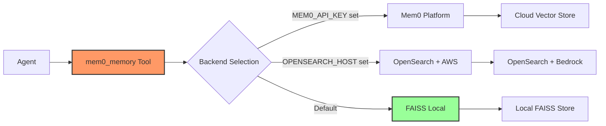
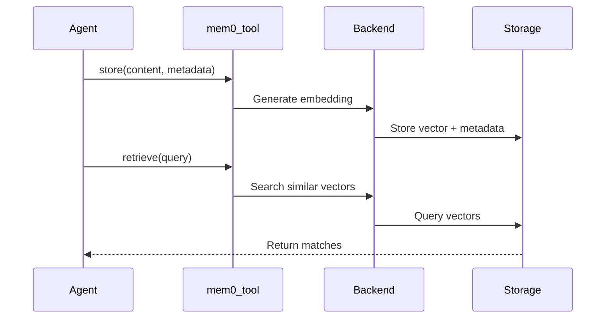

# Memory System

Cyber-AutoAgent uses Mem0 for intelligent memory management with multiple backend options.

## Architecture



## Backend Selection

Mem0 automatically chooses backend based on environment:

1. **Mem0 Platform** (if `MEM0_API_KEY` set) - Cloud service
2. **OpenSearch** (if `OPENSEARCH_HOST` set) - AWS managed
3. **FAISS** (default) - Local file storage

## Memory Operations



## Default Configuration

### FAISS Backend (Default)
- **Storage**: `./mem0_faiss_OP_[TIMESTAMP]/`
- **Embedder**: AWS Bedrock Titan (1024 dims)
- **LLM**: Claude 3.5 Sonnet
- **Benefits**: Fully local, no cloud dependencies

### OpenSearch Backend
- **Storage**: AWS OpenSearch Service
- **Embedder**: AWS Bedrock Titan (1024 dims) 
- **LLM**: Claude 3.5 Sonnet
- **Benefits**: Scalable, managed service

### Mem0 Platform
- **Storage**: Mem0 cloud service
- **Configuration**: Managed by Mem0
- **Benefits**: Fully managed, no setup

## Memory Categories

Evidence is automatically categorized:

```python
# Findings stored with metadata
mem0_memory(
    action="store",
    content="SQL injection in login form",
    user_id="cyber_agent", 
    metadata={"category": "finding", "severity": "high"}
)
```

Categories used:
- **finding**: Security discoveries
- **vulnerability**: Confirmed vulnerabilities
- **exploit**: Successful exploits  
- **reconnaissance**: Scan results

## Storage Locations

### FAISS (Local)
```
./mem0_faiss_OP_20250712_155132/
├── config.json
├── graph_data/
├── key_value_data/
├── sqlite.db
└── vector_data/
```

### Evidence Files
```
./evidence/evidence_OP_20250712_155132/
├── final_report_*.md
├── scan_outputs/
└── custom_tools/
```

## Memory Tool Usage

The unified `mem0_memory` tool handles all operations:

```python
# Store finding
mem0_memory(action="store", content="...", metadata={"category": "finding"})

# Search memories  
mem0_memory(action="retrieve", query="SQL injection")

# List all memories
mem0_memory(action="list", user_id="cyber_agent")

# Get specific memory
mem0_memory(action="get", memory_id="mem_123")
```

## Configuration

### Local Mode (Ollama)
```python
config = {
    "embedder": {"provider": "ollama", "config": {"model": "mxbai-embed-large"}},
    "llm": {"provider": "ollama", "config": {"model": "llama3.2:3b"}}
}
```

### Remote Mode (AWS Bedrock)
```python
config = {
    "embedder": {"provider": "aws_bedrock", "config": {"model": "amazon.titan-embed-text-v2:0"}},
    "llm": {"provider": "aws_bedrock", "config": {"model": "us.anthropic.claude-3-5-sonnet-20241022-v2:0"}}
}
```

## Best Practices

1. **Categorize findings** with consistent metadata
2. **Search before storing** to avoid duplicates  
3. **Export important data** before retention cleanup
4. **Use descriptive content** for better retrieval

## Command Line Options

```bash
# Use existing memory store
--memory-path ./mem0_faiss_OP_20250712_155132

# Keep memory after operation
--keep-memory

# Memory will be at: ./mem0_faiss_OP_[TIMESTAMP]/
```