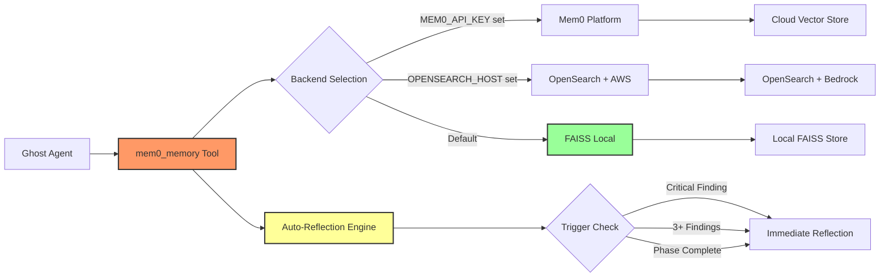
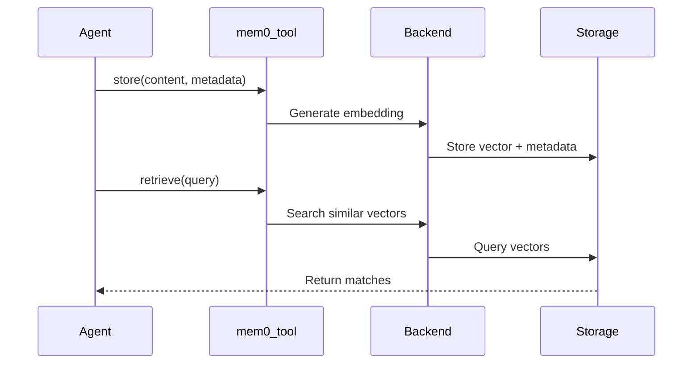

# Memory System

Cyber-AutoAgent uses an advanced memory system powered by Mem0 with automatic reflection, plan management, and cyber-specific enhancements.

## Architecture



## Backend Selection

Mem0 automatically chooses backend based on environment:

1. **Mem0 Platform** (if `MEM0_API_KEY` set) - Cloud service
2. **OpenSearch** (if `OPENSEARCH_HOST` set) - AWS managed
3. **FAISS** (default) - Local file storage

## Memory Operations



## Default Configuration

### FAISS Backend (Default)
- **Storage**: `./outputs/<target-name>/memory/
- **Embedder**: AWS Bedrock Titan (1024 dims)
- **LLM**: Claude 3.5 Sonnet
- **Benefits**: Fully local, no cloud dependencies

### OpenSearch Backend
- **Storage**: AWS OpenSearch Service
- **Embedder**: AWS Bedrock Titan (1024 dims) 
- **LLM**: Claude 3.5 Sonnet
- **Benefits**: Scalable, managed service

### Mem0 Platform
- **Storage**: Mem0 cloud service
- **Configuration**: Managed by Mem0
- **Benefits**: Fully managed, no setup

## Memory Categories

Evidence is automatically categorized with cyber-specific metadata:

```python
# Findings stored with rich metadata
mem0_memory(
    action="store",
    content="[WHAT] SQL injection [WHERE] /login [IMPACT] Auth bypass [EVIDENCE] payload",
    user_id="cyber_agent", 
    metadata={
        "category": "finding",
        "severity": "critical",      # critical/high/medium/low
        "confidence": "95%",         # Confidence level
        "module": "web_security",    # Source module
        "created_at": "2024-01-15T10:30:00Z"
    }
)
```

### Core Categories
- **finding**: Security discoveries with severity and confidence
- **plan**: Strategic assessment plans (active/inactive)
- **reflection**: Analysis of findings and plan progress
- **vulnerability**: Confirmed vulnerabilities
- **exploit**: Successful exploits  
- **reconnaissance**: Scan results

### Advanced Memory Features

#### 1. Automatic Reflection
The system automatically triggers reflection after:
- Critical or high severity findings
- Every 3 findings (configurable threshold)
- Major phase transitions

```python
# Auto-reflection example
if metadata.get("severity") in ["critical", "high"]:
    self._should_reflect = True  # Triggers reflection prompt
```

#### 2. Strategic Plan Management
```python
# Store hierarchical plans
mem0_memory(
    action="store_plan",
    content={
        "objective": "Compromise web application",
        "phases": [
            {"id": 1, "goal": "Map attack surface", "status": "active"},
            {"id": 2, "goal": "Find vulnerabilities", "status": "pending"},
            {"id": 3, "goal": "Exploit and persist", "status": "pending"}
        ]
    }
)

# Retrieve active plan
mem0_memory(action="get_plan")
```

#### 3. Reflection System
```python
# Generate reflection prompt based on findings
mem0_memory(action="reflect")  
# Returns analysis prompt considering recent findings and current plan

# Store reflection insights
mem0_memory(
    action="store_reflection",
    content="Pivoting to API testing based on auth bypass finding"
)

## Storage Locations

### FAISS (Local)
```
./outputs/example.com/memory/
├── config.json
├── graph_data/
├── key_value_data/
├── sqlite.db
└── vector_data/
```

### Evidence Files
```
./evidence/evidence_OP_20250712_155132/
├── final_report_*.md
├── scan_outputs/
└── custom_tools/
```

## Memory Tool Usage

The unified `mem0_memory` tool handles all operations:

### Basic Operations
```python
# Store finding with metadata
mem0_memory(
    action="store",
    content="[WHAT] RCE [WHERE] /upload [IMPACT] Shell access [EVIDENCE] shell.php",
    metadata={"category": "finding", "severity": "critical", "confidence": "98%"}
)

# Search memories  
mem0_memory(action="retrieve", query="SQL injection")

# List all memories
mem0_memory(action="list", user_id="cyber_agent")

# Get specific memory
mem0_memory(action="get", memory_id="mem_123")

# Delete memory
mem0_memory(action="delete", memory_id="mem_123")
```

### Advanced Operations
```python
# Store strategic plan
mem0_memory(
    action="store_plan",
    content="Phase 1: Recon. Phase 2: Exploit web vulns. Phase 3: Lateral movement."
)

# Get current plan
current_plan = mem0_memory(action="get_plan")

# Trigger reflection analysis
reflection_prompt = mem0_memory(action="reflect")

# Store reflection insights
mem0_memory(
    action="store_reflection", 
    content="Web app heavily fortified, pivoting to API endpoints"
)
```

### Memory Query Patterns
```python
# Search by category
mem0_memory(action="retrieve", query="category:finding")

# Search by severity
mem0_memory(action="retrieve", query="severity:critical")

# Search by module
mem0_memory(action="retrieve", query="module:web_security")

# Complex queries
mem0_memory(action="retrieve", query="SQL injection critical web_security")
```

## Configuration

### Local Mode (Ollama)
```python
config = {
    "embedder": {"provider": "ollama", "config": {"model": "mxbai-embed-large"}},
    "llm": {"provider": "ollama", "config": {"model": "llama3.2:3b"}}
}
```

### Remote Mode (AWS Bedrock)
```python
config = {
    "embedder": {"provider": "aws_bedrock", "config": {"model": "amazon.titan-embed-text-v2:0"}},
    "llm": {"provider": "aws_bedrock", "config": {"model": "us.anthropic.claude-3-5-sonnet-20241022-v2:0"}}
}
```

## Best Practices

### 1. Finding Storage Format
Always use the structured format for findings:
```
[WHAT] Vulnerability type
[WHERE] Exact location
[IMPACT] Business/technical impact
[EVIDENCE] Proof or reproduction
```

### 2. Metadata Consistency
- **category**: Use standard categories (finding, plan, reflection)
- **severity**: critical, high, medium, low
- **confidence**: Percentage (e.g., "95%")
- **module**: Source module name

### 3. Plan Management
- Store plans at operation start
- Update plan status as phases complete
- Use reflection to adapt strategy

### 4. Automatic Features
- Let auto-reflection guide assessment flow
- Trust the 3-finding reflection threshold
- Use reflection prompts for strategic pivots

### 5. Memory Optimization
- Search before storing to avoid duplicates
- Use specific queries for better retrieval
- Leverage metadata for filtering

## Command Line Options

```bash
# Use existing memory store
--memory-path ./outputs/example.com/memory/mem0_faiss_example.com

# Keep memory after operation (default: true)
--keep-memory

# Memory will be at: ./outputs/<target-name>/memory/mem0_faiss_<target-name>/
# Note: Memory is now per-target and persists across operations by default
```