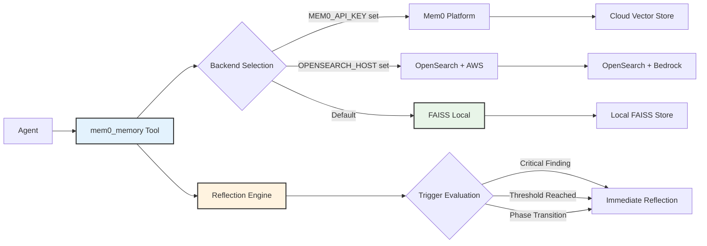
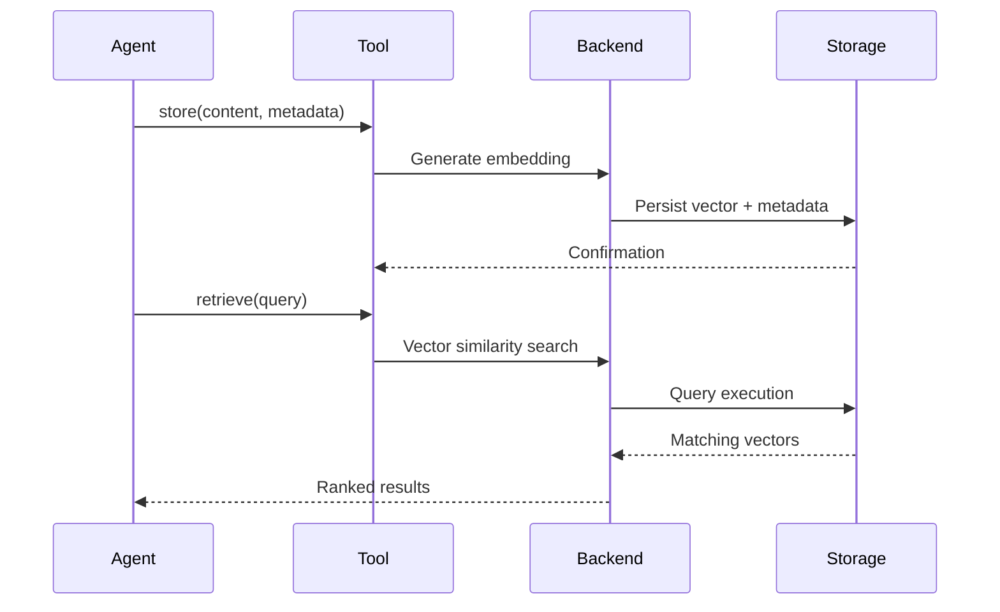

# Memory System

Cyber-AutoAgent implements persistent memory using Mem0 with automatic reflection, strategic planning, and evidence categorization. The system supports multiple backend configurations for different deployment scenarios.

## Architecture



## Backend Selection

Backend configuration follows environment-based precedence:

**Priority Order:**
1. **Mem0 Platform**: `MEM0_API_KEY` configured - Cloud-hosted service
2. **OpenSearch**: `OPENSEARCH_HOST` configured - AWS managed search
3. **FAISS**: Default - Local vector storage

Backend selection occurs at memory initialization and remains fixed for operation duration.

## Memory Operations



## Backend Configurations

### FAISS Backend
**Default Configuration:**
- **Storage Location**: `./outputs/<target>/memory/`
- **Embedder**: AWS Bedrock Titan Text v2 (1024 dimensions)
- **LLM**: Claude 3.5 Sonnet
- **Characteristics**: Local persistence, no external dependencies

### OpenSearch Backend
**AWS Managed Configuration:**
- **Storage**: AWS OpenSearch Service
- **Embedder**: AWS Bedrock Titan Text v2 (1024 dimensions)
- **LLM**: Claude 3.5 Sonnet
- **Characteristics**: Scalable search, managed infrastructure

### Mem0 Platform
**Cloud Service Configuration:**
- **Storage**: Mem0 managed infrastructure
- **Configuration**: Platform-managed
- **Characteristics**: Zero-setup, fully managed

## Memory Categorization

Evidence storage employs structured metadata for efficient retrieval and analysis:

```python
# Finding storage with metadata
mem0_memory(
    action="store",
    content="[WHAT] SQL injection [WHERE] /login [IMPACT] Auth bypass [EVIDENCE] payload",
    user_id="cyber_agent",
    metadata={
        "category": "finding",
        "severity": "critical",
        "confidence": "95%",
        "module": "web_security",
        "created_at": "2024-01-15T10:30:00Z"
    }
)
```

### Category Taxonomy

**Core Categories:**
- **finding**: Security discoveries with severity assessment
- **plan**: Strategic assessment roadmaps
- **reflection**: Tactical analysis and pivot decisions
- **vulnerability**: Confirmed security weaknesses
- **exploit**: Successful exploitation evidence
- **reconnaissance**: Target enumeration results

**Severity Levels:**
- Critical: Immediate exploitation risk
- High: Significant security impact
- Medium: Moderate risk exposure
- Low: Minor security concerns

## Advanced Features

### Automatic Reflection

Reflection triggers activate based on operational conditions:

**Trigger Conditions:**
- Critical or high severity findings detected
- Finding count threshold reached (default: 3)
- Phase transition events

```python
# Reflection trigger evaluation
if metadata.get("severity") in ["critical", "high"]:
    self._should_reflect = True
```

### Strategic Plan Management

Hierarchical planning with phase tracking:

```python
# Plan storage
mem0_memory(
    action="store_plan",
    content={
        "objective": "Compromise web application",
        "phases": [
            {"id": 1, "goal": "Map attack surface", "status": "active"},
            {"id": 2, "goal": "Find vulnerabilities", "status": "pending"},
            {"id": 3, "goal": "Exploit and persist", "status": "pending"}
        ]
    }
)

# Plan retrieval
current_plan = mem0_memory(action="get_plan")
```

### Reflection Analysis

Context-aware tactical analysis:

```python
# Generate reflection prompt
reflection_prompt = mem0_memory(action="reflect")

# Store reflection insights
mem0_memory(
    action="store_reflection",
    content="Pivoting to API testing based on auth bypass finding"
)

## Storage Structure

### FAISS Backend Layout
```
./outputs/<target>/memory/
├── config.json           # Backend configuration
├── graph_data/          # Relationship graphs
├── key_value_data/      # Metadata storage
├── sqlite.db            # Structured data
└── vector_data/         # Embeddings
```

### Operation Output Structure
```
./outputs/<target>/OP_<timestamp>/
├── report.md            # Final assessment report
├── logs/               # Operation logs
│   └── cyber_operations.log
└── utils/              # Operation artifacts
```

## Memory Tool Usage

The unified `mem0_memory` tool handles all operations:

### Basic Operations
```python
# Store finding with metadata
mem0_memory(
    action="store",
    content="[WHAT] RCE [WHERE] /upload [IMPACT] Shell access [EVIDENCE] shell.php",
    metadata={"category": "finding", "severity": "critical", "confidence": "98%"}
)

# Search memories  
mem0_memory(action="retrieve", query="SQL injection")

# List all memories
mem0_memory(action="list", user_id="cyber_agent")

# Get specific memory
mem0_memory(action="get", memory_id="mem_123")

# Delete memory
mem0_memory(action="delete", memory_id="mem_123")
```

### Advanced Operations
```python
# Store strategic plan
mem0_memory(
    action="store_plan",
    content="Phase 1: Recon. Phase 2: Exploit web vulns. Phase 3: Lateral movement."
)

# Get current plan
current_plan = mem0_memory(action="get_plan")

# Trigger reflection analysis
reflection_prompt = mem0_memory(action="reflect")

# Store reflection insights
mem0_memory(
    action="store_reflection", 
    content="Web app heavily fortified, pivoting to API endpoints"
)
```

### Memory Query Patterns
```python
# Search by category
mem0_memory(action="retrieve", query="category:finding")

# Search by severity
mem0_memory(action="retrieve", query="severity:critical")

# Search by module
mem0_memory(action="retrieve", query="module:web_security")

# Complex queries
mem0_memory(action="retrieve", query="SQL injection critical web_security")
```

## Configuration

### Local Mode (Ollama)
```python
config = {
    "embedder": {"provider": "ollama", "config": {"model": "mxbai-embed-large"}},
    "llm": {"provider": "ollama", "config": {"model": "llama3.2:3b"}}
}
```

### Remote Mode (AWS Bedrock)
```python
config = {
    "embedder": {"provider": "aws_bedrock", "config": {"model": "amazon.titan-embed-text-v2:0"}},
    "llm": {"provider": "aws_bedrock", "config": {"model": "us.anthropic.claude-3-5-sonnet-20241022-v2:0"}}
}
```

## Operational Guidelines

### Finding Documentation Format

Structured finding format ensures consistent evidence collection:

```
[WHAT] Vulnerability classification
[WHERE] Precise location identifier
[IMPACT] Business and technical impact
[EVIDENCE] Reproduction steps and proof
```

### Metadata Standards

**Required Fields:**
- **category**: Taxonomy classification
- **severity**: Risk level (critical/high/medium/low)
- **confidence**: Assessment certainty (percentage)
- **module**: Source module identifier

### Plan Management

**Lifecycle:**
1. Initialize plan at operation start
2. Update phase status during execution
3. Adapt strategy through reflection

### Reflection System

**Operational Flow:**
- Automatic triggering based on findings
- Configurable threshold (default: 3 findings)
- Strategic pivot recommendations

### Query Optimization

**Efficiency Techniques:**
- Pre-query deduplication checks
- Metadata-based filtering
- Specific query construction
- Result ranking utilization

## Configuration Options

### Command Line Arguments

```bash
# Specify memory path
--memory-path ./outputs/<target>/memory/

# Memory persistence (default: enabled)
--keep-memory

# Memory storage location
# Format: ./outputs/<target>/memory/
```

### Memory Persistence

**Default Behavior:**
- Memory persists per-target across operations
- Cross-operation learning enabled
- Historical context maintained

**Storage Path Pattern:**
```
./outputs/<target>/memory/
```

Memory isolation ensures target-specific knowledge remains separated while enabling cumulative learning across multiple assessment operations against the same target.