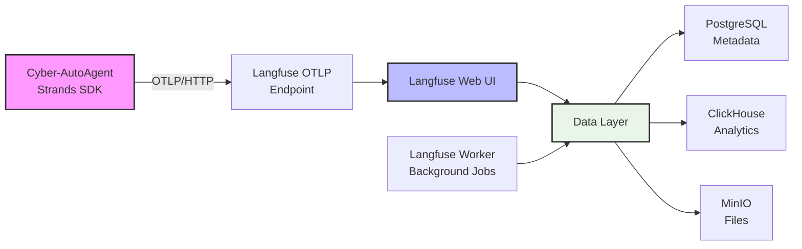
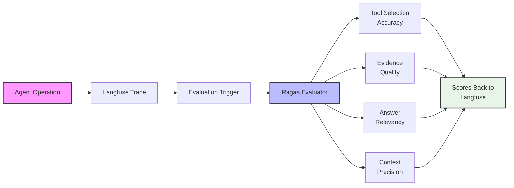
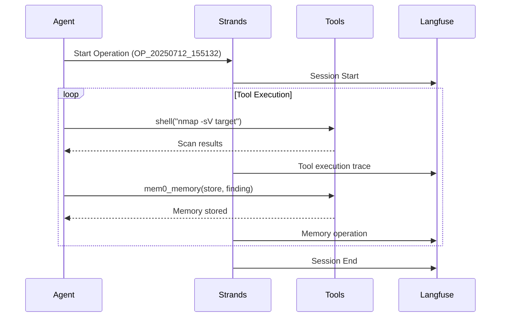

# Observability & Evaluation Guide

Cyber-AutoAgent provides built-in observability via Langfuse tracing and automated evaluation using Ragas metrics to monitor and improve penetration testing operations.

## Architecture Overview

### Observability Stack


### Evaluation Flow


### Operation Trace Flow


## Quick Start

```bash
# 1. Start monitoring stack
docker-compose up -d

# 2. Run with full observability
docker run --rm \
  --network cyber-autoagent_default \
  -e LANGFUSE_HOST=http://langfuse-web:3000 \
  -e ENABLE_AUTO_EVALUATION=true \
  cyber-autoagent \
  --target "http://testphp.vulnweb.com" \
  --objective "Find SQL injection vulnerabilities"

# 3. View at http://localhost:3000 (admin@cyber-autoagent.com / changeme)
```

**What you get:**
- Real-time trace of every tool execution
- Token usage and performance metrics
- Automated scoring of agent effectiveness
- Complete evidence trail

## Evaluation Metrics

The system automatically evaluates 6 core metrics after each operation to assess cybersecurity agent performance:

### Core Metrics Overview

| Metric | Type | What It Measures | Good Example | Poor Example |
|--------|------|------------------|--------------|--------------|
| **Tool Selection Accuracy** | 0.0-1.0 | Strategic tool choice and sequencing | `nmap -sV` → `nikto` → `sqlmap` | Using `nmap` for SQL injection |
| **Evidence Quality** | 0.0-1.0 | Vulnerability documentation completeness | Full exploit chain with payloads/outputs | "Found SQL injection" (no details) |
| **Goal Accuracy** | 0 or 1 | Binary - objective achieved | SQLi found when looking for SQLi | No findings despite thorough testing |
| **Topic Adherence** | 0.0-1.0 | Security focus consistency | Consistent pentesting terminology | Drifting to non-security topics |
| **Methodology Adherence** | 0.0-1.0 | Following penetration testing standards | PTES: recon→enum→exploit→report | Random testing without method |
| **Penetration Test Quality** | 0.0-1.0 | Holistic assessment of entire operation | Critical findings with full evidence | No findings or poor methodology |

### Key Metric Details

**Tool Selection Accuracy**: Evaluates appropriate cybersecurity tool choice and sequencing. Excellent scores use strategic combinations like `nmap+nikto` for recon followed by targeted `sqlmap`. Poor scores use wrong tools like `metasploit` before reconnaissance.

**Evidence Quality**: Assesses vulnerability documentation completeness. Excellent scores include full exploitation chains with URLs, payloads, outputs, and impact. Poor scores have vague statements without technical details.

**Penetration Test Quality**: Comprehensive assessment requiring excellence in all areas - reconnaissance, vulnerability identification, validation, documentation, and remediation recommendations.

### Score Interpretation

| Score Range | Assessment | Action Required |
|-------------|------------|-----------------|
| **0.9-1.0** | Excellent | None - exemplary performance |
| **0.7-0.89** | Good | Minor improvements possible |
| **0.5-0.69** | Fair | Review approach and tool selection |
| **0.0-0.49** | Poor | Significant issues need addressing |

### Common Score Patterns

1. **High Tool Selection, Low Evidence Quality**: Agent uses correct tools but doesn't collect proper evidence → Improve memory storage after findings
2. **Low Methodology Adherence**: Agent skipping assessment phases → Ensure systematic progression through recon, enumeration, exploitation
3. **Low Topic Adherence**: Agent drifting off-topic → Strengthen system prompts

## Configuration

```bash
# Essential environment variables
ENABLE_OBSERVABILITY=true        # Default: true
ENABLE_AUTO_EVALUATION=false     # Default: false (enable for scoring)
LANGFUSE_HOST=http://langfuse-web:3000
LANGFUSE_PUBLIC_KEY=cyber-public
LANGFUSE_SECRET_KEY=cyber-secret

# For production, generate secure keys:
export LANGFUSE_ENCRYPTION_KEY=$(openssl rand -hex 32)
export LANGFUSE_ADMIN_PASSWORD=$(openssl rand -base64 32)
```

**Model Support:**
- AWS Bedrock: `-e SERVER=remote` (default)
- Ollama: `-e SERVER=local -e OLLAMA_HOST=http://localhost:11434`

## Troubleshooting

| Issue | Fix |
|-------|-----|
| No traces | Check `LANGFUSE_HOST` and network connectivity |
| No evaluation | Set `ENABLE_AUTO_EVALUATION=true` |
| Auth errors | Verify PUBLIC_KEY and SECRET_KEY match |
| Slow traces | Reduce `LANGFUSE_INGESTION_QUEUE_DELAY_MS` to 1000 |

```bash
# Debug commands
curl -I http://localhost:3000/api/public/otel/v1/traces
docker logs cyber-autoagent 2>&1 | grep -i evaluation
```

## Advanced

- **Custom metrics**: Extend `CyberAgentEvaluator` in `src/modules/evaluation/evaluation.py`
- **Performance**: Scale with `langfuse-worker` replicas
- **Export data**: Coming in next release

---

For detailed configuration and examples, see the [Langfuse docs](https://langfuse.com/docs) and [Ragas framework](https://github.com/explodinggradients/ragas).