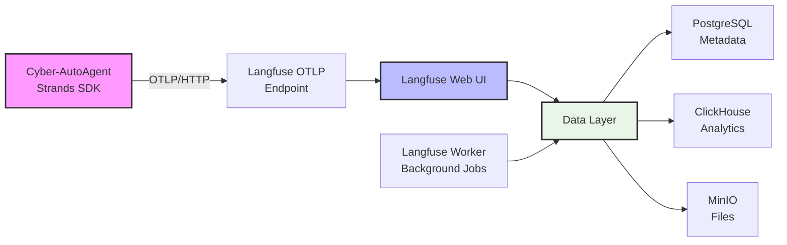
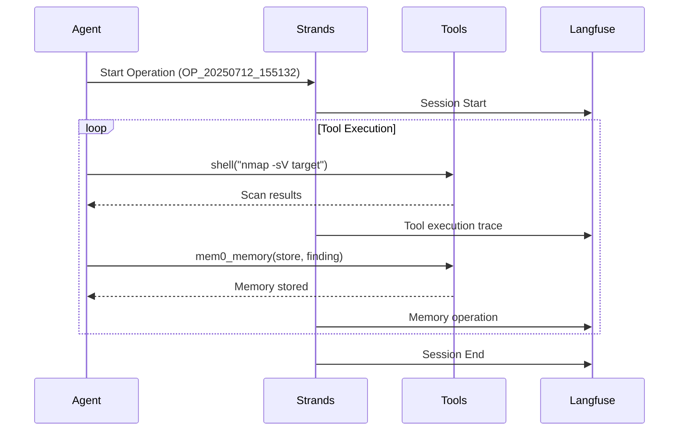

# Observability Guide

Cyber-AutoAgent includes built-in observability via Strands SDK + Langfuse (self-hosted) for monitoring penetration testing operations.

## Architecture



## OTLP Integration

Automatic trace export via Strands SDK:

1. **Agent** uses Strands framework tools
2. **Strands SDK** generates OTLP traces automatically  
3. **OTLP Exporter** sends to Langfuse endpoint
4. **Langfuse** processes and stores traces

## Trace Content

Each operation creates traces showing:



## Automatic Configuration

Observability is **enabled by default** with:

```yaml
# Environment variables in docker-compose.yml
ENABLE_OBSERVABILITY: "true"
LANGFUSE_HOST: "http://langfuse-web:3000" 
LANGFUSE_PUBLIC_KEY: "cyber-public"
LANGFUSE_SECRET_KEY: "cyber-secret"
```

The agent automatically:
1. Sets OTLP endpoint: `{LANGFUSE_HOST}/api/public/otel/v1/traces`
2. Creates Basic Auth header from public/secret keys
3. Initializes Strands telemetry with OTLP exporter

## Trace Attributes

Each trace includes:
- **session.id**: Operation ID (OP_20250712_155132)
- **user.id**: Agent identifier (cyber-agent-{target})
- **agent.target**: Target being tested
- **agent.objective**: Test objective  
- **agent.model**: AI model used
- **langfuse.tags**: [Cyber-AutoAgent, SERVER, operation_id]

## Quick Start

```bash
# Start full stack with observability
docker-compose up -d

# Run penetration test (traces auto-exported)
docker run --rm \
  --network cyber-autoagent_default \
  -e LANGFUSE_HOST=http://langfuse-web:3000 \
  cyber-autoagent \
  --target "example.com" \
  --objective "Security assessment"

# View traces at http://localhost:3000
# Login: admin@cyber-autoagent.com / changeme
```

## What You'll See

### Operation Timeline
- Agent initialization and tool discovery
- Each shell command execution (nmap, sqlmap, etc.)
- Memory storage operations
- Swarm agent deployments
- HTTP requests and responses

### Performance Metrics  
- Total operation duration
- Individual tool execution times
- Token usage per AI model call
- Memory operation latency

### Evidence Tracking
- Findings stored in memory
- Tool outputs and results
- Error conditions and retries

## Search and Filtering

Filter traces by:
- **Target**: Find all scans of specific hosts
- **Model Provider**: `tags:remote` vs `tags:local`  
- **Time Range**: Last 24 hours, week, month
- **Success/Failure**: Completed vs errored operations

## Data Storage

Traces stored in Langfuse stack:
- **PostgreSQL**: Trace metadata and structure
- **ClickHouse**: High-volume analytics data
- **MinIO**: Evidence files and attachments

Evidence also stored locally:
- `./evidence/evidence_OP_*/`: Local copy of findings
- `./logs/cyber_operations.log`: Complete session logs

## Performance Tuning

Default optimizations in `docker-compose.yml`:
```yaml
LANGFUSE_INGESTION_QUEUE_DELAY_MS: "5000"    # 5sec visibility
LANGFUSE_CACHE_API_KEY_ENABLED: "true"       # API performance  
LANGFUSE_S3_CONCURRENT_WRITES: "25"          # Parallel uploads
LANGFUSE_INIT_PROJECT_RETENTION: "30"        # 30-day retention
```

## Disabling Observability

```bash
# Disable trace export
export ENABLE_OBSERVABILITY=false

# Or in docker-compose.yml
ENABLE_OBSERVABILITY: "false"
```

Agent will run without trace export but local logging continues.

## Troubleshooting

### No Traces Appearing
1. Check agent logs: `docker logs cyber-autoagent`
2. Verify Langfuse health: `docker logs cyber-langfuse`
3. Test OTLP endpoint: `curl http://localhost:3000/api/public/otel/v1/traces`

### Authentication Errors
1. Verify keys match in docker-compose.yml
2. Check Basic Auth header generation
3. Ensure containers can communicate

### Storage Issues
1. Monitor MinIO disk usage
2. Adjust retention period if needed
3. Export important data before cleanup