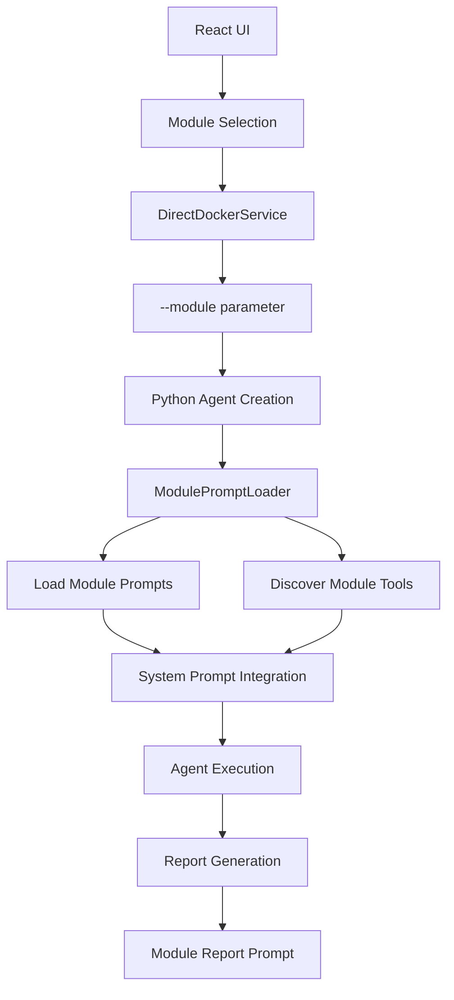
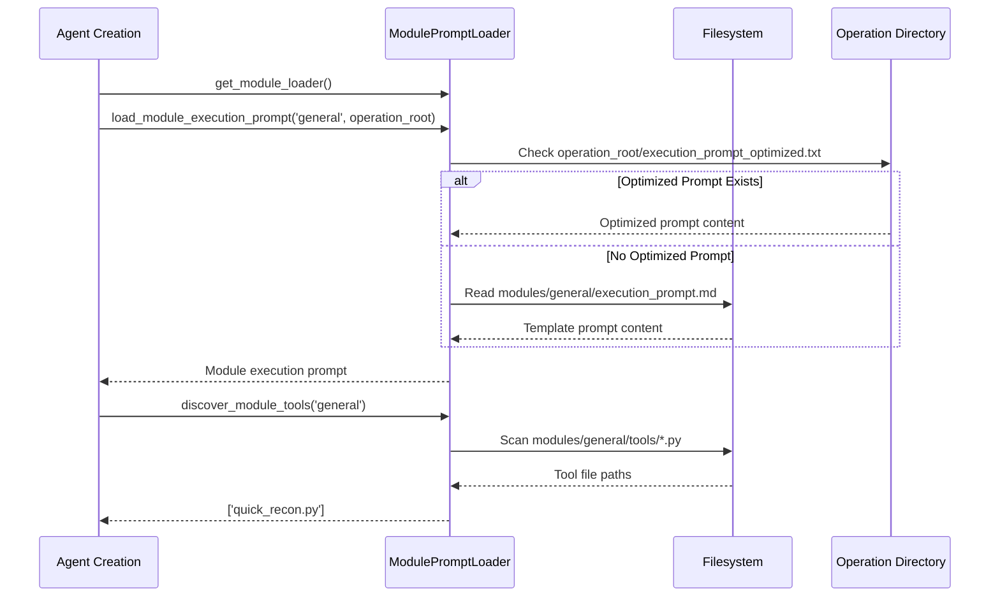
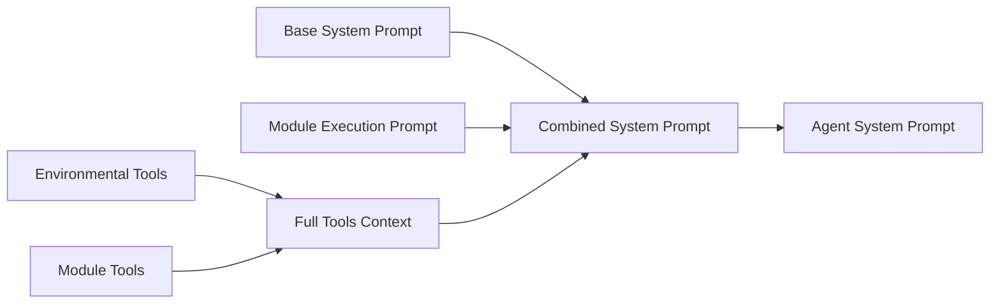
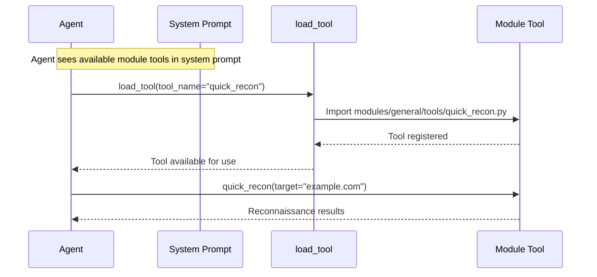
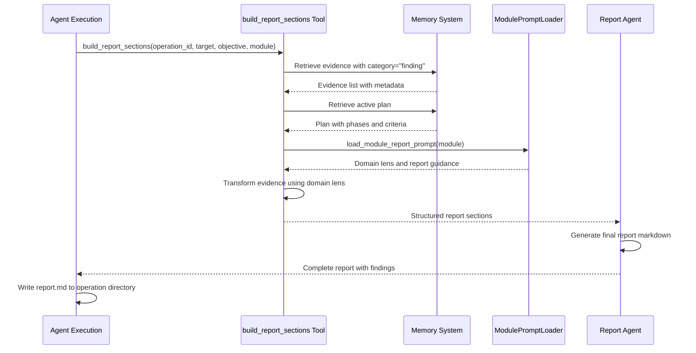

# Module-Based Prompt System

Cyber-AutoAgent uses a modular prompt architecture that enables specialized security assessments with domain-specific expertise, tools, and reporting.

## Architecture Overview



## Module Selection Flow

### 1. User Interface Selection
```typescript
// React UI - Module selection
interface AssessmentParams {
  module: string;  // 'general'
  target: string;
  objective?: string;
}
```

### 2. Parameter Passing
```typescript
// DirectDockerService.ts - Docker execution
const args = [
  '--module', params.module,
  '--objective', objective,
  '--target', params.target,
  '--iterations', String(config.iterations || 100),
  '--provider', config.modelProvider || 'bedrock',
];
```

### 3. CLI Argument Processing
```python
# cyberautoagent.py - Command line parsing
parser.add_argument(
    "--module",
    type=str,
    default="general",
    help="Security module to use (e.g., general)",
)
```

## Module Structure

```
src/modules/operation_plugins/
├── general/
│   ├── execution_prompt.md    # Domain-specific system prompt
│   ├── report_prompt.md       # Report generation guidance
│   ├── module.yaml            # Module configuration
│   └── tools/                 # Module-specific tools / specialist agents
│       └── validation_specialist.py
└── ctf/
    ├── execution_prompt.md
    ├── report_prompt.md
    ├── module.yaml
    └── tools/
        └── __init__.py
```

**Module Configuration** (module.yaml):
```yaml
cognitive_level: 4
configuration:
  approach: Family-driven discovery and exploitation with curated-first probes and explicit success-state termination
```

**Available Modules**:
- **general**: Comprehensive web application and network security testing
  - Includes the `validation_specialist` tool (invoked via `load_tool("validation_specialist")`) and can be extended with additional specialist agents following the same pattern.
- **ctf**: CTF challenge solving with flag recognition and success detection

## Prompt Loading System

### ModulePromptLoader Class

```python
# modules/prompts/module_loader.py
class ModulePromptLoader:
    def load_module_execution_prompt(self, module_name: str) -> Optional[str]
    def load_module_report_prompt(self, module_name: str) -> Optional[str]
    def discover_module_tools(self, module_name: str) -> List[str]
    def get_available_modules(self) -> List[str]
    def validate_module(self, module_name: str) -> bool
```

### Loading Process



The loader checks for operation-specific optimized prompts first (created by the prompt optimizer), falling back to the module template if not found.

## System Prompt Integration

### Base + Module Prompt Composition

```python
# modules/agents/cyber_autoagent.py - Agent creation
def create_agent(module: str = "general"):
    # Load module-specific execution prompt
    module_loader = get_module_loader()
    module_execution_prompt = module_loader.load_module_execution_prompt(module)
    
    # Discover module tools
    module_tool_paths = module_loader.discover_module_tools(module)
    tool_names = [Path(tool_path).stem for tool_path in module_tool_paths]
    
    # Build tools context
    module_tools_context = f"""
## MODULE-SPECIFIC TOOLS
Available {module} module tools (use load_tool to activate):
{", ".join(tool_names)}
"""
    
    # Generate enhanced system prompt
    system_prompt = get_system_prompt(
        target=target,
        objective=objective,
        tools_context=full_tools_context,
        module_context=module_execution_prompt,
    )
```

### Prompt Composition Flow



### Example: General Module Integration

```text
# Ghost - Cyber Operations Specialist
[Base system prompt with core behaviors]

## MODULE-SPECIFIC GUIDANCE
<role>
You are a comprehensive security assessment specialist conducting general penetration testing.
</role>

<assessment_methodology>
1. Initial Reconnaissance
2. Service Classification  
3. Adaptive Testing Strategy
</assessment_methodology>

## MODULE-SPECIFIC TOOLS
Available general module tools (use load_tool to activate):
quick_recon

Load these tools when needed: load_tool(tool_name="tool_name")
```

## Tool Discovery System

### Discovery Process

```python
# modules/prompts/module_loader.py
def discover_module_tools(self, module_name: str) -> List[str]:
    tools_path = self.modules_path / module_name / "tools"
    tools = []
    
    if tools_path.exists():
        for tool_file in tools_path.glob("*.py"):
            if tool_file.name != "__init__.py":
                tools.append(str(tool_file))
    
    return tools
```

### Tool Integration Flow



## Report Generation System

### Module Report Prompt Integration

```python
# modules/tools/report_builder.py
@tool
def build_report_sections(
    operation_id: str,
    target: str,
    objective: str,
    module: str = "general",
    steps_executed: int = 0,
    tools_used: List[str] = None,
) -> Dict[str, Any]:
    """Build structured sections for the security assessment report.

    Retrieves operation-scoped evidence and plan, summarizes findings,
    and returns preformatted sections for the final report template.
    """
    # Load module report prompt for domain lens
    module_loader = get_module_loader()
    module_prompt = module_loader.load_module_report_prompt(module)
    domain_lens = _extract_domain_lens(module_prompt)

    # Transform evidence to content using domain lens
    report_content = _transform_evidence_to_content(
        evidence=evidence,
        domain_lens=domain_lens,
        target=target,
        objective=objective
    )

    # Return structured sections for report generation
    return {
        "overview": report_content.get("overview", ""),
        "evidence_text": evidence_text,
        "findings_table": findings_table,
        "analysis": report_content.get("analysis", ""),
        "recommendations": report_content.get("immediate", ""),
        # ... additional sections
    }
```

### Report Generation Flow



The report generation uses a dedicated `build_report_sections` tool that retrieves evidence from memory, applies module-specific domain lenses, and produces structured sections for the report agent to format.

## Module Examples

### General Security Module

**Execution Prompt Features:**
- Multi-domain security coverage (Network, Web, API, Infrastructure, Cloud)
- Adaptive testing methodology based on discovered services
- Risk-based vulnerability prioritization
- Comprehensive reconnaissance approach
- Evidence-driven exploitation with artifact validation

**Available Tools:**
- `quick_recon`: Basic reconnaissance and port scanning
- Module tools can be pre-loaded or loaded dynamically via `load_tool()`

**Report Characteristics:**
- Multi-domain vulnerability grouping
- Context-aware findings explanation
- Vulnerability chaining analysis
- Executive summary for business risk
- Structured findings with severity-based prioritization

### CTF Module

**Execution Prompt Features:**
- Flag recognition patterns and success detection
- Family-driven vulnerability discovery
- Curated-first probes for common CTF patterns
- Explicit success-state termination
- Challenge-specific exploitation strategies

**Report Characteristics:**
- Challenge solution documentation
- Flag extraction methodology
- Tool usage and command sequences
- Lessons learned and technique breakdown


## Implementation Details

### Agent Creation with Modules

```python
# modules/agents/cyber_autoagent.py
agent, callback_handler = create_agent(
    target=args.target,
    objective=args.objective,
    max_steps=args.iterations,
    available_tools=available_tools,
    op_id=local_operation_id,
    model_id=args.model,
    region_name=args.region,
    provider=args.provider,
    memory_path=args.memory_path,
    memory_mode=args.memory_mode,
    module=args.module,  # Module parameter passed through
)
```


The module system provides a powerful way to specialize Cyber-AutoAgent for different security domains while maintaining consistent core functionality and user experience.
