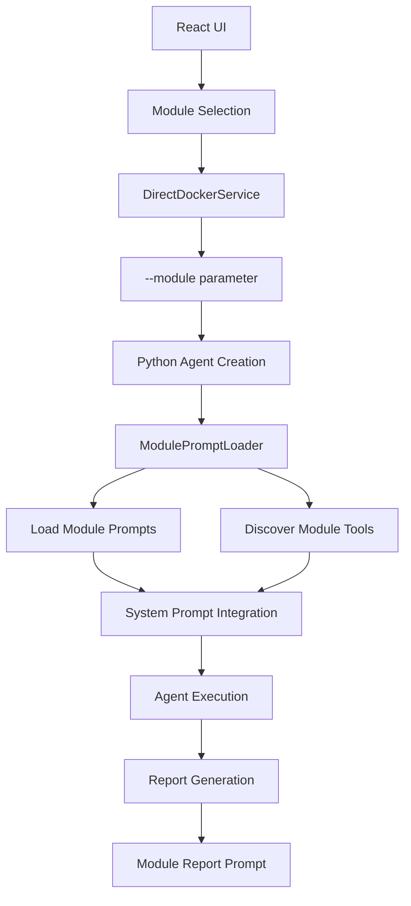
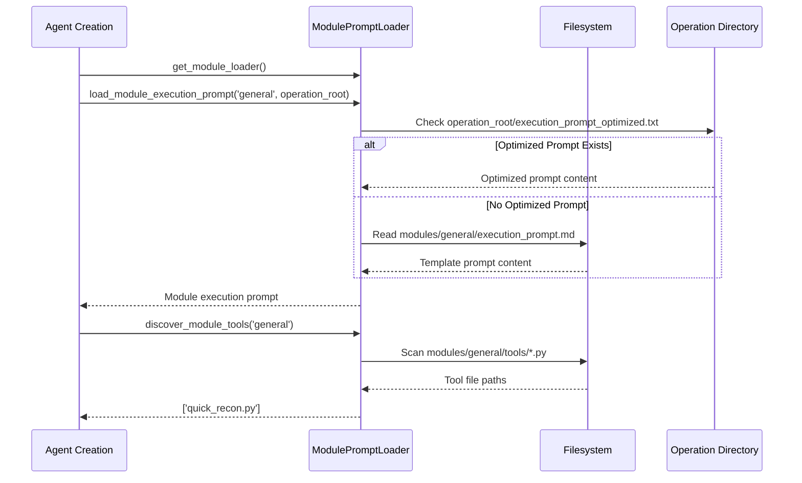
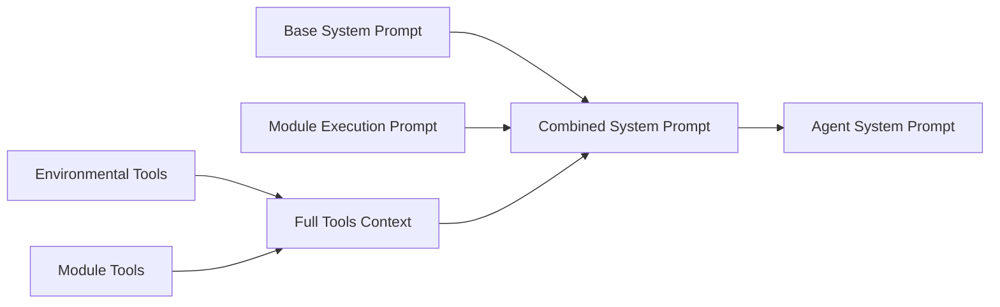
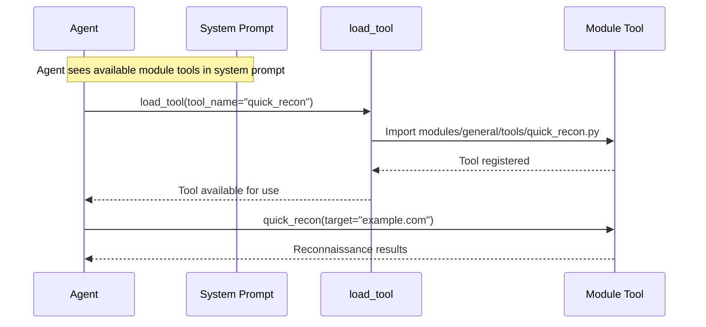
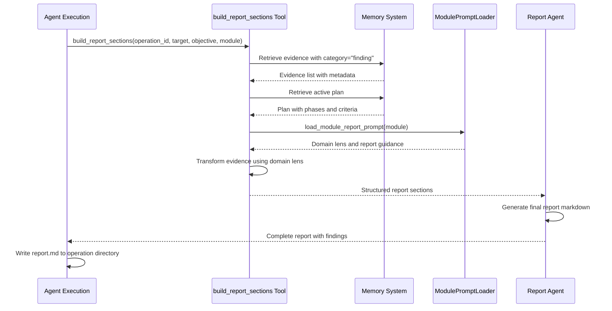

# Module-Based Prompt System

Cyber-AutoAgent uses a modular prompt architecture that enables specialized security assessments with domain-specific expertise, tools, and reporting.

## Architecture Overview


```mermaid
graph TD
    A[React UI] --> B[Module Selection]
    B --> C[DirectDockerService]
    C --> D[--module parameter]
    D --> E[Python Agent Creation]
    E --> F[ModulePromptLoader]
    F --> G[Load Module Prompts]
    F --> H[Discover Module Tools]
    G --> I[System Prompt Integration]
    H --> I
    I --> J[Agent Execution]
    J --> K[Report Generation]
    K --> L[Module Report Prompt]
```

## Module Selection Flow

### 1. User Interface Selection
```typescript
// React UI - Module selection
interface AssessmentParams {
  module: string;  // 'general'
  target: string;
  objective?: string;
}
```

### 2. Parameter Passing
```typescript
// DirectDockerService.ts - Docker execution
const args = [
  '--module', params.module,
  '--objective', objective,
  '--target', params.target,
  '--iterations', String(config.iterations || 100),
  '--provider', config.modelProvider || 'bedrock',
];
```

### 3. CLI Argument Processing
```python
# cyberautoagent.py - Command line parsing
parser.add_argument(
    "--module",
    type=str,
    default="general",
    help="Security module to use (e.g., general)",
)
```

## Module Structure

```
src/modules/operation_plugins/
├── general/
│   ├── execution_prompt.md    # Domain-specific system prompt
│   ├── report_prompt.md       # Report generation guidance
│   ├── module.yaml            # Module configuration
│   └── tools/                 # Module-specific tools
│       ├── __init__.py
│       └── quick_recon.py
└── ctf/
    ├── execution_prompt.md
    ├── report_prompt.md
    ├── module.yaml
    └── tools/
        └── __init__.py
```

**Module Configuration** (module.yaml):
```yaml
cognitive_level: 4
configuration:
  approach: Family-driven discovery and exploitation with curated-first probes and explicit success-state termination
```

**Available Modules**:
- **general**: Comprehensive web application and network security testing
- **ctf**: CTF challenge solving with flag recognition and success detection

## Prompt Loading System

### ModulePromptLoader Class

```python
# modules/prompts/module_loader.py
class ModulePromptLoader:
    def load_module_execution_prompt(self, module_name: str) -> Optional[str]
    def load_module_report_prompt(self, module_name: str) -> Optional[str]
    def discover_module_tools(self, module_name: str) -> List[str]
    def get_available_modules(self) -> List[str]
    def validate_module(self, module_name: str) -> bool
```

### Loading Process


```mermaid
sequenceDiagram
    participant A as Agent Creation
    participant L as ModulePromptLoader
    participant F as Filesystem
    participant P as Operation Directory

    A->>L: get_module_loader()
    A->>L: load_module_execution_prompt('general', operation_root)
    L->>P: Check operation_root/execution_prompt_optimized.txt
    alt Optimized Prompt Exists
        P-->>L: Optimized prompt content
    else No Optimized Prompt
        L->>F: Read modules/general/execution_prompt.md
        F-->>L: Template prompt content
    end
    L-->>A: Module execution prompt

    A->>L: discover_module_tools('general')
    L->>F: Scan modules/general/tools/*.py
    F-->>L: Tool file paths
    L-->>A: ['quick_recon.py']
```

The loader checks for operation-specific optimized prompts first (created by the prompt optimizer), falling back to the module template if not found.

## System Prompt Integration

### Base + Module Prompt Composition

```python
# modules/agents/cyber_autoagent.py - Agent creation
def create_agent(module: str = "general"):
    # Load module-specific execution prompt
    module_loader = get_module_loader()
    module_execution_prompt = module_loader.load_module_execution_prompt(module)
    
    # Discover module tools
    module_tool_paths = module_loader.discover_module_tools(module)
    tool_names = [Path(tool_path).stem for tool_path in module_tool_paths]
    
    # Build tools context
    module_tools_context = f"""
## MODULE-SPECIFIC TOOLS
Available {module} module tools (use load_tool to activate):
{", ".join(tool_names)}
"""
    
    # Generate enhanced system prompt
    system_prompt = get_system_prompt(
        target=target,
        objective=objective,
        tools_context=full_tools_context,
        module_context=module_execution_prompt,
    )
```

### Prompt Composition Flow


```mermaid
graph LR
    A[Base System Prompt] --> C[Combined System Prompt]
    B[Module Execution Prompt] --> C
    D[Environmental Tools] --> E[Full Tools Context]
    F[Module Tools] --> E
    E --> C
    C --> G[Agent System Prompt]
```

### Example: General Module Integration

```text
# Ghost - Cyber Operations Specialist
[Base system prompt with core behaviors]

## MODULE-SPECIFIC GUIDANCE
<role>
You are a comprehensive security assessment specialist conducting general penetration testing.
</role>

<assessment_methodology>
1. Initial Reconnaissance
2. Service Classification  
3. Adaptive Testing Strategy
</assessment_methodology>

## MODULE-SPECIFIC TOOLS
Available general module tools (use load_tool to activate):
quick_recon

Load these tools when needed: load_tool(tool_name="tool_name")
```

## Tool Discovery System

### Discovery Process

```python
# modules/prompts/module_loader.py
def discover_module_tools(self, module_name: str) -> List[str]:
    tools_path = self.modules_path / module_name / "tools"
    tools = []
    
    if tools_path.exists():
        for tool_file in tools_path.glob("*.py"):
            if tool_file.name != "__init__.py":
                tools.append(str(tool_file))
    
    return tools
```

### Tool Integration Flow


```mermaid
sequenceDiagram
    participant A as Agent
    participant S as System Prompt
    participant T as load_tool
    participant M as Module Tool
    
    Note over A,S: Agent sees available module tools in system prompt
    A->>T: load_tool(tool_name="quick_recon")
    T->>M: Import modules/general/tools/quick_recon.py
    M-->>T: Tool registered
    T-->>A: Tool available for use
    A->>M: quick_recon(target="example.com")
    M-->>A: Reconnaissance results
```

## Report Generation System

### Module Report Prompt Integration

```python
# modules/tools/report_builder.py
@tool
def build_report_sections(
    operation_id: str,
    target: str,
    objective: str,
    module: str = "general",
    steps_executed: int = 0,
    tools_used: List[str] = None,
) -> Dict[str, Any]:
    """Build structured sections for the security assessment report.

    Retrieves operation-scoped evidence and plan, summarizes findings,
    and returns preformatted sections for the final report template.
    """
    # Load module report prompt for domain lens
    module_loader = get_module_loader()
    module_prompt = module_loader.load_module_report_prompt(module)
    domain_lens = _extract_domain_lens(module_prompt)

    # Transform evidence to content using domain lens
    report_content = _transform_evidence_to_content(
        evidence=evidence,
        domain_lens=domain_lens,
        target=target,
        objective=objective
    )

    # Return structured sections for report generation
    return {
        "overview": report_content.get("overview", ""),
        "evidence_text": evidence_text,
        "findings_table": findings_table,
        "analysis": report_content.get("analysis", ""),
        "recommendations": report_content.get("immediate", ""),
        # ... additional sections
    }
```

### Report Generation Flow


```mermaid
sequenceDiagram
    participant E as Agent Execution
    participant T as build_report_sections Tool
    participant M as Memory System
    participant L as ModulePromptLoader
    participant A as Report Agent

    E->>T: build_report_sections(operation_id, target, objective, module)
    T->>M: Retrieve evidence with category="finding"
    M-->>T: Evidence list with metadata
    T->>M: Retrieve active plan
    M-->>T: Plan with phases and criteria
    T->>L: load_module_report_prompt(module)
    L-->>T: Domain lens and report guidance
    T->>T: Transform evidence using domain lens
    T-->>A: Structured report sections
    A->>A: Generate final report markdown
    A-->>E: Complete report with findings
    E->>E: Write report.md to operation directory
```

The report generation uses a dedicated `build_report_sections` tool that retrieves evidence from memory, applies module-specific domain lenses, and produces structured sections for the report agent to format.

## Module Examples

### General Security Module

**Execution Prompt Features:**
- Multi-domain security coverage (Network, Web, API, Infrastructure, Cloud)
- Adaptive testing methodology based on discovered services
- Risk-based vulnerability prioritization
- Comprehensive reconnaissance approach
- Evidence-driven exploitation with artifact validation

**Available Tools:**
- `quick_recon`: Basic reconnaissance and port scanning
- Module tools can be pre-loaded or loaded dynamically via `load_tool()`

**Report Characteristics:**
- Multi-domain vulnerability grouping
- Context-aware findings explanation
- Vulnerability chaining analysis
- Executive summary for business risk
- Structured findings with severity-based prioritization

### CTF Module

**Execution Prompt Features:**
- Flag recognition patterns and success detection
- Family-driven vulnerability discovery
- Curated-first probes for common CTF patterns
- Explicit success-state termination
- Challenge-specific exploitation strategies

**Report Characteristics:**
- Challenge solution documentation
- Flag extraction methodology
- Tool usage and command sequences
- Lessons learned and technique breakdown


## Implementation Details

### Agent Creation with Modules

```python
# modules/agents/cyber_autoagent.py
agent, callback_handler = create_agent(
    target=args.target,
    objective=args.objective,
    max_steps=args.iterations,
    available_tools=available_tools,
    op_id=local_operation_id,
    model_id=args.model,
    region_name=args.region,
    provider=args.provider,
    memory_path=args.memory_path,
    memory_mode=args.memory_mode,
    module=args.module,  # Module parameter passed through
)
```


The module system provides a powerful way to specialize Cyber-AutoAgent for different security domains while maintaining consistent core functionality and user experience.

## Knowledge Base Tool Usage

The `retrieve_kb` tool provides offline access to curated security domain knowledge including CVEs, threat actors, TTPs, and payload patterns. Unlike operation memory (dynamic, per-target evidence), the KB is static, cross-target reference knowledge.

### Tool Interface

```python
retrieve_kb(
    query: str,
    filters: Optional[Dict[str, str]] = None,
    max_results: int = 3
) -> str
```

### Usage Examples

**Basic CVE Lookup:**
```python
retrieve_kb("Log4Shell exploitation techniques")
```

**Filtered Query:**
```python
retrieve_kb(
    "blind XSS detection",
    filters={"domain": "web"}
)
```

**Tag-based Search:**
```python
retrieve_kb(
    "credential access techniques",
    filters={"tactic": "credential_access"}
)
```

**Multi-filter Query:**
```python
retrieve_kb(
    "SSTI payloads",
    filters={"domain": "web", "category": "payload"}
)
```

### Available Filters

- **domain**: web, network, api, cloud
- **category**: cve, technique, payload, actor
- **tags**: Any tag from KB entries (e.g., xss, sqli, rce, python)
- **cve**: Specific CVE identifier
- **tactic**: MITRE ATT&CK tactic

### Response Format

```json
{
  "status": "success",
  "count": 2,
  "query": "blind XSS detection",
  "filters": {"domain": "web"},
  "results": [
    {
      "id": "xss-blind-detection",
      "domain": "web",
      "category": "technique",
      "content": "Blind XSS requires out-of-band exfiltration...",
      "tags": ["xss", "oob", "blind"],
      "source": "OWASP XSS Guide"
    }
  ]
}
```

### Integration Patterns

**Pre-Exploitation Research:**
```python
# Before attempting exploitation, lookup known patterns
kb_result = retrieve_kb("SSTI Jinja2 RCE")
# Extract payload templates from results
# Apply payloads to target
```

**Threat Intelligence:**
```python
# Identify adversary TTPs during investigation
kb_result = retrieve_kb("APT28 credential access")
# Cross-reference with observed behavior
```

**Payload Generation:**
```python
# Retrieve payload templates
kb_result = retrieve_kb(
    "XSS payload templates",
    filters={"domain": "web", "category": "payload"}
)
# Adapt payloads to target context
```

### Best Practices

**1. Query Early:**
Query the KB at the beginning of exploitation attempts to leverage known patterns:
```python
# Good: Research before exploitation
kb_payloads = retrieve_kb("SQLi union payloads", filters={"domain": "web"})
# Then apply payloads to target
```

**2. Use Filters:**
Narrow results with filters to get more relevant knowledge:
```python
# More specific than generic query
retrieve_kb("RCE techniques", filters={"domain": "web", "category": "technique"})
```

**3. Limit Results:**
Use `max_results` to control token usage:
```python
retrieve_kb("XSS payloads", max_results=2)  # Only top 2 matches
```

**4. Combine with Operation Memory:**
Use KB for reference, operation memory for findings:
```python
# KB: Lookup known exploitation pattern
kb_pattern = retrieve_kb("XXE file read techniques")

# Memory: Store discovered vulnerability
mem0_memory(
    action="store",
    content="[WHAT] XXE [WHERE] /upload [EVIDENCE] /etc/passwd read successful",
    metadata={"category": "finding", "severity": "high"}
)
```

### Configuration

**Environment Variables:**
```bash
export CYBER_KB_ENABLED=true          # Enable/disable KB
export CYBER_KB_MAX_RESULTS=3         # Default max results
export CYBER_KB_BASE_DIR=data/kb      # KB data directory
```

**CLI Flags:**
```bash
python src/cyberautoagent.py \
  --kb-enabled \
  --kb-max-results 5 \
  --target example.com \
  --objective "Web application assessment"
```

### Maintenance

**Updating KB Content:**

1. Edit JSONL files in `data/kb/content/`
2. Run build script to regenerate index:
   ```bash
   python data/kb/build_kb.py
   ```
3. Commit updated files

**Adding New Entries:**

```json
{
  "id": "unique-identifier",
  "domain": "web|network|api|cloud",
  "category": "cve|technique|payload|actor",
  "content": "Concise description (200-400 tokens)",
  "tags": ["tag1", "tag2", "tag3"],
  "source": "Reference source"
}
```

**KB Versioning:**

The KB is versioned via `manifest.json`:
```json
{
  "version": "v0.1.0",
  "created_at": "2025-10-22T02:38:00Z",
  "entry_count": 20,
  "has_faiss_index": true
}
```

### Limitations

- **Read-only**: Cannot modify KB during operations
- **Static**: Updates require rebuilding the index
- **Offline-first**: No live threat intelligence feeds
- **Curated**: Limited to preloaded entries

For dynamic, operation-specific knowledge, use operation memory (`mem0_memory` tool) instead.