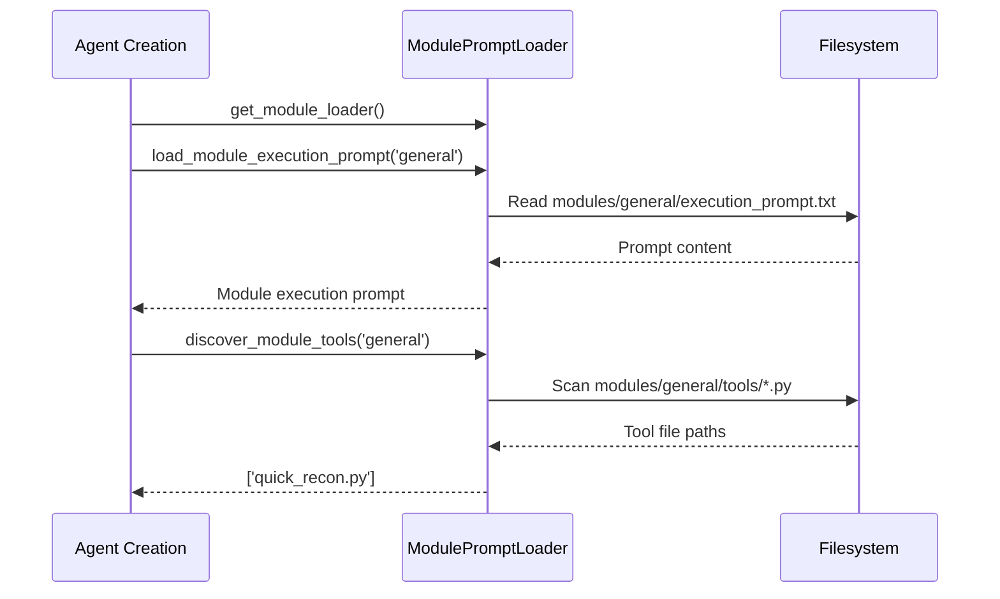
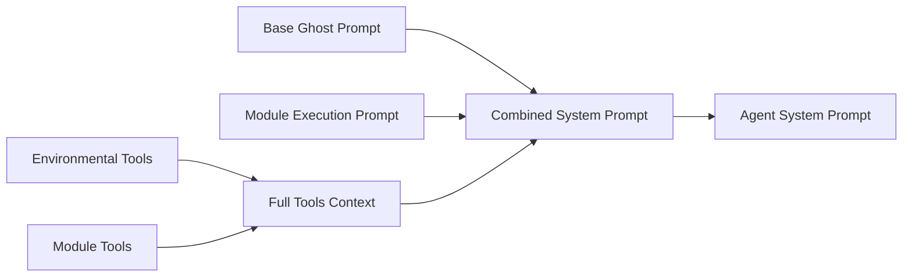
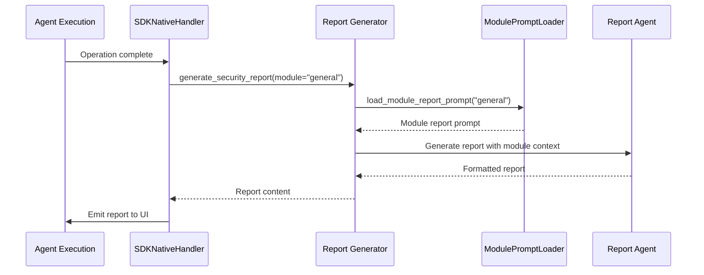

# Module-Based Prompt System

Cyber-AutoAgent uses a modular prompt architecture that enables specialized security assessments with domain-specific expertise, tools, and reporting.

## Architecture Overview


## Module Selection Flow

### 1. User Interface Selection
```typescript
// React UI - Module selection
interface AssessmentParams {
  module: string;  // 'general'
  target: string;
  objective?: string;
}
```

### 2. Parameter Passing
```typescript
// DirectDockerService.ts - Docker execution
const args = [
  '--module', params.module,
  '--objective', objective,
  '--target', params.target,
  '--iterations', String(config.iterations || 100),
  '--provider', config.modelProvider || 'bedrock',
];
```

### 3. CLI Argument Processing
```python
# cyberautoagent.py - Command line parsing
parser.add_argument(
    "--module",
    type=str,
    default="general",
    help="Security module to use (e.g., general)",
)
```

## Module Structure

```
modules/
└── general/
    ├── execution_prompt.txt    # Domain-specific system prompt
    ├── report_prompt.txt       # Report generation guidance
    ├── module.yaml            # Module metadata
    └── tools/                 # Module-specific tools
        ├── __init__.py
        └── quick_recon.py
```

## Prompt Loading System

### ModulePromptLoader Class

```python
# modules/prompts/module_loader.py
class ModulePromptLoader:
    def load_module_execution_prompt(self, module_name: str) -> Optional[str]
    def load_module_report_prompt(self, module_name: str) -> Optional[str]
    def discover_module_tools(self, module_name: str) -> List[str]
    def get_available_modules(self) -> List[str]
    def validate_module(self, module_name: str) -> bool
```

### Loading Process



## System Prompt Integration

### Base + Module Prompt Composition

```python
# modules/agents/cyber_autoagent.py - Agent creation
def create_agent(module: str = "general"):
    # Load module-specific execution prompt
    module_loader = get_module_loader()
    module_execution_prompt = module_loader.load_module_execution_prompt(module)
    
    # Discover module tools
    module_tool_paths = module_loader.discover_module_tools(module)
    tool_names = [Path(tool_path).stem for tool_path in module_tool_paths]
    
    # Build tools context
    module_tools_context = f"""
## MODULE-SPECIFIC TOOLS
Available {module} module tools (use load_tool to activate):
{", ".join(tool_names)}
"""
    
    # Generate enhanced system prompt
    system_prompt = get_system_prompt(
        target=target,
        objective=objective,
        tools_context=full_tools_context,
        module_context=module_execution_prompt,
    )
```

### Prompt Composition Flow



### Example: General Module Integration

```text
# Ghost - Cyber Operations Specialist
[Base system prompt with core behaviors]

## MODULE-SPECIFIC GUIDANCE
<role>
You are a comprehensive security assessment specialist conducting general penetration testing.
</role>

<assessment_methodology>
1. Initial Reconnaissance
2. Service Classification  
3. Adaptive Testing Strategy
</assessment_methodology>

## MODULE-SPECIFIC TOOLS
Available general module tools (use load_tool to activate):
quick_recon

Load these tools when needed: load_tool(tool_name="tool_name")
```

## Tool Discovery System

### Discovery Process

```python
# modules/prompts/module_loader.py
def discover_module_tools(self, module_name: str) -> List[str]:
    tools_path = self.modules_path / module_name / "tools"
    tools = []
    
    if tools_path.exists():
        for tool_file in tools_path.glob("*.py"):
            if tool_file.name != "__init__.py":
                tools.append(str(tool_file))
    
    return tools
```

### Tool Integration Flow


## Report Generation System

### Module Report Prompt Integration

```python
# modules/tools/report_generator.py
def generate_security_report(module: Optional[str] = None):
    # Get module report prompt if available
    module_report_prompt = _get_module_report_prompt(module)
    
    # Get the report prompt from centralized prompts
    report_prompt = get_report_generation_prompt(
        target=target,
        objective=objective,
        operation_id=operation_id,
        steps_executed=steps_executed,
        tools_text=tools_text,
        evidence_text=evidence_text,
        module_report_prompt=module_report_prompt
    )
```

### Report Generation Flow



## Module Examples

### General Security Module

**Execution Prompt Features:**
- Multi-domain security coverage (Network, Web, API, Infrastructure, Cloud)
- Adaptive testing methodology based on discovered services
- Risk-based vulnerability prioritization
- Comprehensive reconnaissance approach

**Available Tools:**
- `quick_recon`: Basic reconnaissance and port scanning
- `identify_technology`: Web technology fingerprinting

**Report Characteristics:**
- Multi-domain vulnerability grouping
- Context-aware findings explanation
- Vulnerability chaining analysis
- Executive summary for business risk


## Implementation Details

### Agent Creation with Modules

```python
# modules/agents/cyber_autoagent.py
agent, callback_handler = create_agent(
    target=args.target,
    objective=args.objective,
    max_steps=args.iterations,
    available_tools=available_tools,
    op_id=local_operation_id,
    model_id=args.model,
    region_name=args.region,
    provider=args.provider,
    memory_path=args.memory_path,
    memory_mode=args.memory_mode,
    module=args.module,  # Module parameter passed through
)
```


The module system provides a powerful way to specialize Cyber-AutoAgent for different security domains while maintaining consistent core functionality and user experience.