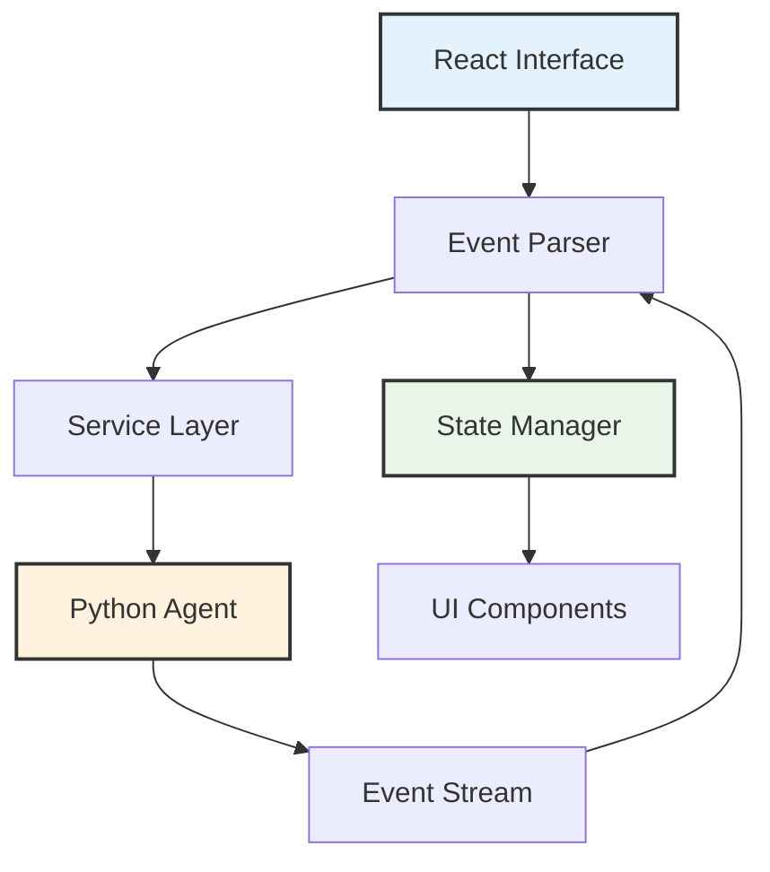
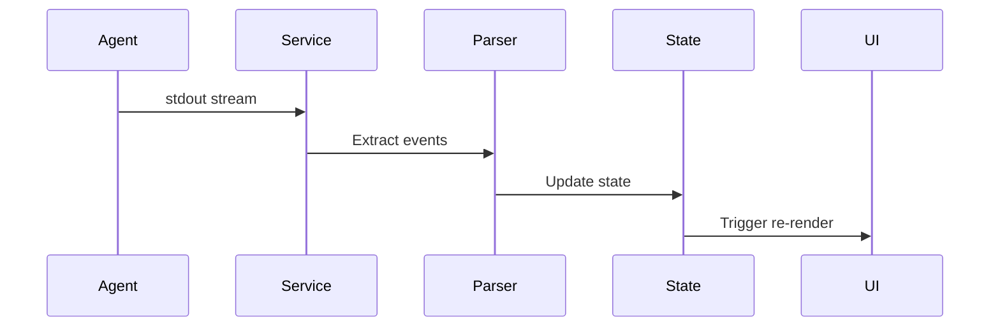

# Terminal Interface Architecture

The Cyber-AutoAgent terminal interface provides real-time streaming of agent operations through a React-based presentation layer built on Ink and TypeScript.

## Design Overview

The interface implements event-driven architecture with minimal parsing, maintaining separation between agent execution logic and user interface concerns.



## Core Technologies

**React Ink**: Terminal-based React renderer for CLI applications
**TypeScript**: Type-safe component and service implementation
**Event Protocol**: Structured JSON events via stdout

## Architecture Layers

### Service Layer

**DirectDockerService**: Container-based execution
- Spawns Python agent in Docker container
- Manages process lifecycle
- Buffers and parses event stream
- Handles errors and termination

**PythonExecutionService**: Local execution adapter
- Direct Python subprocess management
- Development mode support
- Identical event protocol

### Event Protocol

Python agent emits structured events through stdout:

```
__CYBER_EVENT__{"type":"tool_start","tool_name":"shell","tool_input":{...}}__CYBER_EVENT_END__
```

**Event Types:**
- `tool_start`: Tool invocation with parameters
- `tool_output`: Execution results
- `reasoning`: Agent decision context
- `step_header`: Iteration tracking
- `metrics_update`: Token usage and costs

### Event Processing



**Processing Flow:**
1. Agent emits events to stdout
2. Service buffers and extracts structured events
3. Parser validates event format
4. State manager updates application state
5. React components re-render based on state changes

## State Management

Application state follows unidirectional data flow using centralized state store:

**State Categories:**
- Operation metadata (target, objective, operation ID)
- Execution progress (current step, status)
- Event history (tool executions, outputs)
- Configuration (provider, model, iterations)

**State Updates:**
- Event-driven mutations from agent operations
- Immutable state transformations
- Selective component subscriptions

## Component Structure

```
src/modules/interfaces/react/
├── src/
│   ├── components/
│   │   ├── Terminal.tsx          # Event rendering
│   │   ├── StreamDisplay.tsx     # Output formatting
│   │   └── ConfigEditor.tsx      # Configuration UI
│   ├── services/
│   │   ├── DirectDockerService.ts
│   │   ├── PythonExecutionService.ts
│   │   └── MemoryService.ts
│   ├── stores/
│   │   └── configStore.ts
│   └── types/
│       └── events.ts
```

## Configuration Management

Configuration persists to `~/.cyber-autoagent/config.json`:

**Managed Settings:**
- Model provider selection (Bedrock, Ollama, LiteLLM)
- Model identifiers and parameters
- Execution limits (iterations)
- Memory persistence mode
- Observability endpoints

**Configuration Flow:**
1. Load from persistent storage
2. Merge with environment variables
3. Validate against schema
4. Provide to execution services

## Performance Characteristics

**Event Buffering**: Handles high-frequency event streams without blocking
**Efficient Rendering**: Minimizes re-renders through selective subscriptions
**Memory Management**: Bounded buffer sizes prevent memory leaks
**Stream Processing**: Non-blocking event parsing in separate execution context

## Integration Points

### Python Agent Integration

Interface communicates with Python agent exclusively through stdout events:
- No direct function calls
- No shared memory
- Clean process isolation

### Docker Integration

Service spawns containers with:
- Environment variable injection
- Volume mounts for output directories
- Network configuration for observability
- Resource limits where configured

### Configuration Storage

Persistent configuration enables:
- Provider settings across sessions
- Model preferences
- Execution parameter defaults
- Observability configuration

## Event Protocol Specification

### Event Structure

```typescript
interface CyberEvent {
  type: string;
  timestamp: string;
  data: Record<string, any>;
}
```

### Event Emission

Python agent emits events using:
```python
print(f"__CYBER_EVENT__{json.dumps(event)}__CYBER_EVENT_END__\n", end="", flush=True)
```

### Event Parsing

Interface extracts events using pattern matching:
```typescript
const eventPattern = /__CYBER_EVENT__(.*?)__CYBER_EVENT_END__/;
const match = buffer.match(eventPattern);
if (match) {
  const event = JSON.parse(match[1]);
  processEvent(event);
  buffer = buffer.slice(match.index + match[0].length);
}
```

## Development Workflow

**Local Development:**
```bash
cd src/modules/interfaces/react
npm install
npm run build
npm start
```

**Testing:**
```bash
npm test              # Run test suite
npm run typecheck    # TypeScript validation
npm run test:watch   # Watch mode
```

**Build Process:**
- TypeScript compilation to JavaScript
- Type checking and validation
- Dependency bundling

## Deployment Modes

### Standalone Execution

Interface spawns Python agent directly:
- Uses system Python installation
- Direct subprocess management
- Suitable for development

### Container Execution

Interface spawns Dockerized agent:
- Isolated environment
- Consistent dependencies
- Production deployment mode

### Observability Integration

When configured, interface connects to Langfuse:
- Passes observability endpoints to agent
- No direct event processing
- Agent handles trace submission

## Implementation Notes

**Minimal Parsing**: Events stream through with minimal interpretation
**State Isolation**: React state limited to UI concerns
**Process Management**: Clean shutdown and error handling
**Event Ordering**: Maintains event sequence from agent

## Extension Points

**Custom Event Types**: Add new event types through protocol extension
**Service Adapters**: Implement alternative execution services
**State Middleware**: Add logging or analytics through state layer
**Component Customization**: Replace UI components while maintaining event contract

This architecture enables clean separation between agent execution and user interface while maintaining real-time operation visibility and minimal coupling between layers.