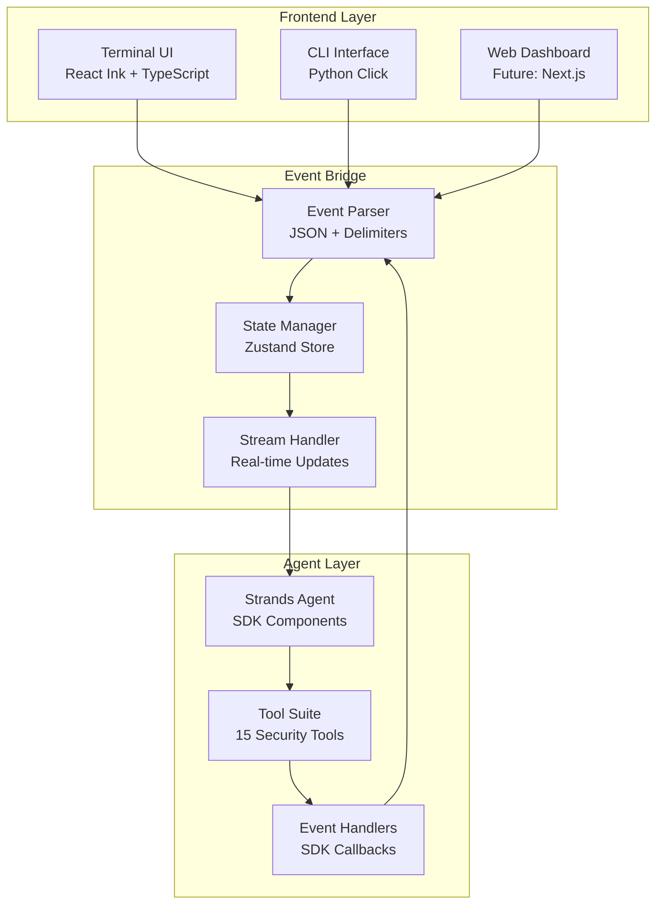
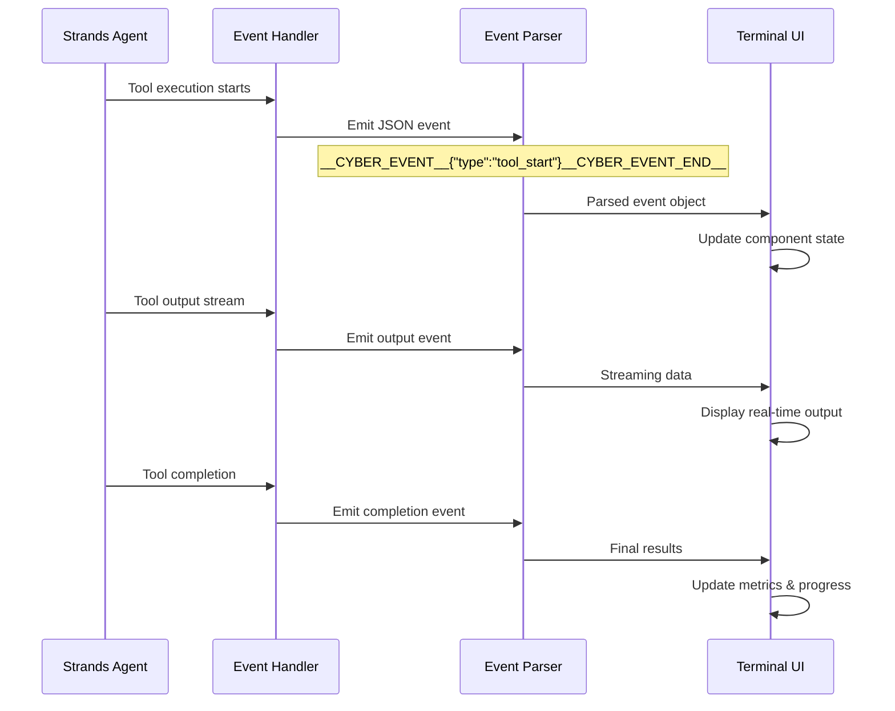
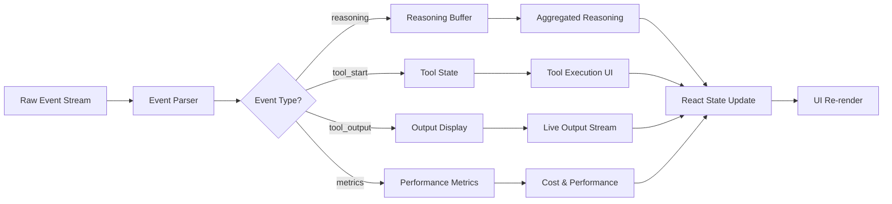
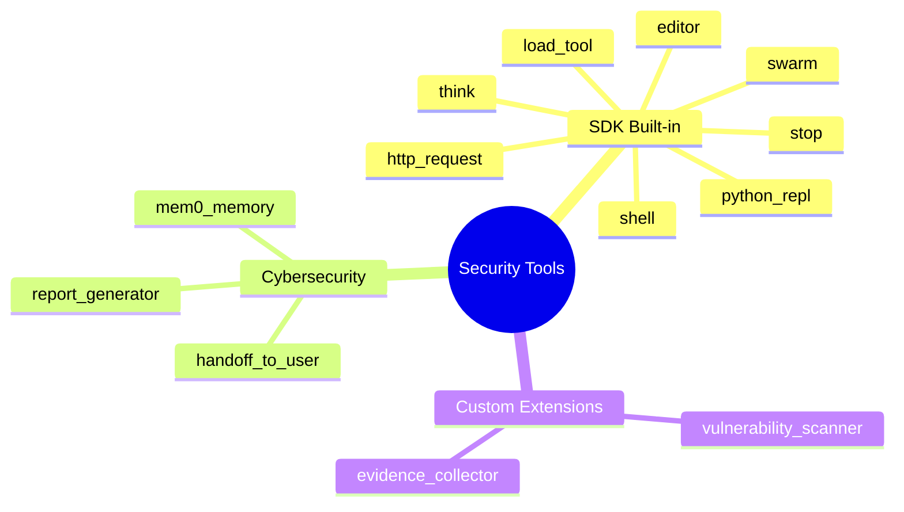
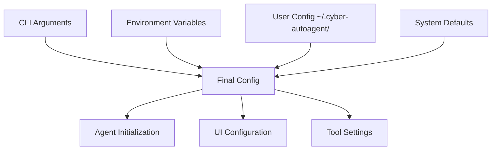

# Cyber-AutoAgent Interfaces

> Modern, event-driven interfaces for autonomous cybersecurity assessment tools

[](https://opensource.org/licenses/MIT)
[](https://www.python.org/downloads/)
[](https://www.typescriptlang.org/)
[](https://strandsagents.com/)

## Overview

This project provides professional-grade interfaces for cybersecurity assessment agents built on the Strands SDK. It features a React-based terminal UI that streams real-time agent operations, tool executions, and security findings in a clean, enterprise-ready format.

## Architecture



## Quick Start

### Prerequisites
- **Node.js** 18.0+ and **Python** 3.11+
- **Docker** 24.0+ (for containerized execution)
- **TypeScript** 5.0+ and **React** 18+

### Installation
```bash
# Clone and setup
git clone <repository-url>
cd cyber-autoagent

# Backend setup
python -m venv venv
source venv/bin/activate  # Windows: venv\Scripts\activate
pip install -e .

# Frontend setup (Terminal UI)
cd src/modules/interfaces/react
npm install
npm run build
```

### Basic Usage
```bash
# Direct CLI execution
python src/cyberautoagent.py \
  --target example.com \
  --objective "Security assessment" \
  --provider bedrock

# React Terminal UI
cd src/modules/interfaces/react
npm start -- --target example.com --objective "Security assessment"
```

## Event System

### Event Flow Sequence



### Event Types

```typescript
interface CyberEvent {
  type: 'step_header' | 'reasoning' | 'tool_start' | 'tool_output' | 
        'error' | 'metrics_update' | 'user_handoff' | 'completion';
  timestamp: string;
  data: EventData;
}
```

### State Management Flow



## Interface Types

### Terminal UI (Production Ready)
**Stack**: React Ink, TypeScript, Zustand

Features:
- Real-time agent reasoning display
- Tool execution with argument preview
- Professional security assessment workflows  
- Metrics tracking (tokens, costs, performance)
- Multi-theme support

**Key Components**:
```typescript
interface TerminalComponents {
  App: 'Main orchestrator with global state';
  StreamDisplay: 'Real-time event renderer';
  MetricsPanel: 'Performance monitoring';
  ToolDisplay: 'Tool execution visualization';
}
```

### CLI Interface (Core)
**Stack**: Python Click, Rich formatting

Features:
- Direct agent execution
- Scriptable operations for automation
- CI/CD pipeline integration
- JSON output modes

## Tool Integration

### Supported Tools (15 total)

The interface provides complete transparency for all security tools:



### Tool Display Pattern

All tools follow a consistent visualization:

```
reasoning
[Agent's decision-making process]

[STEP N/M] operation_id • duration ────────────────

tool: tool_name
[tool-specific parameters and preview]

(●) duration Executing...

output (metadata)
[tool execution results and findings]

──────────────────────────────────────────────────
```

## Development Guide

### Project Structure
```
src/modules/interfaces/
├── react/                  # Terminal UI components
│   ├── src/components/     # React components
│   ├── src/hooks/         # Custom hooks
│   ├── src/types/         # TypeScript definitions
│   └── src/utils/         # Utility functions
├── cli/                   # Native CLI interface
└── shared/                # Common interface utilities
```

### Event Handler Development

```python
from strands.handlers import PrintingCallbackHandler

class CustomInterfaceHandler(PrintingCallbackHandler):
    """Extends SDK handler for UI integration"""
    
    def __call__(self, **kwargs):
        # Process SDK callbacks
        event = self.transform_event(kwargs)
        self.emit_to_ui(event)
    
    def emit_to_ui(self, event: Dict[str, Any]) -> None:
        """Emit structured event for UI consumption"""
        event_json = json.dumps(event)
        print(f"__CYBER_EVENT__{event_json}__CYBER_EVENT_END__")
```

### Component Development

```typescript
import React from 'react';
import { Box, Text } from 'ink';

export const ToolDisplay: React.FC<{execution: ToolExecution}> = ({ 
  execution 
}) => (
  <Box flexDirection="column" marginY={1}>
    <Text color="cyan">tool: {execution.toolName}</Text>
    {execution.parameters && (
      <Box marginLeft={2}>
        <Text color="gray">
          {Object.entries(execution.parameters)
            .map(([k, v]) => `${k}: ${v}`)
            .join(' | ')}
        </Text>
      </Box>
    )}
    {execution.output && (
      <Text color="white">{execution.output}</Text>
    )}
  </Box>
);
```

### Testing Framework

```bash
# Component tests
npm test

# Integration tests  
npm run test:integration

# End-to-end tests
npm run test:e2e
```

## Configuration

### Multi-Layer Config System



### Environment Variables
```bash
# Model configuration
export AWS_REGION=us-east-1
export AWS_ACCESS_KEY_ID=your_key
export OPENAI_API_KEY=your_key

# Interface settings  
export __REACT_INK__=true
export CYBER_THEME=professional
export CYBER_LOG_LEVEL=info
```

## Security Considerations

### Interface Security Model
- **Input Validation**: All user inputs validated against strict schemas
- **Command Injection Prevention**: Parameterized commands and sanitization
- **Audit Logging**: Complete operation and tool execution logs
- **Access Control**: Role-based permissions for sensitive operations

### Compliance Features
- **Data Classification**: Automatic evidence categorization
- **Retention Policies**: Configurable data lifecycle management  
- **Audit Trails**: Comprehensive security event logging
- **Privacy Controls**: GDPR and data protection compliance

## Performance & Scalability

### Optimization Strategies
- **Event Processing**: Debounced updates prevent UI thrashing
- **Memory Management**: Automatic cleanup and buffer limits
- **Connection Pooling**: Efficient AI provider API usage
- **Caching**: Configuration and frequently accessed data

### Monitoring
```typescript
interface PerformanceMetrics {
  eventThroughput: number;     // Events/second
  memoryUtilization: number;   // MB used
  responseLatency: number;     // Average response time
  concurrentOps: number;       // Active operations
}
```

## Contributing

### Development Workflow
1. **Fork** the repository
2. **Create** a feature branch (`git checkout -b feature/amazing-feature`)
3. **Implement** with comprehensive tests
4. **Ensure** all tests pass (`npm test && python -m pytest`)
5. **Submit** a pull request

### Code Standards
- **TypeScript**: Strict mode with comprehensive type coverage
- **Python**: Type hints, docstrings, and PEP 8 compliance
- **Testing**: >90% code coverage for new features
- **Security**: Security review required for all interface changes

### Issue Templates
- **Bug Report**: Detailed reproduction steps and environment info
- **Feature Request**: Clear use case and implementation approach
- **Security Issue**: Private disclosure process for vulnerabilities

## Roadmap

### Near Term (3-6 months)
- **WebSocket Integration**: Real-time bidirectional communication
- **Plugin System**: Custom tool and interface extensions
- **Enhanced Accessibility**: Screen reader and keyboard navigation
- **Performance Optimization**: Faster event processing and rendering

### Medium Term (6-12 months)  
- **Web Dashboard**: Modern browser-based interface
- **Collaboration Features**: Multi-user assessment support
- **Advanced Visualization**: Network topology and attack path diagrams
- **API Documentation**: Comprehensive REST API for integrations

### Long Term (12+ months)
- **Mobile Support**: Responsive interfaces for mobile devices
- **Cloud Native**: Kubernetes operators and cloud deployments
- **AI Enhancement**: ML-powered assessment optimization
- **Ecosystem Integration**: SIEM, SOAR, and security platform connectors

## License

This project is licensed under the MIT License - see the [LICENSE](LICENSE) file for details.

## Support

- **Documentation**: [docs/](docs/)
- **Issues**: [GitHub Issues](https://github.com/your-org/cyber-autoagent/issues)
- **Discussions**: [GitHub Discussions](https://github.com/your-org/cyber-autoagent/discussions)
- **Security**: [SECURITY.md](SECURITY.md) for vulnerability reports

---

**Built with** ❤️ **for the cybersecurity community**