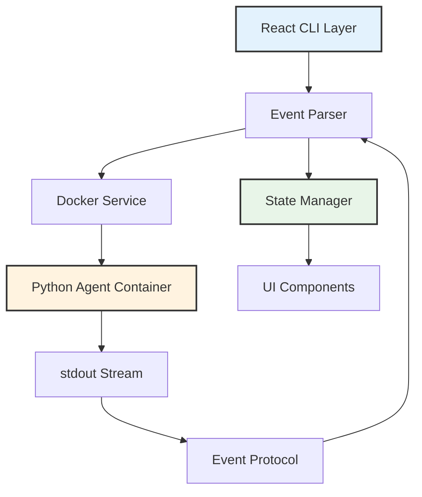
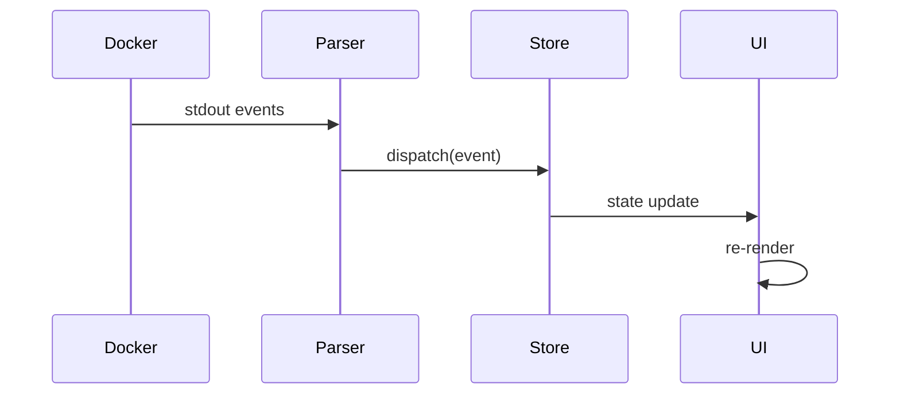

# React Terminal Interface

Cyber-AutoAgent's React-based terminal interface provides real-time streaming of agent operations with event-driven architecture and minimal parsing overhead.

## Architecture Overview

The interface implements a thin presentation layer over the Python agent core, maintaining separation between execution logic and user interface concerns.



## Core Components

### Event Protocol

The interface communicates with the Python agent through structured events emitted via stdout:

```typescript
interface CyberEvent {
  type: 'tool_start' | 'tool_output' | 'reasoning' | 'step_header';
  timestamp: string;
  data: EventData;
}
```

### State Management

Application state follows a unidirectional data flow pattern:



### Service Layer

**DirectDockerService**: Spawns and manages Python agent containers
- Process lifecycle management
- Stream buffering and event extraction
- Error handling and recovery

**PythonExecutionService**: Alternative local execution adapter
- Direct Python subprocess execution
- Development mode support
- Identical event protocol

## Installation

```bash
# Install dependencies
npm install

# Build TypeScript
npm run build

# Run interface
npm start
```

## Configuration

Configuration persists to `~/.cyber-autoagent/config.json`:

**Provider Options:**
- AWS Bedrock (remote execution)
- Ollama (local models)
- LiteLLM (universal gateway)

**Runtime Parameters:**
- Maximum iterations (default: 100)
- Model selection
- Memory persistence mode
- Observability endpoints

## Project Structure

```
src/
├── components/
│   ├── Terminal.tsx          # Event rendering
│   ├── StreamDisplay.tsx     # Output formatting
│   └── ConfigEditor.tsx      # Configuration UI
├── services/
│   ├── DirectDockerService.ts    # Container execution
│   ├── PythonExecutionService.ts # Local execution
│   └── MemoryService.ts          # Memory queries
├── stores/
│   └── configStore.ts        # Persistent configuration
└── types/
    └── events.ts             # Event definitions
```

## Design Principles

**Minimal Parsing**: Events stream from Python with minimal interpretation
- Structured JSON events via `__CYBER_EVENT__` protocol
- Direct passthrough of tool outputs
- No business logic in presentation layer

**State Isolation**: React state limited to UI concerns
- Agent execution state remains in Python
- Interface reflects rather than controls
- Configuration persists independently

**Performance**: Optimized for long-running operations
- Event buffering and batch processing
- Efficient re-render patterns
- Memory-bounded output retention

## Event Protocol

The Python agent emits structured events through stdout:

```
__CYBER_EVENT__{"type":"tool_start","tool_name":"shell","tool_input":{...}}__CYBER_EVENT_END__
```

Event types handled by interface:
- `tool_start`: Tool invocation with parameters
- `tool_output`: Tool execution results
- `reasoning`: Agent decision-making context
- `step_header`: Iteration counter and timing
- `metrics_update`: Token usage and costs

## Testing

```bash
# Run test suite
npm test

# Watch mode for development
npm run test:watch

# Coverage report
npm run test:coverage

# Type checking
npm run typecheck
```

## Environment Integration

Environment variables passed to Python container:

| Variable | Purpose |
|----------|---------|
| `AWS_REGION` | Bedrock provider region |
| `PYTHONUNBUFFERED=1` | Immediate stdout flush |
| `FORCE_COLOR=1` | ANSI color preservation |
| `LANGFUSE_HOST` | Observability endpoint |

## Troubleshooting

**Docker connectivity**: Verify Docker daemon is running and accessible
**Module loading**: Check module paths are correctly mounted to container
**Event parsing**: Ensure Python agent uses matching event protocol version