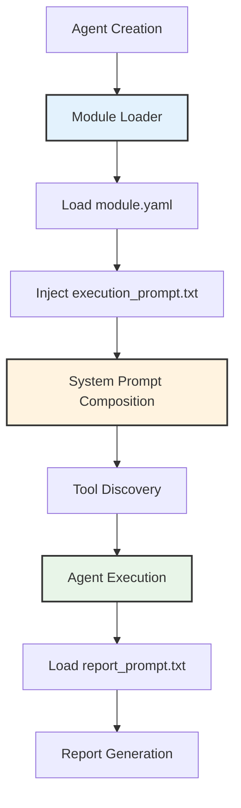
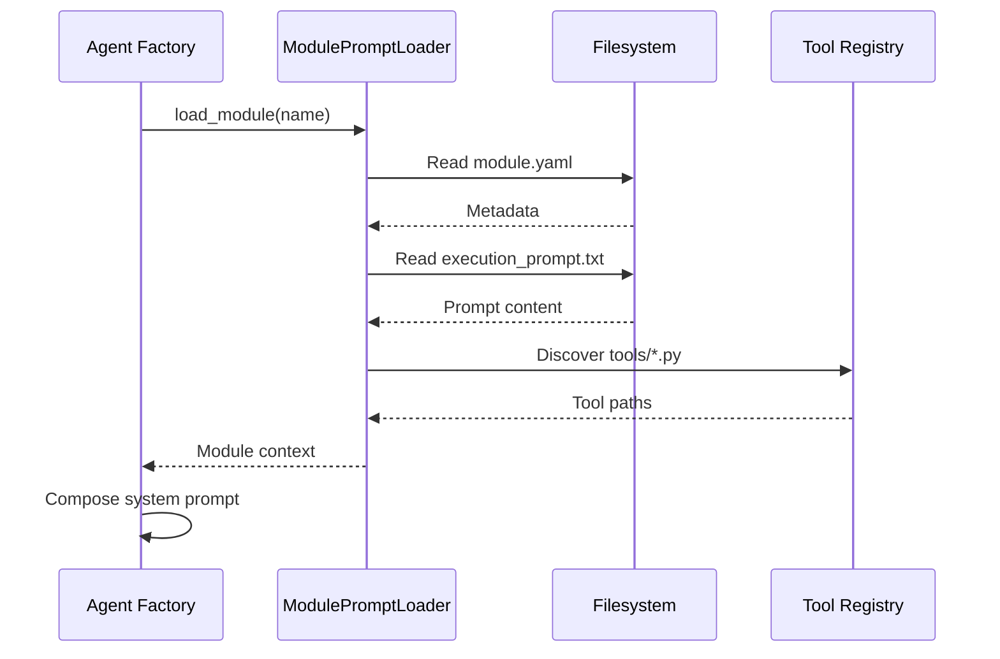
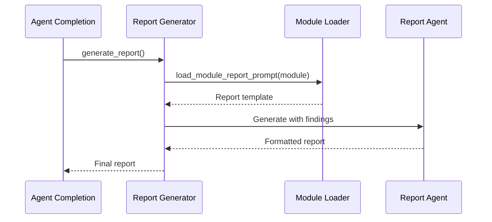

# Operation Modules

Operation modules extend Cyber-AutoAgent capabilities through domain-specific prompts, tools, and reporting templates. Each module specializes the agent's behavior for particular security assessment scenarios.

## Architecture



## Module Structure

```
operation_plugins/
└── <module_name>/
    ├── module.yaml           # Metadata and configuration
    ├── execution_prompt.txt  # Domain-specific system prompt
    ├── report_prompt.txt     # Report generation guidance
    └── tools/               # Module-specific tools
        ├── __init__.py
        └── custom_tool.py   # @tool decorated functions
```

## Component Functions

### module.yaml
Defines module metadata and capabilities:

```yaml
name: module_name
display_name: Human Readable Name
description: Module purpose and scope
version: 1.0.0
cognitive_level: 4              # Sophistication rating (1-5)
capabilities:
  - capability_description
tools:
  - tool_name
supported_targets:
  - web-application
  - api-endpoint
configuration:
  approach: Assessment methodology description
```

### execution_prompt.txt
Specialized instructions injected into agent system prompt during operation. Defines domain expertise, methodology, and tool usage patterns specific to the module's security domain.

### report_prompt.txt
Report generation template specifying structure, visual elements, and domain-specific analysis sections for final assessment reports.

### tools/
Optional directory containing module-specific tool implementations using Strands `@tool` decorator.

## Loading Process



## Prompt Composition

Module execution prompts integrate with base agent instructions:

```python
# System prompt assembly
system_prompt = f"""
{base_agent_prompt}

## MODULE CONTEXT
{module_execution_prompt}

## AVAILABLE TOOLS
{discovered_module_tools}

## ASSESSMENT OBJECTIVE
{user_objective}
"""
```

## Module Discovery

Modules are discovered from multiple sources:

**Search Paths:**
1. Built-in: `src/modules/operation_plugins/`
2. User-defined: `~/.cyberagent/modules/`
3. Custom: `CYBERAGENT_MODULE_PATHS` environment variable

**Validation Requirements:**
- Valid `module.yaml` file
- At least one prompt file (execution or report)
- Proper directory structure

## Tool Integration

Module tools extend agent capabilities for specific domains:

```python
# Example module tool
from strands import tool

@tool
def domain_scanner(target: str, options: dict = None) -> str:
    """Domain-specific security scanner."""
    # Implementation
    return "Scan results"
```

Tools discovered from `tools/*.py` are made available via `load_tool`:

```python
# Agent runtime
load_tool(tool_name="domain_scanner")
result = domain_scanner(target="example.com")
```

## Report Generation

Report generation integrates module-specific guidance:



Report prompts guide structure and emphasis:
- Executive summary focus
- Visual element requirements
- Domain-specific analysis sections
- Remediation guidance format

## Creating Custom Modules

### Directory Setup

```bash
mkdir -p ~/.cyberagent/modules/custom_module/tools
cd ~/.cyberagent/modules/custom_module
```

### Minimal Module

**module.yaml:**
```yaml
name: custom_module
display_name: Custom Security Module
description: Specialized assessment for custom domain
version: 1.0.0
cognitive_level: 3
capabilities:
  - Domain-specific vulnerability detection
supported_targets:
  - custom-application
```

**execution_prompt.txt:**
```xml
<role>
Specialized security assessor for [domain]
</role>

<assessment_methodology>
1. Initial reconnaissance
2. Vulnerability identification
3. Exploitation validation
</assessment_methodology>
```

### Tool Implementation

```python
# tools/custom_tool.py
from strands import tool

@tool
def custom_scanner(target: str, depth: int = 3) -> str:
    """Execute domain-specific security scan."""
    # Scanner implementation
    return f"Scan completed: {target}"
```

## Development Guidelines

**Prompt Design:**
- Use XML tags for critical sections
- Follow confidence-based decision framework
- Maintain concise, technical language
- Include specific tool usage guidance

**Memory Integration:**
- Store findings with standardized metadata
- Use consistent category taxonomy
- Include confidence scores
- Reference module name in metadata

**Tool Development:**
- Implement error handling
- Return structured results
- Document parameters and return types
- Follow Strands tool conventions

## Module Validation

Validate module structure before deployment:

```python
from modules.prompts.factory import ModulePromptLoader

loader = ModulePromptLoader()
if loader.validate_module("custom_module"):
    print("Module valid")
```

## Available Modules

| Module | Cognitive Level | Domain | Key Capabilities | Tools |
|--------|-----------------|--------|------------------|-------|
| **ctf** | 4 | CTF challenges and competitions | Flag extraction, vulnerability exploitation, success-state detection | None |
| **general** | 3 | Web application security assessment | Advanced reconnaissance, payload coordination, authentication analysis | 3 specialized tools |

### CTF Module

**Purpose:** Specialized for Capture The Flag competitions and challenge environments

**Key Features:**
- Flag pattern recognition (UUID, hash, token formats)
- Curated-first endpoint discovery
- Family-driven vulnerability exploitation
- XSS sink-oriented testing with state detection
- IDOR parameter tampering with context variation
- Authentication chain analysis
- Multi-class injection strategies (SQLi, SSTI)
- File upload and path traversal validation
- SSRF and network probing
- GraphQL introspection and API abuse testing

**Configuration:**
- Approach: Family-driven discovery with curated-first probes

### General Module

**Purpose:** Comprehensive web application security assessments

**Key Features:**
- Coordinated reconnaissance (subfinder, assetfinder, httpx, katana)
- Intelligent payload testing (dalfox, arjun, corsy)
- Deep authentication flow analysis (JWT, OAuth, SAML)
- Business logic vulnerability detection
- Injection vulnerability identification

**Module Tools:**
- `specialized_recon_orchestrator`: Coordinates external recon tools
- `advanced_payload_coordinator`: Orchestrates payload testing tools
- `auth_chain_analyzer`: Analyzes authentication mechanisms

**Configuration:**
- Approach: Intelligence-driven assessment with specialized tools

## Implementation Reference

**Module Loading:** `src/modules/prompts/factory.py:ModulePromptLoader`
**Agent Integration:** `src/modules/agents/cyber_autoagent.py:create_agent`
**Report Generation:** `src/modules/tools/report_generator.py`