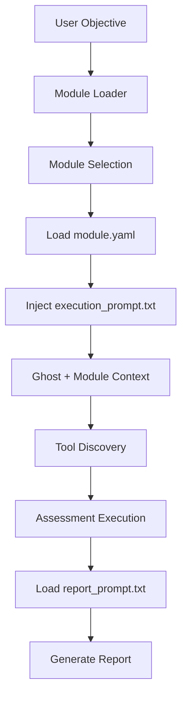

# Cyber-AutoAgent Modules

## Overview

Modules are specialized security assessment components that extend Cyber-AutoAgent's capabilities. Each module provides domain-specific expertise, tools, and reporting formats while maintaining consistency through a unified architecture.

## Module Architecture



## Module Structure

Each module contains:

```
module_name/
├── module.yaml           # Module configuration and metadata
├── execution_prompt.txt  # Prompt for Ghost during assessment
├── report_prompt.txt     # Prompt for report generation
├── requirements.txt      # Python dependencies (optional)
└── tools/               # Module-specific tools
    ├── __init__.py
    └── tool_name.py     # @tool decorated functions
```

## How Modules Work

### 1. Module Discovery
The system searches for modules in:
- Built-in modules: `./modules/`
- User modules: `~/.cyberagent/modules/`
- Custom paths: `CYBERAGENT_MODULE_PATHS` environment variable

### 2. Module Loading
When a module is selected:
1. `module.yaml` is parsed for configuration
2. Tools in `tools/` directory are dynamically loaded
3. `execution_prompt.txt` is injected into Ghost's context
4. Module-specific objectives are composed with user objectives

### 3. Execution Flow
```python
# Simplified flow
module_prompt = load_module_execution_prompt(module_name)
system_prompt = f"""
{ghost_base_prompt}

[MODULE DOMAIN CONTEXT]
{module_prompt}

[ASSESSMENT OBJECTIVE]
{user_objective}
"""
```

### 4. Report Generation
After assessment completion:
1. Findings are collected from memory
2. `report_prompt.txt` guides report structure
3. Visual elements (Mermaid diagrams, tables) are generated
4. Module-specific sections are included

## Module Configuration (module.yaml)

```yaml
name: module_name                # Unique identifier
display_name: Human Readable     # Display name
description: Brief description   # Module purpose
version: 1.0.0                  # Semantic version
author: Cyber-AutoAgent Team    # Author info
license: MIT                    # License type

# Module sophistication (1-5 scale)
cognitive_level: 4              

# Dependencies on other modules
dependencies: []                

# Core capabilities
capabilities:
  - capability_1: Description
  - capability_2: Description

# Tools used by this module
tools:
  - tool_name_1
  - tool_name_2

# Module chaining configuration
module_interface:
  accepts_from: [module1, module2]
  provides_to: [module3, module4]
  finding_categories: [category1, category2]

# Supported target types
supported_targets:
  - web-application
  - api-endpoint

# Runtime configuration
configuration:
  timeout: 900                  # Max execution time (seconds)
  max_depth: 10                # Analysis depth limit
  approach: Assessment approach description
  confidence_threshold: 0.75   # Minimum confidence for findings
```

## Prompts

### Execution Prompt (execution_prompt.txt)
Defines the module's operational context during assessment:

```
<role>
Specialized role description
</role>

<cognitive_architecture>
Working Memory: Current operational context
Episodic Memory: Finding storage patterns
Semantic Memory: Domain knowledge
Procedural Memory: Available tools
</cognitive_architecture>

<confidence_framework>
Ghost's Confidence Assessment:
>80% Confidence: Execute specialized tools
50-80% Confidence: Enhanced reconnaissance
<50% Confidence: Gather more intel
</confidence_framework>

<domain_expertise>
Module-specific expertise areas
</domain_expertise>

<assessment_methodology>
Step-by-step methodology
</assessment_methodology>
```

### Report Prompt (report_prompt.txt)
Guides report generation with consistent structure:

```
## Report Structure

### 1. Executive Summary (3 sentences max)
### 2. Attack Flow Visualization (Mermaid)
### 3. Findings Summary Table
### 4. Detailed Findings
### 5. Attack Timeline (Sequence Diagram)
### 6. Module-Specific Analysis
### 7. Remediation Priority Matrix
### 8. Evidence and Reproduction
```

## Available Modules

| Module | Cognitive Level | Primary Focus | Key Tools |
|--------|-----------------|---------------|-----------|
| **general** | 2 | Comprehensive security assessment | Quick recon |

## Creating Custom Modules

### 1. Create Module Directory
```bash
mkdir ~/.cyberagent/modules/custom_module
```

### 2. Create module.yaml
Use the template and customize for your domain.

### 3. Write Execution Prompt
Define the specialized role and methodology.

### 4. Write Report Prompt
Follow the unified structure with module-specific sections.

### 5. Add Tools (Optional)
```python
# tools/custom_tool.py
from strands import tool

@tool
def custom_scanner(target: str, options: dict = None) -> str:
    """Custom security scanner for specific vulnerability."""
    # Implementation
    return "Scanner results"
```

## Best Practices

### 1. Maintain Consistency
- Follow the confidence framework pattern
- Use standardized report sections
- Keep Ghost's terse communication style

### 2. Tool Integration
- All tools must use `@tool` decorator
- Return structured data for report generation
- Handle errors gracefully

### 3. Memory Usage
- Store findings with proper metadata:
  ```python
  metadata = {
      "category": "finding",
      "module": "module_name",
      "severity": "critical",
      "confidence": "95%"
  }
  ```

### 4. Visual Documentation
- Include Mermaid diagrams for attack flows
- Use tables for findings summaries
- Add sequence diagrams for complex attacks

## Module Development Workflow

1. **Plan**: Define module scope and capabilities
2. **Configure**: Create module.yaml with metadata
3. **Prompt**: Write execution and report prompts
4. **Tool**: Develop specialized tools if needed
5. **Test**: Validate module with sample targets
6. **Document**: Update capabilities and examples

## Troubleshooting

### Module Not Loading
- Check module.yaml syntax
- Verify module name is unique
- Ensure proper directory structure

### Tools Not Found
- Confirm tools have `@tool` decorator
- Check __init__.py exists in tools/
- Verify tool names match module.yaml

### Report Generation Issues
- Validate report_prompt.txt format
- Check for required visual elements
- Ensure finding metadata is complete

## Future Enhancements

- Module chaining protocols
- Inter-module communication
- Automated module selection
- Module marketplace integration

For more information, see the [main documentation](../README.md).