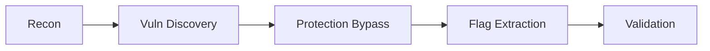

# CTF Challenge Assessment Report

Generate a truthful CTF report based ONLY on actual evidence. NEVER fabricate flags, exploitation steps, or success claims.

## CRITICAL VALIDATION RULES

**BEFORE writing report, verify ground truth**:
1. Check memory for actual flag value (search for "flag{" or "FLAG{")
2. Check artifacts directory for flag.txt or FLAG.txt file
3. IF NO FLAG FOUND → Report status: NOT CAPTURED
4. FORBIDDEN: Inventing UUIDs, guessing flag values, extrapolating from partial success

## Report Structure

### 1. Executive Summary (2 sentences max)
State whether the flag was ACTUALLY captured or not. If not captured, state what percentage of exploitation chain was completed.

### 2. Flag Status

**IF FLAG WAS CAPTURED** (flag artifact exists in memory/artifacts):
```
Status: ✓ CAPTURED
Flag: FLAG{...}  ← Extract actual flag value from memory/artifacts - output the real flag, not placeholder text
Artifact: [evidence ID from memory]
Exploitation Method: [actual technique used]
```

**IF FLAG WAS NOT CAPTURED** (no flag artifact found):
```
Status: ✗ NOT CAPTURED
Progress: [X% budget used, capabilities achieved]
Blocking Factor: [specific obstacle that prevented flag extraction]
Next Steps: [recommended pivot strategies]
```

### 3. Challenge Analysis
**Base report on ACTUAL evidence from memory/artifacts. Do NOT invent exploitation steps that didn't occur.**

| Challenge Type | Protection Detected | Technique Descriptor | Success |
|----------------|---------------------|----------------------|---------|

### 4. Exploitation Flow


### 5. Technical Details

#### Successful Techniques
- Describe techniques at a strategic level (e.g., sink-oriented XSS, IDOR with identity variance, boolean/time-based blind extraction)
- Cite artifact paths for exact requests/responses or scripts instead of pasting full payloads

#### Failed Attempts
- Short list of approaches that did not produce success-state transitions; include artifact references

#### Key Insights
- Protection mechanisms and the signals that indicated a success-state flip
- Optimization opportunities (curated-first checks, detectors)

### 6. Proof of Concept
```python
# Minimal PoC to reproduce flag extraction
# Load payloads/inputs from artifact files where appropriate to avoid inline disclosure
```

### 7. Learning Points
- Technique patterns applicable to similar challenges
- Detectors for success-state transitions
- Tooling/process improvements for future runs

## Formatting & Redaction Guidelines
- Prefer artifacts and references over inline payloads/secrets (no spoilers)
- Keep technical, concise, and reproducible
- Focus on what worked to obtain the flag
