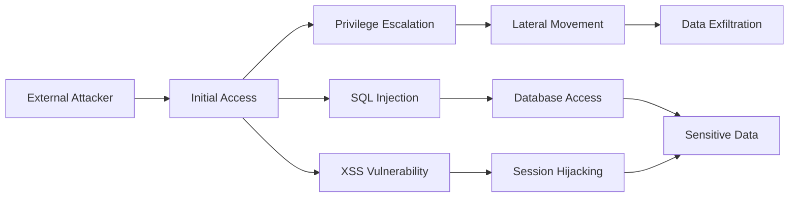

# SECURITY ASSESSMENT REPORT

## EXECUTIVE SUMMARY
<overview>
{overview}
</overview>

## MODULE REPORT CONTEXT
<module_report>
{module_report}
</module_report>
 
## VISUAL SUMMARY
<attack_surface_visualization>
```mermaid
graph TD
    A[Target: {target}] --> B[Attack Surface Analysis]
    B --> C[{critical_count} Critical Vulnerabilities]
    B --> D[{high_count} High Risk Issues]
    B --> E[{medium_count} Medium Concerns]
    B --> F[{low_count} Low Priority Items]
    
    C --> G[Immediate Action Required]
    D --> G
    E --> H[Scheduled Remediation]
    F --> H
```
</attack_surface_visualization>

## KEY FINDINGS
<findings_matrix>
{findings_table}
</findings_matrix>

## DETAILED VULNERABILITY ANALYSIS
<technical_analysis>
{analysis_details}

{evidence_text}
</technical_analysis>

## RISK ASSESSMENT
<risk_visualization>

</risk_visualization>

## REMEDIATION ROADMAP

<immediate_actions>
### Immediate Actions (0-48 hours)
{immediate_recommendations}
</immediate_actions>

<short_term_actions>
### Short-term Improvements (1-4 weeks)
{short_term_recommendations}
</short_term_actions>

<strategic_actions>
### Strategic Security Enhancements (1-3 months)
{long_term_recommendations}
</strategic_actions>

## ATTACK PATH ANALYSIS
<attack_paths>
### Primary Attack Vectors
Detailed mapping of how an attacker could chain discovered vulnerabilities:



### Kill Chain Mapping
Map findings to MITRE ATT&CK framework stages and provide detection opportunities.
</attack_paths>

## TECHNICAL APPENDIX
<technical_appendix>
### Proof of Concept Code
Include sanitized PoC code demonstrating key vulnerabilities (without weaponization).

### Configuration Examples
Provide secure configuration templates for identified misconfigurations.

### Detection Rules
Supply SIEM rules, IDS signatures, or monitoring queries to detect exploitation attempts.
</technical_appendix>

## ASSESSMENT METHODOLOGY
<methodology>
Tools Utilized:
{tools_summary}

Total Steps Executed: {steps_executed}
Evidence Collection: Automated via Cyber-AutoAgent
Analysis Framework: {analysis_framework}
</methodology>

<report_footer>
----
Report Generated: {date}
Operation ID: {operation_id}
Generated by: Cyber-AutoAgent Security Assessment Platform
</report_footer>
