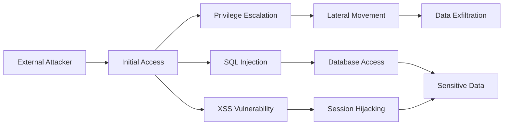

# SECURITY ASSESSMENT REPORT

## EXECUTIVE SUMMARY
{overview}

## MODULE REPORT CONTEXT
{module_report}
 
## VISUAL SUMMARY
```mermaid
graph TD
    A[Target: {target}] --> B[Attack Surface Analysis]
    B --> C[{critical_count} Critical Vulnerabilities]
    B --> D[{high_count} High Risk Issues]
    B --> E[{medium_count} Medium Concerns]
    B --> F[{low_count} Low Priority Items]
    
    C --> G[Immediate Action Required]
    D --> G
    E --> H[Scheduled Remediation]
    F --> H
```

## KEY FINDINGS
{findings_table}

## DETAILED VULNERABILITY ANALYSIS
{analysis_details}

{evidence_text}

## RISK ASSESSMENT


## REMEDIATION ROADMAP

### Immediate Actions (0-48 hours)
{immediate_recommendations}

### Short-term Improvements (1-4 weeks)
{short_term_recommendations}

### Strategic Security Enhancements (1-3 months)
{long_term_recommendations}

## ATTACK PATH ANALYSIS
### Primary Attack Vectors
Detailed mapping of how an attacker could chain discovered vulnerabilities:



### Kill Chain Mapping
Map findings to MITRE ATT&CK framework stages and provide detection opportunities.

## TECHNICAL APPENDIX
### Proof of Concept Code
Include sanitized PoC code demonstrating key vulnerabilities (without weaponization).

### Configuration Examples
Provide secure configuration templates for identified misconfigurations.

### Detection Rules
Supply SIEM rules, IDS signatures, or monitoring queries to detect exploitation attempts.

## ASSESSMENT METHODOLOGY
Tools Utilized:
{tools_summary}

Total Steps Executed: {steps_executed}
Evidence Collection: Automated via Cyber-AutoAgent
Analysis Framework: {analysis_framework}

----
Report Generated: {date}
Operation ID: {operation_id}